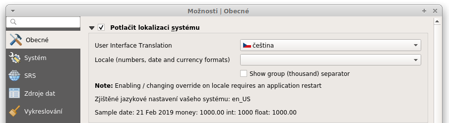
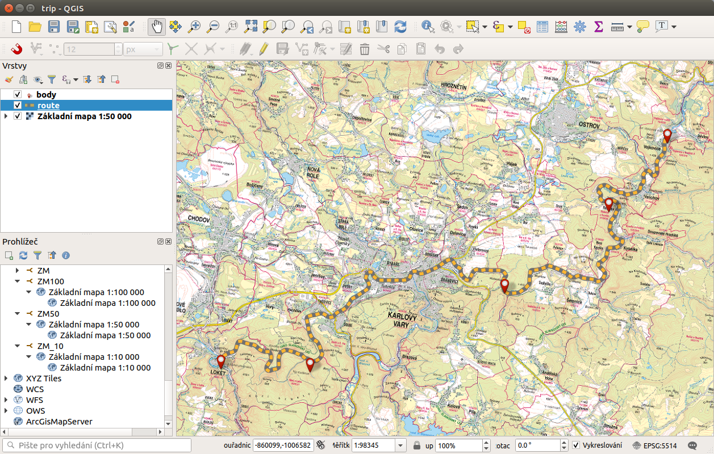
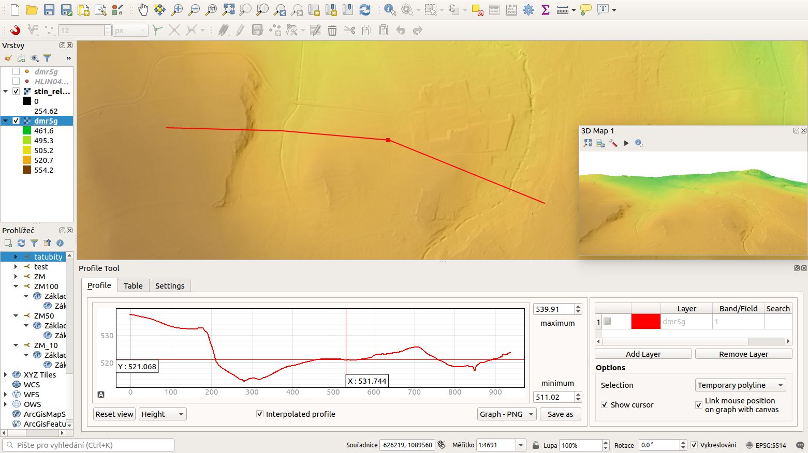

# GISMentors: QGIS pro začátečníky

{align=left}

[QGIS](https://qgis.org/) je open source *geografický informační
systém* ([GIS]({{wikipedia}}/GIS)) publikovaný pod všeobecnou licencí GNU GPL.
Projekt QGIS vznikl v roce 2002, verze s označením 1.0 vyšla později v
roce 2009.  Mezi hlavní výhody patří zejména rychlost vývoje a
rozšiřování jeho funkcionality.  Licence GNU GPL umožňuje používání
software i pro komerční účely. Podstatné je, že umožňuje i modifikaci
zdrojového kódu a jeho následné šíření.

Současným konceptem ve vývoji je pravidelné a intenzivní publikování
nových verzí. Dlouhodobá stabilní verze (LTR) je doplněna dvěma
krátkodobými verzemi (viz [QGIS release
schedule](https://qgis.org/en/site/getinvolved/development/roadmap.html#release-schedule)). Krátkodobé
verze mají sloužit pro zveřejňování nových funkcionalit v kratších
intervalech.

S touto změnou přicházejí nejenom novější a lepší technologické
nástroje, ale také jasná zpráva o tom, že QGIS se neustále vyvíjí,
drží krok a nezastarává.  Součástí velkých změn je i v tomto případě
nutnost se adaptovat na ně, což závisí hlavně od způsobu jakým QGIS
uživatel využívá. Všechny změny ale vycházejí z dlouhodobého plánování
a hlavně z požadavků uživatelů.

!!! warning "Data"

    **Data ke školení** jsou stažitelná jako [zip
    archiv](http://training.gismentors.eu/geodata/qgis/data.zip) (614
    MB).

!!! note

    Školení je zaměřeno na LTR verzi QGIS 3.28. V jiných verzích není
    zaručena funkčnost uvedených příkladů. Dále předpokládáme zapnutou
    *českou lokalizaci*, `Možnosti {{rarr}} Obecné`.

    
  
QGIS je napsán v programovacím jazyce C++ a uživatelské prostředí je
postaveno na frameworku Qt. Díky použití těchto rozšířených
programovacích prostředků je QGIS multiplatformní, tudíž jej lze
využívat na většině používaných operačních systémech jako je MS
Windows, GNU/Linux nebo OS X. QGIS využívá pro práci s geografickými
daty v rastrové anebo vektorové reprezentaci knihovnu
[GDAL]({{skoleni}}/open-source-gis/knihovny/gdal.html), díky tomu je
možné v QGISu pracovat se širokým spektrem datových formátů a webových
služeb OGC.

/// caption
Ukázka uživatelského rozhraní QGIS.
///

Program nabízí přehledné uživatelské prostředí. Uživatel má k
dispozici širokou škálu nástrojů pro prohlížení, modifikaci a export
dat. Od verze 2.0 QGIS obsahuje "Print Composer", tedy nástroj pro
vytváření map. V tiskovém modulu lze vytvářet z nahraných dat výstupy
se všemy kartografickými náležitostmi. Výsledky je možné exportovat do
formátu PDF nebo obrázku, viz [Mapový výstup](mapovy_vystup/index.md).

/// caption
Ukázka mapového výstupu vytvořeného v QGIS.
///

QGIS je populární i pro svou rozšiřitelnost pomocí takzvaných
zásuvných modulů (tzv. "pluginů"). Pluginy jsou dílčí nástroje, které
jsou vyvíjeny uživatelskou komunitou projektu QGIS. Pomocí pluginů je
možné dopnit do QGIS novou funkcionalitu či podporu pro další formáty
či služby jako je např. Google Maps, Bing nebo OpenStreetMap.

Oficiální repozitář, který je nativně k dispozici jako zdroj pluginů
je dostupný [zde](https://plugins.qgis.org/plugins/). Instalace
konkrétního pluginu je pak možná přímo v okně pro správu zásuvných
modulů (pluginů) `Zásuvné moduly {{rarr}} Spravovat a instalovat
zásuvné moduly...`.

/// caption
Ukázka měření terénního profilu pomocí nástroje "Profile tool".
///

## Obsah školení

TBD

## O materiálech

Text dokumentu je licencován pod [Creative Commons
Attribution-ShareAlike 4.0 International
License](http://creativecommons.org/licenses/by-sa/4.0/).

Online HTML verze textu školení je dostupná na adrese:

* <https://gismentors.github.io/qgis-zacatecnik/>

Zdrojové texty školení jsou dostupné na adrese:

* <https://github.com/GISMentors/qgis-zacatecnik/>

Případné chyby nebo náměty na vylepšení můžete hlásit:

* <https://github.com/GISMentors/qgis-zacatecnik/issues>

*Verze textu dokumentu:* |release| (sestaveno |today|)

### Autoři

Za [GISMentors](https://www.gismentors.cz/):

* [Alžbeta Gardoňová](https://www.gismentors.cz/mentors/gardonova/)
* [Oto Kaláb](https://www.gismentors.cz/mentors/kalab/)
* [Martin Landa](https://www.gismentors.cz/mentors/landa/)
* [Jan Růžička](https://www.gismentors.cz/mentors/ruzicka/)
