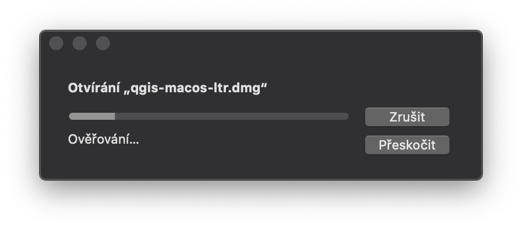
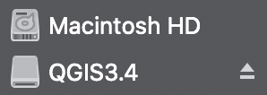
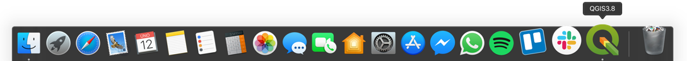

.. _label: instalace-macos

.. index::
   single: MasOS
   see: MacOS; Instalace

MacOS
=====

Na své zařízení od společnosti Apple s operačním systémem macOS obvykle
nainstalujete software pomocí oficiálního obchodu s aplikacemi App Store
nebo obrazového disku s příponou .dmg.

QGIS prozatím v App Store dostupný, a proto je QGIS nutné instalovat přes
soubor :file:`.dmg`.
Ten je volně ke stažení na oficiálních stránkách `QGIS
<https://www.qgis.org/en/site/forusers/download.html>`_., kde si můžete vybrat
mezi nejnovější verzí nebo verzí LTR.

.. figure:: images/01_macos_download.png
   :class: large

Samotná instalace je velmi jednoduchá. Po spuštění instalátoru :file:`.dmg`
budete vyzváni k potvrzení licenčních podmínek.

.. figure:: images/02_licence.png
   :class: medium

Po potvrzení podmínek se spustí ověřování připojení obrazového disku, které
může trvat několik minut.

Po připojení disku se vám zobrazí dialog, ve kterém stačí ikonu QGISu
přetáhnout kursorem myši do znázorněné ikony aplikací.

.. figure:: images/04_pretazeni.png
   :class: small

V tento moment se začne samotný program kopírovat na disk počítače.

.. figure:: images/05_kopirovani.png
   :class: small

Po chvilce kopírování je program připravený k používání.

Po instalaci budete mít stále připojený obraz disku, jelikož je program již
nainstalován, můžete tento disk klidně odpojit. Připojený obraz uvidíte ve
Finderu v části zařízení, kde ho odpojíte pomocí ikonky vpravo.

Následně můžete smazat i instalační soubor :file:`.dmg`, který již nebudete
nadále potřebovat a zbytečně zabírá místo na disku.

Pokud budete potřebovat QGIS odinstalovat z důvodu např. aktualizace na novější
verzi, stačí pouze přetáhnout myší ikonu QGISu ze složky aplikace do koše.
Při vysypání koše bude QGIS trvale z počítače odinstalován.

Spuštění QGISu
--------------

Pro rychlé spuštění QGISu na macOS zmáčněte klávesy :kbd:`command + mezerník`,
otevře se okno spotlight kam pouze napište QGIS a zmáčkněte :kbd:`Enter`.

.. figure:: images/07_spusteni.png
   :class: medium

Dále můžete QGIS spustit buď pomocí ikony v Docku, nebo ho naleznete ve Finderu
ve složce Aplikace.

