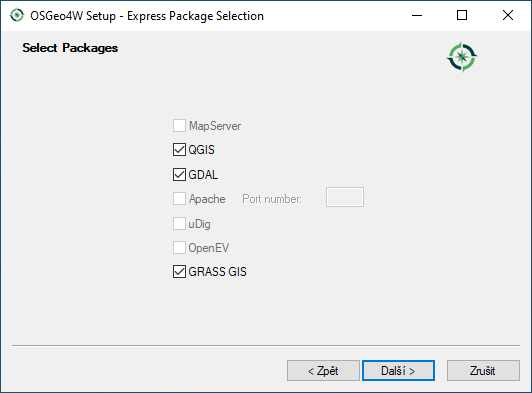

single: MS Windows see: MS Windows; Instalace

# MS Windows

Systém QGIS je možné pod MS Windows nainstalovat *dvěma způsoby*:

1.  pomocí `samostaného instalátoru<samostatny-instalator>`
    - *pro začátečníky*
2.  v rámci `OSGeo4W instalátoru <osgeo4w-instalator>`
    - *pro pokročilejší uživatele*
    - rychlá a snadná aktualizace
    - komplexnější řešení umožňující instalaci dalšího softwaru
      distribuovaného pod hlavičkou [OSGeo](http://www.osgeo.org/)

V obou výše uvedených případech lze vybrat mezi nejnovejší verzí a LTR.

Oba uvedené způsoby jsou dostupné přímo ze stránek
[QGIS](https://www.qgis.org/en/site/forusers/download.html).

<figure>

<figcaption>Nabídka instalací pro MS Windows.</figcaption>
</figure>

Zvolte instalaci kompatibilní s vaším operačním systémem. V současné
době je většina počítačů 64bitových, QGIS zveřejňuje instalátor také pro
starší 32bitové architektury. Od [verze QGIS
3.18](https://blog.qgis.org/2020/10/15/phasing-out-32-bit-support-in-qgis/)
nabízí podporu pouze 64bitové platformy.

## Samostatný instalátor

### Proces instalace

Instalátor spustíme jako správce. Samotná instalace má 5 kroků, které
jsou zobrazeny a popsány níže.

<figure>

<figcaption>Spuštění instalátoru.</figcaption>
</figure>

<figure>

<figcaption>Licenční podmínky.</figcaption>
</figure>

<figure>

<figcaption>Adresář, kde se QGIS nainstaluje.</figcaption>
</figure>

<figure>

<figcaption>Volba rozsahu instalace (je možné zvolit i ukázkovou datovou
sadu z nabídky).</figcaption>
</figure>

<figure>

<figcaption>Dokončení instalace.</figcaption>
</figure>

Po úspěšné instalaci se na pracovní ploše i v nabídce Start objeví
položka QGIS, kterou je možné jednoduše spustit.

> [!IMPORTANT]
> Součástí instalace QGIS je i systém **GRASS GIS** (více ve školení
> `GRASS GIS pro začátečníky
> <grass-gis-zacatecnik>` a jeho propojení s QGISem ve školení
> `QGIS pro pokročilé <qgis-pokrocily/grass/index.html>`).

single: OSGeo4W see: OSGeo4W; Instalace

## OSGeo4W instalátor

Instalátor OSGeo4W je dostupný na adrese:
<https://trac.osgeo.org/osgeo4w/>. Zvolte [64bitovou
verzi](http://download.osgeo.org/osgeo4w/osgeo4w-setup-x86_64.exe).
Podpora pro [32bitovou
architekturu](http://download.osgeo.org/osgeo4w/osgeo4w-setup-x86.exe)
je pomalu opouštěna (QGIS 3.18 je dostupný pouze pro 64bit).

> [!TIP]
> Aktualizace softwarových balíčků je narozdíl od samostatné instalace
> naprosto triviální. Stačí instalátor spustit a projít bez změny
> nastavení jednotlivé stránky průvodce. Nové verze softwaru se stáhnou
> a nainstalují automaticky.

Pomocí tohoto instalátoru lze kromě QGISu nainstalovat i dalších
softwary jako např. GRASS GIS, SAGA GIS a další. I zde si můžete vybrat
mezi

- *krátkodobou verzi* QGISu (`Express Desktop Install`)

<figure>

<figcaption>Spuštění instalátoru.</figcaption>
</figure>

<figure>

<figcaption>Volba serveru. Doporučujeme evropská zrcadla jako jako např.
<em>osgeo4w-oslandia</em>.</figcaption>
</figure>

<figure>

<figcaption>Výběr softwarových balíčků pro instalaci (ponechte GDAL i
GRASS GIS).</figcaption>
</figure>

<figure>

<figcaption>Odsouhlaste instalaci povinných závislostí.</figcaption>
</figure>

<figure>

<figcaption>Odsouhlaste licenční podmínky.</figcaption>
</figure>

anebo

- *dlouhodobou stabilní* (`Advanced Install`, `Desktop --> qgis-ltr`
  nebo `qgis-ltr-full` včetně všech doporučených závislostí jako je
  GRASS GIS anebo SAGA)

<figure>

<figcaption>Spuštění instalátoru. V dalších krocích ponecháme výchozí
nastavení.</figcaption>
</figure>

<figure>

<figcaption>V sekci Select packages vybereme balíček
qgis-ltr-full.</figcaption>
</figure>
