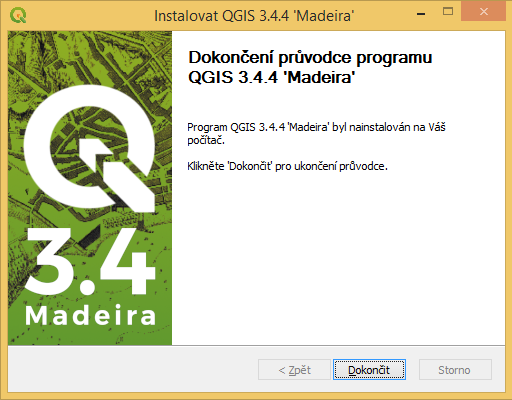
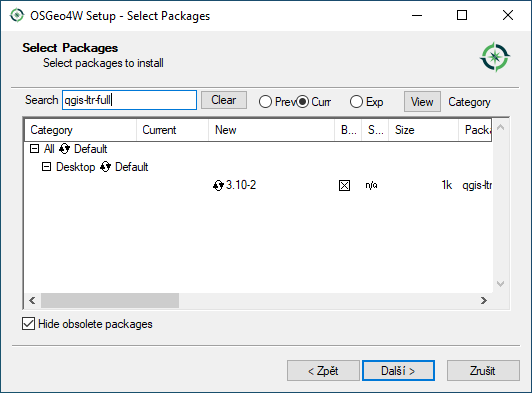

.. _label: instalace-windows

.. index::
   single: MS Windows
   see: MS Windows; Instalace

MS Windows
==========

Systém QGIS je možné pod MS Windows nainstalovat *dvěma způsoby*:

#. pomocí :ref:`samostaného instalátoru<samostatny-instalator>`

   * *pro začátečníky*

#. v rámci :ref:`OSGeo4W instalátoru <osgeo4w-instalator>`

   * *pro pokročilejší uživatele*
   * rychlá a snadná aktualizace
   * komplexnější řešení umožňující instalaci dalšího softwaru
     distribuovaného pod hlavičkou `OSGeo <http://www.osgeo.org/>`__

V obou výše uvedených případech lze vybrat mezi nejnovejší verzí a LTR.

Oba uvedené způsoby jsou dostupné přímo ze stránek `QGIS
<https://www.qgis.org/en/site/forusers/download.html>`__.

.. figure:: images/qgis_windows_download.png
   :class: large
   :scale-latex: 85

   Nabídka instalací pro MS Windows.

Zvolte instalaci kompatibilní s vaším operačním systémem. V současné
době je většina počítačů 64bitových, QGIS zveřejňuje instalátor také
pro starší 32bitové architektury. Od `verze QGIS 3.18
<https://blog.qgis.org/2020/10/15/phasing-out-32-bit-support-in-qgis/>`__
nabízí podporu pouze 64bitové platformy.

.. _samostatny-instalator:

Samostatný instalátor
---------------------

..
   Zda je váš systém 32 bitový nebo 64 bitový zjistíte otevřením složky
   \"Počítač\", klik pravým tlačítkem do složky, z nabídky vybrat
   vlastnosti. V novém okně lze zjistit typ systému.

   .. figure:: images/install_pc.png
      :scale-latex: 75

      Složka \"Počítač\".

   .. figure:: images/install_pc_type.png
      :scale-latex: 75

      Typ operačního systému.

.. raw:: latex

   \clearpage

Proces instalace
^^^^^^^^^^^^^^^^

Instalátor spustíme jako správce. Samotná instalace má 5 kroků, které
jsou zobrazeny a popsány níže.

.. figure:: images/install_1.png

   Spuštění instalátoru.

.. figure:: images/install_2.png

   Licenční podmínky.

.. figure:: images/install_3.png

   Adresář, kde se QGIS nainstaluje.

.. _nativni-instalator-data:

.. figure:: images/install_4.png

   Volba rozsahu instalace (je možné zvolit i ukázkovou datovou sadu z nabídky).

.. raw:: latex

	 \clearpage

   Dokončení instalace.

Po úspěšné instalaci se na pracovní ploše i v nabídce Start objeví
položka QGIS, kterou je možné jednoduše spustit.

.. important:: Součástí instalace QGIS je i systém **GRASS GIS** (více ve
   školení :skoleni:`GRASS GIS pro začátečníky
   <grass-gis-zacatecnik>` a jeho propojení s QGISem ve školení
   :skoleni:`QGIS pro pokročilé <qgis-pokrocily/grass/index.html>`).
               
.. index::
   single: OSGeo4W
   see: OSGeo4W; Instalace

.. _osgeo4w-instalator:

OSGeo4W instalátor
------------------

Instalátor OSGeo4W je dostupný na adrese:
https://trac.osgeo.org/osgeo4w/. Zvolte `64bitovou verzi
<http://download.osgeo.org/osgeo4w/osgeo4w-setup-x86_64.exe>`__. Podpora
pro `32bitovou architekturu
<http://download.osgeo.org/osgeo4w/osgeo4w-setup-x86.exe>`__ je pomalu
opouštěna (QGIS 3.18 je dostupný pouze pro 64bit).

.. tip:: Aktualizace softwarových balíčků je narozdíl od samostatné
         instalace naprosto triviální. Stačí instalátor spustit a
         projít bez změny nastavení jednotlivé stránky průvodce. Nové
         verze softwaru se stáhnou a nainstalují automaticky.

Pomocí tohoto instalátoru lze kromě QGISu nainstalovat i dalších
softwary jako např. GRASS GIS, SAGA GIS a další. I zde si můžete
vybrat mezi

* *krátkodobou verzi* QGISu (``Express Desktop Install``)

.. figure:: images/osgeo4w_install_1.png

   Spuštění instalátoru.

.. figure:: images/osgeo4w_install_1a.png

   Volba serveru. Doporučujeme evropská zrcadla jako jako např. *osgeo4w-oslandia*.
   
.. figure:: images/osgeo4w_install_2.png

   Výběr softwarových balíčků pro instalaci (ponechte GDAL i GRASS GIS).
   
.. figure:: images/osgeo4w_install_3.png

   Odsouhlaste instalaci povinných závislostí.

.. figure:: images/osgeo4w_install_4.png

   Odsouhlaste licenční podmínky.

anebo

.. _osgeo4w-qgis-ltr:

* *dlouhodobou stabilní* (``Advanced Install``,
  :menuselection:`Desktop --> qgis-ltr` nebo
  :menuselection:`qgis-ltr-full` včetně všech doporučených závislostí
  jako je GRASS GIS anebo SAGA)

.. figure:: images/osgeo4w_ltr_install_1.png

   Spuštění instalátoru. V dalších krocích ponecháme výchozí
   nastavení.
 

  
   V sekci Select packages vybereme balíček qgis-ltr-full.

