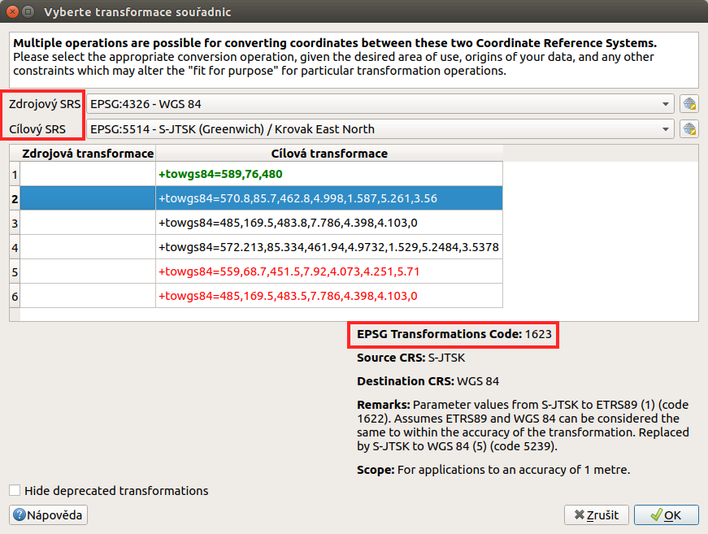

# Přidávání a export geodat

QGIS podporuje široké spektrum geodat. Geografická data můžeme rozdělit
podle způsobu uložení na lokální a distribuovaná (síťová). V obou
kategoriích se následně vyskytují data rastrová a vektorová. V této
kapitole jsou popsány základní principy připojení a exportu geodat v
programu QGIS. Práce s konkrétními formáty budou potom uvedeny v
samostatných kapitolách.

pair: import dat; rozhraní - popis

## Přidávání dat

Data lze přidat z hlavního menu `Vrstva --> Přidat
vrstvu-->...`. Na základě vybraného typu dat se nám zobrazí konkrétní
dialogové okno s nastavením pro nahrání dat.

<figure>

<figcaption>Menu přidávání vrstev.</figcaption>
</figure>

Jak jde vidět na `addlayer`, u většiny typů dat lze pro přidání využít
klávesové zkratky.

Stejného výsledku lze dosáhnout i pomocí ikon v nástrojovém panelu
`Spravovat vrstvy`.

<figure>

<figcaption>Nástrojový panel pro přidávání vrstev Spravovat
vrstvy</figcaption>
</figure>

Další možností je přidat data pomocí vestavěného datového katalogu
(prohlížeče souborů), a to buď dvojitým kliknutím, jednoduchým
přetažením souboru do mapového okna nebo okna vrstev (`browser`) anebo
přes kontextové memu dané vrstvy. Pomocí kláves `CTRL` nebo `SHIFT`
můžeme vybrat a přidat přetažením více souborů najednou. Pomocí datového
katalogu lze také procházet a přidávat soubory přímo z archivu zip.

> [!TIP]
> Pomocí přetažení lze přidat data také přímo ze správce souborů v
> operačním systému.

<figure>

<figcaption>Přidání vrstvy přetažením souboru do mapového okna nebo
seznamu vrstev.</figcaption>
</figure>

pair: export dat; rozhraní - popis

> [!TIP]
> Přes panel nástrojů je možné dosáhnout i dalších funkčností. Jednou z
> nich je nově **mazání** dat, nejenom jejich odstranění z projektu.
> Další fukncionalita je závislá od typu dat (souborová databáze -
> přidávání dat tažením).

## Export dat

Pro export vrstvy nebo její části se používá funkce `Uložit jako...`.
Funkci můžeme spustit dvěma způsoby:

V seznamu vrstev označíme vrstvu, kterou chceme exportovat, a vybereme z
hlavního menu `Vrstva --> Uložit jako...`

<figure>

<figcaption>Spuštění exportu z hlavního menu.</figcaption>
</figure>

Elegantnější a rychlejší způsob je spuštění exportu ze seznamu vrstev.
Pravým kliknutím na vrstvu vyvoláme kontextové menu a vybereme
`Export --> Save Features As`.

<figure>

<figcaption>Spuštění exportu z kontextového menu v seznamu
vrstev.</figcaption>
</figure>

> [!TIP]
> Exportování dat umožňuje i změnu kódování textu, změnu souřadnicového
> systému (transformaci) a další funkce, které jsou základními operacemi
> pro každodenní praxi.

Jak exportovat konkrétní data se dozvíme v jednotlivých kapitolách.

## Výběr souřadnicového systému

Při vkládání rastrových nebo vektorových dat se může stát, že po
potvrzení výběru je vyžadována specifikace souřadnicového systému
vkládaných dat (`srs`). Okno se zobrazí v případě, pokud vkládaný soubor
neobsahuje vlastní specifikaci souřadnicového systému, jako například
ESRI Shapefile bez souboru končícího příponou `\*.prj`, s uvedeným EPSG
kódem, který by odpovídal kódu které používá QGIS (z knihovny proj4).

> [!NOTE]
> Soubory typu ESRI Shapefile QGIS opatří dalším souborem `.qpj`, který
> vytváří sám pro jasné přiřazení souřadnicového systému vrstvě.

V okně výběru je možné vyhledat souřadnicové systémy pomocí filtru.
Zvolení správného souřadnicového systému je velice důležité, pokud máte
v mapovém okně načtena data v různých souřadnicových systémech, a
dochází tak k transformaci, při měření nebo připojování k webovým
službám.

<figure>

<figcaption>Volba souřadnicového systému při vkládání dat.</figcaption>
</figure>

Mezi souřadnicovými systémy je možné filtrovat pomocí jejich názvů. Na
obrázku `srs` je vidět filtr pomocí textu "jtsk". Pokud v poli s
vybranými systémy označíme jeden, tak se níže vypíše jeho definice
(zapsání matematických koeficientů) a vykreslí rozsah území, pro který
se používá.

Naposledy použité souřadnicové systémy se pak budou objevovat v horní
části pro rychlý výběr a budou i v rychlých nabídkách jiných nástrojů,
které umožňují výběr souřadnicového systému.

> [!TIP]
> Po přidání dat můžeme zkontrolovat jejich pozici v prostoru pomocí
> funkce Přiblížení na vrstvu, nebo pomocí funkce
> Přiblížit na rozměry okna pozici vůči ostatním vrstvám
> projektu. Změnu špatně zvoleného systému lze provést ve vlastnostech
> dané vrstvy v záložce `Zdroj`.

## Transformace

Výchozí nastavení QGIS-u používá tzv. "on-the-fly" transformaci, což
umožňuje pracovat v projektu s daty v jiných souřadnicových systémech,
než jaký má projekt. Prakticky to znamená, že při každém překreslení
mapového okna se všechny vrstvy v jiném souřadnicovém systému, než jaký
má projekt, přepočítávají. Některé souř. systémy můžou mít víc než jednu
možnost tansformace. Chování lze nastavit dle potřeb v
`Nastavení --> Možnosti`, záložka `SRS` sekce
`Výchozí transformace souřadnic`.

<figure>

<figcaption>Nastavení požadovaných transformačních klíčů v
menu.</figcaption>
</figure>

V případě souřadnicového systému S-JTSK je vhodné tuto transformaci
nastavit. Pomocí tlačítka zvolíme možnost přidání nové zvolené
transformace. Jako první je nutné zvolit dvojici `zdojový` a `cílový`
souř. systém, který chceme přesně nadefinovat. V tomto případě se jedná
o dvojici EPSG 4326 a 5514. Po zadání této dvojice se vypíšou všechny
dostupné transformace. Pro detailní popis je potřeba na zvolenou
transformaci kliknout a ve spodní části se následně vypíše detailní
popis. Zde je možné zjistit přesné číselné parametry, textový popis, ale
zejména číselnou identifikaci konkrétní transformace.

<figure>

<figcaption>Výběr transformace pro konkrétní dvojici EPSG
kódů.</figcaption>
</figure>

Jeden zápis definuje jeden konkrétní převod. Pro opačnou transformaci je
nutné udělat nový zápis se správným pořadím zdrojového a cílového souř.
systému.

V případě, že existuje víc možností transformace a žádná není nastavená
jako preferovaná, tak bude uživatel opakovaně vyzýván při každé
přidávané vrstvě zvlášť.
