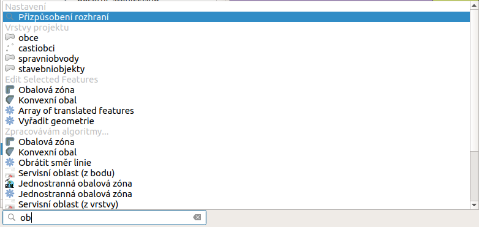
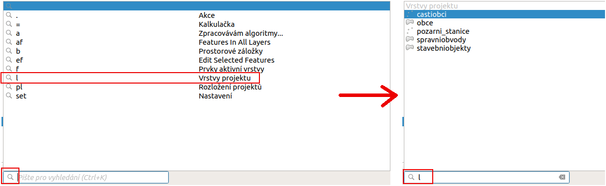
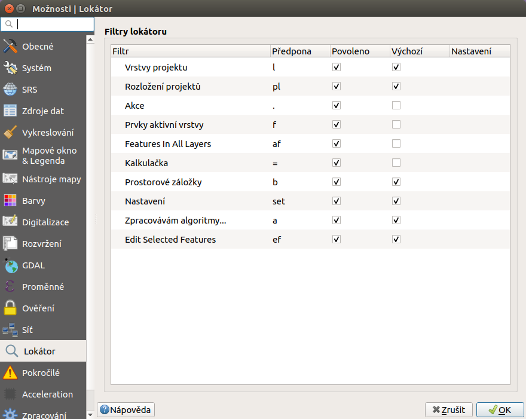
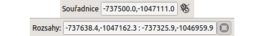
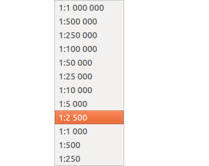
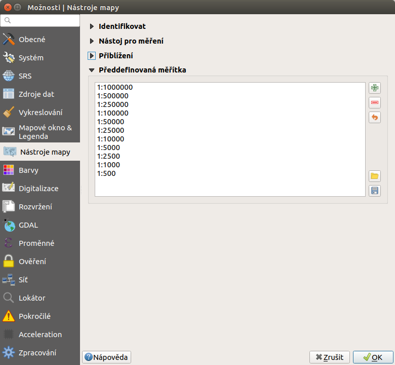
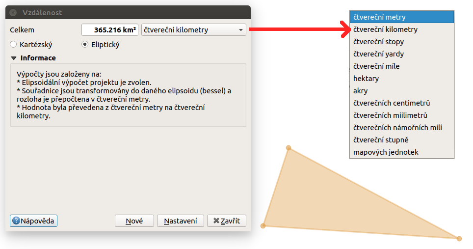
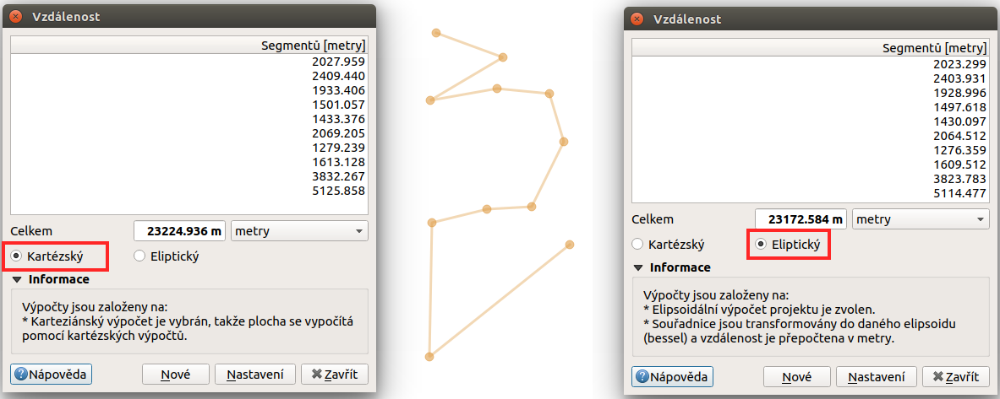
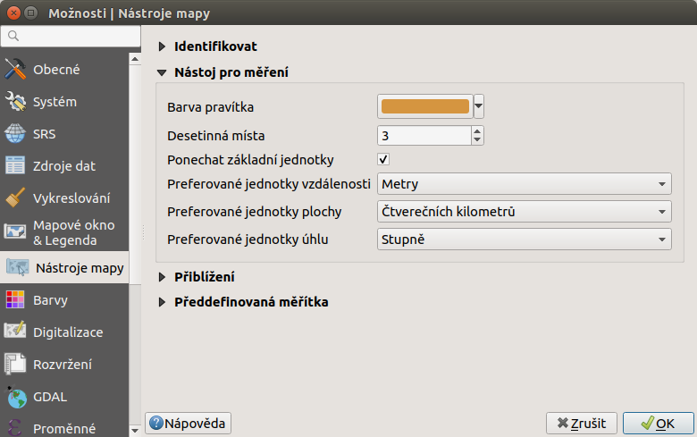
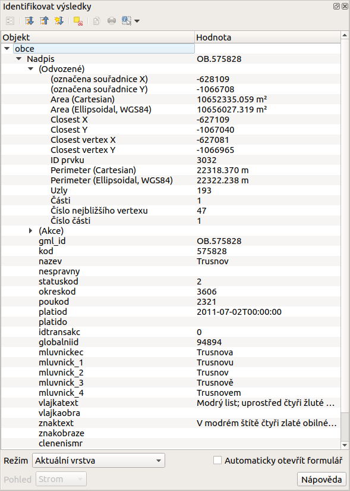

single: rozhraní - popis

# Popis rozhraní

Po spuštění systému QGIS se zobrazí standardní rozhraní. Na obrázku níže
jsou označeny základní části systému.

> [!TIP]
> Vzhled systému QGIS je možné jednoduše měnit dle potřeb. Zobrazování
> jednotlivých nástrojů je možné upravit a přizpůsobit si tak pracovní
> prostředí. Pokud budete rozšiřovat funkčnost systému, tak je dobré si
> vhodně umístit nové nástroje.

<figure>

<figcaption>Základní části systému QGIS (detailní popis částí je
níže).</figcaption>
</figure>

pair: mapové okno; rozhraní - popis

## Mapové okno (1)

V tomto okně se vykreslují všechny zapnuté mapové vrstvy. Vykreslování
odpovídá nastavení každé jednotlivé vrstvy. Pořadí vykreslování vrstev
odpovídá pořadí v panelu vrstev. Ty se tedy překreslují přes sebe
všechny i když se vzájemně plně nebo jenom částečně překrývají. Pokud
překreslování mapového okna trvá delší dobu je vhodné nechat překreslit
pouze nezbytné vrstvy.

pair: přepínač vrstev; rozhraní - popis

## Panel vrstev / Panel prohlížeče (2)

Přepínač vrstev zobrazuje všechny přidané vrstvy. Jejich zobrazení
poskytuje rychlou informaci o jejich pozici a grafickém zobrazení v
mapovém okně. Kliknutím pravého tlačítka na vybranou vrstvu se vyvolá
kontextové menu k dané vrstvě. V tomto menu je možné najít vše od
stylování vrstvy až po export dat.

Podle typu ikonky před názvem vrstvy je možné rychle identifikovat, zda
se jedná o vektorovou nebo o rastrovou vrstvu. U vektorové vrstvy se
typicky rozlišuje mezi polygonovou (plošnou), liniovou anebo bodovou
vrstvou. Zobrazení symbolů záleží na aktuálního nastavení symbologie
dané vrstvy. Pokud nejde o jednoduchý symbol, tak je možné pomocí
trojúhelníčku na začátku řádku rozbalit všechny položky stylování dané
vrstvy. Pokud chceme rychle změnit konkrétní symbol, tak je možné se
pomocí dvoukliku přepnout přímo do editace symbolu. Pokud má vrstva
vícero různých symbolů, tak je možné zapínat symboly každé skupiny
zvlášť přímo pomocí zaškrtávátka u každého symbolu. Není proto nutné
dělat změny v nastavení symbologie (platí u vektorových vrstev).

Vykreslování vrstvy v mapovém okně lze zapnou pomocí zatrhnutí okénka na
úrovni každé vrstvy.

Změnit pořadí vrstev lze pomocí tažení vrstvy na jinou pozici.

V případě práce s velkým počtem vrstev je možné shlukovat tématicky
vrstvy do tzv. skupin. Vytvoření skupiny je pomocí tlačítka Přidat
skupinu. Ta se automaticky přidá do seznamu vrstev s výchozím
názvem, který je možné změnit (přes kontextové menu skupiny). Vrstvy lze
do skupiny přidat pomocí přetažení. U skupiny lze vykonávat některé
vybrané funkce, jako i u běžných vrstev a některé jsou specifické.

Vrstvu lze z projektu odstranit. Neznamená to, že by se smazala, pouze
nebude součástí aktuálního projektu. Odstranit vrstvu lze z jejího
kontektového menu, nebo pomocí tlačítka Odstranit
vrtvu/skupinu. Tuto akci lze provést i pro více vrstev naráz. Ty
lze ozbačit za pomocí kláves `Ctrl` anebo `Shift` a pak vyvolat
kontextové menu pro všechny označené vrstvy.

Panel prohlížeče slouží k zjednodušení přístupu ke geodatům. Umožňuje
přistupovat k různým typům dat, např. vektorovým, rastrovým, databázím,
službám.

pair: postranní menu; rozhraní - popis

## Datový prohlížeč (3)

Slouží pro správu datových zdrojů jako jsou adresáře se souborovými
formáty jako např. ESRI Shapefile, databázové zdroje jako PostgreSQL,
MSSQL a pod a v neposlední řadě webové služby, viz
`../webove_sluzby/index`.

single: stavový řádek pair: stavový řádek; rozhraní - popis

## Stavový řádek (4)

Obsahuje základní informace o nastavení mapového okna. Jednotlivé části
jsou posány níže.

<figure>

<figcaption>Stavový řádek systému QGIS.</figcaption>
</figure>

pair: souřadnice mapového okna; stavový řádek

### Lokátor (vyhledávač)

Pro lepší orientaci mezi algoritmy, nástroji, vrstvami a dalšími
součástmi je možné používat okno pro vyhledávání - `Lokátor`. Zadáním
části názvu vyhledávané vrstvy nebo nástroje se filtruje mezi všemi
položkami. Výsledky jsou řazeny do kategorií. Na obrázku je vidět, že po
zadání textu se vyhledají vrstvy obsahující vložený text, níže pak
algoritmy s odpovídajícím názvem, ale i nástroje aplikovatelné na
vybrané vrstvy.

<figure>

<figcaption>Vyhledávací okno s ukázkou nalezených výsledků toztříděných
do jednotlivých kategorií.</figcaption>
</figure>

> [!TIP]
> Pokud chceme vyhledávat v konkrétní sekci, například pouze vrstvu nebo
> nástroj, tak můžete nastavit filtrování pouze v konkrétní kategorii.
> Třídění je možné ovlivnit zadáním parametru před samotným textem.
> Parametr je možné napsat přímo jako text, anebo si vybrat ze seznamu.
> Seznam se aktivuje po kliknutí do vyhledávacího řádku. Zkratku buď
> opíšeme a přidáme za ni mezeru, anebo ji dvouklikem vložíme. Za
> zkratku pak píšeme část textu pro vyhledávání. Poslední variantou je
> výběr v menu, které se otevře po kliknutí na symbol lupy.
>
> <figure>
>  alt="images/locator_thema.png" />
> <figcaption>Vyhledávací okno s vyhledáváním omezeným pouze na vrstvy v
> projektu s ukázkou nalezených výsledků.</figcaption>
> </figure>
>
> V případě potřeby je možné upravit nastavení vyhledávání. Je možné
> nastavit, ve kterých skupinách se vyhledává, nebo jakými zkratkami se
> nastavují. Nastavení je v horním menu `Nastavení --> Možnosti`,
> záložka `Lokátor`.
>
> <figure>
>  alt="images/locator_settings.png" />
> <figcaption>Nastavení fungování lokátoru, aktivní skupiny a jejich
> zkratky.</figcaption>
> </figure>

### Informace o stavu

Pole za vyhledávačem je místo, kde se uživateli zobrazují běžné
informace. Příkladem je vypsání zprávy o uložení projektu s vypsáním
cesty k souboru projektu. Kousek dál je místo, kde se zobrazuje ikonka
při překreslování mapového okna. Pokud je zde vykreslená ikonka načítání
, tak se aktuálně překresluje obsah mapového okna. Po ukončení
vykreslování tato ikonka zmizí. Délka překreslování záleží na
vykreslovaném obsahu.

### Souřadnice

Další část stavového řádku slouží pro orientaci v mapovém okně. Zde se
zobrazuje buď aktuální souřadnice ukazatele myši v mapovém okně, nebo
tzv. extent (rozsah území aktuálně zobrazeného v mapovém okně). Ukázka
obou možností je zobrazena na následujícím obrázku. Jako přepínač mezi
uvedenými fukcemi slouží ikona Přepnout rozšíření a zobrazení
pozice myši, resp. Přepnout rozšíření a zobrazení pozice
myši.

<figure>

<figcaption>Možnosti zobrazení souřadnic ukazatele myši nebo rozsahu
mapového okna.</figcaption>
</figure>

pair: měřítko; stavový řádek

### Měřítko

Další funkcí je měřítko. Tato funkce zobrazuje aktuální měřítko mapového
okna. Umožňuje také překreslení mapového okna do jiného měřítka pomocí
výběru z předdefinovaného seznamu měřítek.

<figure>

</figure>

> [!TIP]
> Seznam předdefinovaných měřítek je možné upravit. V menu
> `Nastavení --> Možnosti...` záložka `Nástroje mapy` je část
> `Předdefinovaná měřítka`. Nové měřítko je možné přidat pomocí ikonky
> Přidat předdefinované měřítko a nebo odstranit pomocí
> Odstranit vybrané.
>
> <figure>
>  alt="images/predefined_scales.png" />
> <figcaption>Menu pro upravení předdefinovaných měřítek.</figcaption>
> </figure>

pair: překreslování mapového okna; stavový řádek

### Překreslování mapového okna

Vykreslování v mapovém okně je možné nastavit různým způsobem.
Standardně se kresba v mapovém okně překresluje při následujících
akcích:

- přidání nové vrstvy
- posun nebo zoomování mapového okna
- změna velikosti QGIS okna
- změna viditelnosti vrstvy

V některých případech může překreslování mapového okna trvat déle, než
je vhodné. V takovýchto případech je možné upravit nastavení
vykreslování a `stylování <styl-vrstvy>` jednotlivých vrstev. V případě,
že překreslování není potřebné, tak je možné jej potlačit -mapové okno
se nebude překreslovat. Pro takovéto nastavení je ve stavovém řádku
položka se zaškrtávátkem `Vykreslování`.

> [!TIP]
> Pokud potřebujete přerušit vykreslování, tak je to možné provést
> pomocí vypnutí překreslování. To se může hodit zejména při
> vykreslování náročných vrstev, když je zapotřebí pouze změnit obsah
> mapového okna.

pair: souřadnicový systém mapového okna; stavový řádek

### Souřadnicový systém

Mezi nejdůležitější nastavení patří nastavení souřadnicového systému
mapového okna. Aktuální EPSG kód souřadnicového systému je vidět přímo
ve stavovém řádku vedle ikony .

> [!NOTE]
> Podrobnější informace k problematice souřadnicových systémů ve školení
> `Open Source GIS
> <open-source-gis/soursystemy/index.html>`.

> [!TIP]
> Souřadnicové systémy je možné vybírat podle EPSG kódu. Po instalaci je
> defaultně nastaven souřadnicový systém WGS 84 (`4326`). Pro potřeby
> zpracování geodat na území ČR se však většinou používá souřadnicový
> systém `5514` (S-JTSK). Nastavení přes stavový řádek je však platné
> jenom pro aktuální projekt. Po opětovném spuštění se systém nastaví
> opět na výchozí souřadnicový systém. Jak nastavit výchozí souřadnicový
> systém je popsáno v kapitole `sour-system`.

Pokud potřebujete zjistit detaily o jakékoli aktivitě systému, tak si
nechte vypisovat tzv. logovací zprávy. Záložku s jednotlivými logovacími
zprávami je možné otevřít pomocí ikonky Zprávy. Tyto zprávy
jsou podstatné zejména v případě neočekávaného chování systému.

single: hlavní menu see: hlavní menu; rozhraní - popis

## Hlavní menu (5)

Hlavní menu se skládá ze dvou základních částí. První je standardní menu
v liště a druhou je nástrojová lišta.

V menu se nachází zejména nástroje pro správu systému a jeho nastavení.

> [!TIP]
> Nastavení systému je možné změnit přes `Nastavení -->
> Možnosti...`. Prvním důležitým nastavením je volba souřadnicového
> systému -záložka `SRS`. Zde se nastaví souřadnicový systém pro nový
> projekt a zvlášť pro novou vrstvu.

Nástrojová lišta obsahuje základní nástroje pro práci s projektem a
vrstvami. Vypínání a zapínání jednotlivých nástrojových lišt a oken lze
provádět pravým kliknutím na panel a výběrem z nabídky.

single: pohyb v okně see: pohyb v okně; rozhraní - popis

### Základní nástroje pro pohyb v okně

- Přiblížit, Oddálit -přiblíží/oddálí vybranou
  oblast, pro přibližování bez vybrání oblasti lze použít i kolečko myši

- Zvětšit podle posledního výřezu, Přiblížit na
  další - lze vrátit na předchozí stav přiblížení a zpět

- Přiblížení na vrstvu - přiblíží na rozsah vybrané vrstvy

- Přiblížení na všechny vrstvy -přiblíží na všechny vrstvy v
  projektu

- Posun mapy - umožní posun v mapovém okně tažením, tuto
  funkci lze nahradit stisknutím kolečka myši a následným tažením

  > [!TIP]
  > Při posunu pomocí stisknutí kolečka myši můžeme mít aktivní jinou
  > funkci, např. výběr, vytváření nových prvků atd.

- Obnovit - obnoví zobrazení všech nahraných dat

single: výběr v mapě see: výběr v mapě; rozhraní - popis

### Základní nástroje výběru

Pomocí těchto nástrojů lze ve vektorových datech označit konkrétní
prvky, se kterými hodláme dále pracovat. Toto označení se nazývá
`Výběr`.

- Vybrat prvky oblastí nebo jednoklikem -nejjednodušší tvorba
  výběru
- Vybrat prvky polygonem - vytvořit výběr naklikáním polygonu
- Vybrat prvky kreslením od ruky
- Vybrat prvky poloměrem
- Vybrat prvky pomocí vzorce - viz kapitola `atrdotaz`
- Zrušit výběr ve všech vrstvách -zruší veškerý výběr

> [!TIP]
> Nástroje pro pohyb v okně na základě výběru
>
> - Přiblížit na výběr
> - Posunout mapu na výběr

single: měření see: měření; rozhraní - popis

### Měření v mapovém okně

> [!WARNING]
> Nástroje pro měření jsou závislé na souřadnicovém systému. V případě
> nastavení zeměpisného souřadnicového systému bude výsledek měření
> (délky a plochy) uveden ve stupních. Pro tento účel je nutné mít
> správně nastavený mapový souřadnicový systém. Měření v mapovém okně
> také respektuje nastavení přichytávání (tzv. snapping). U měření délky
> a plochy je rovněž volba typu výpočtu. Buď se výpočet provádí jako
> *kartézský* - výpočet v kartézských souřadnicích (rovina), nebo
> *elipsoidický* - výpočet na sféře (elipsoidu).

V mapovém okně lze použít pro měření následující nástroje z hlavního
menu.

- Měřit linii `Ctrl+Shift+M`
- Měřit plochu `Ctrl+Shift+J`
- Měřit úhel
- Měřit azimut

Pro měření se kliknutím vybere požadovaný nástroj. Zobrazí se dialogové
okno k danému typu měření, kde lze vybrat jednotky měření. Kliknutím do
mapy se začne kreslit požadovaný útvar pro měření. Během kreslení se
určovaná hodnota upravuje dle polohy kurzoru. Definování prkvu kresbou
lze ukončit pravým kliknutím. Nové měření lze začít pomocí tlačítka
`Nové`.

<figure>

</figure>

U měření délek se určuje délka jednotlivých segmentů mezi vrcholy, ale i
součet všech délek.

<figure>

</figure>

> [!TIP]
> Nastavení měření se nachází v menu `Nastavení -->
> Možnosti...` záložka `Nástroje mapy` část `Nástroj pro
> měření`.
>
> <figure>
>  alt="images/measure_units.png" />
> <figcaption>Nastavení měření - jednotky, symbologie,
> hodnoty.</figcaption>
> </figure>

single: identifikace prvku see: identifikace prvku; rozhraní - popis

### Identifikace prvku

Nástroj pro identifikaci prvku slouží pro získání informací o
interaktivně vybraném prvku v mapovém okně. Pro identifikaci je možné
použít menu `Zobrazit --> Identifikovat prvky`, použít klávesovou
zkratku `Ctrl+Shift+I` nebo ikonu Identifikovat prvky.

Po vyvolání nástroje pro identifikaci se kliknutím v mapě vyberou prvky,
které chceme identifikovat.

<figure>

</figure>

Výsledky identifikace se zobrazují v pop-up okně ve formě stromové
struktury. Pokud vybíráme prvky ve vícero vrstvách, tak první úrovní
rozdělení je jméno vrstvy. Na další úrovni je atribut nastavený v menu
vrstvy `Vlastnosti --> Zobrazení`. Na další úrovni se zobrazují 3
skupiny informací:

- Odvozené - informace, které nejsou mezi atributy, ale jsou určené při
  identifikaci (plocha, obvod, délka, poloha - dle typu prvku),
- Akce - interaktivní položky, které vyvolají akci (menu vrstvy
  `Vlastnosti --> Akce`),
- Vlastnosti - seznam atributů daného objektu (z atributové tabulky).

Při vícero vrstvách lze v mapovém okně nastavit režim výběru (v spodní
části okna) a formu zobrazování.

Při pravém kliku na detail v tabulce se vyvolá kontextové menu, které
umožňuje různé možnosti od zoomování na vybraný prvek, kopírování
hodnot, práci s výběrem až po nastavení dané vrstvy.
