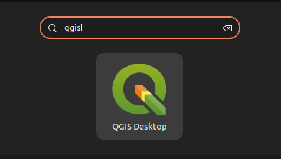
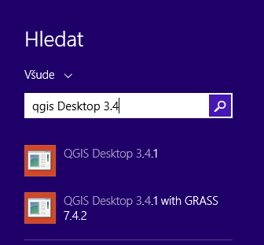

# Úvod do systému QGIS

Po úspěšné instalaci systému QGIS (dle návodu pro `GNU/Linux
<../instalace/linux>` nebo `MS Windows <../instalace/windows>`) je možné
jej spustit a začít okamžitě pracovat.

> [!TIP]
> Pro potřeby testování je možné použít připravená geodata. Při
> instalaci na MS Windows je možné stáhnout dataset již během instalace
> samotného programu, pomocí volby `v průběhu
> instalace <nativni-instalator-data>`. Testovací data je možné
> [stáhnout](http://qgis.org/downloads/data/) i samostatně.

<div class="index">

single: spuštění QGIS

</div>

## Spuštění systému QGIS

Úspěšně nainstalovaný systém by měl být dostupný z hlavní nabídky
operačního systému.

<figure>

<figcaption>Spuštění systému QGIS v Ubuntu 22.4.</figcaption>
</figure>

<figure>

<figcaption>Spuštění systému QGIS z nabídky Start v MS
Windows.</figcaption>
</figure>

<div class="notecmd">

Spuštění QGIS

V systému GNU/Linux je možné spustit QGIS z příkazové řádky jednoduchým
zadáním názvu programu.

``` bash
qgis
```

</div>

Po spuštění programu se objeví standardní pracovní rozhraní systému
QGIS. V tomto rozhraní je možné okamžitě začít importovat data, provádět
analýzy nebo tvořit výstupy. Vzhled samotné aplikace se přizpůsobuje dle
aktuálního nastavení funkčnosti. Popis jednotlivých částí bude vysvětlen
postupně dle potřeby.

> <figure>
>  alt="images/run_qgis.png" />
> <figcaption>Vzhled QGIS po spuštění.</figcaption>
> </figure>

<div class="noteadvanced">

Pokud máte rozpracované projekty v konkrétní verzi a chcete vyskoušet
novou verzi, tak není nutné stávajíci verzi odinstalovat.

Jednotlivé verze jsou schopné pracovat vedle sebe. Navíc jsou schopné
přebírat nastavení. To například znamená, že pokud používáte určité
pluginy, tak budou okamžitě dostupné i v nové verzi. Platí to i zpětně,
když přidáte funkcionalitu v nové verzi, tak je možné ji použít i ve
starší verzi (platí pro nástroje kompatibilní pro nainstalované verze).

</div>

<div class="todo">

pridat ikonky ?

</div>
