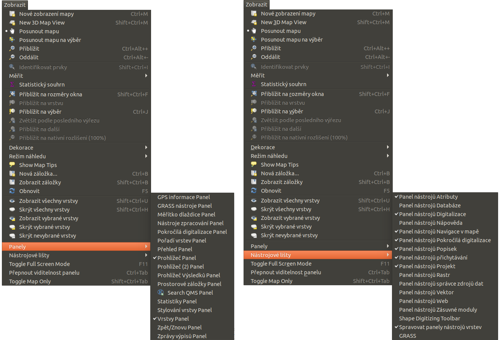
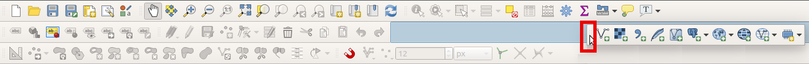
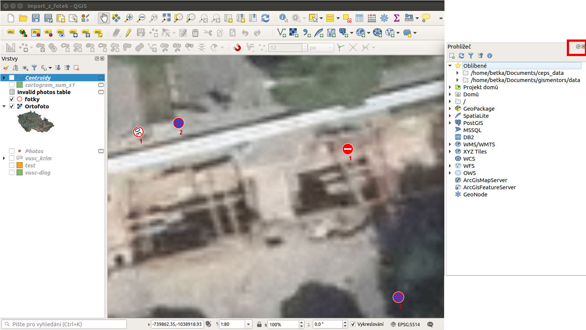
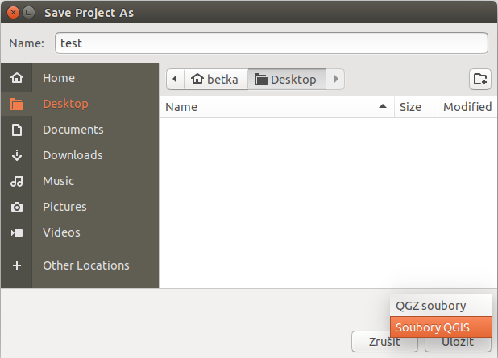
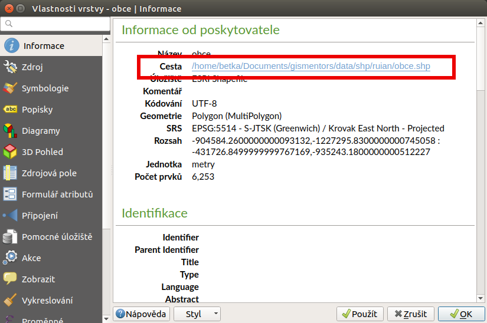
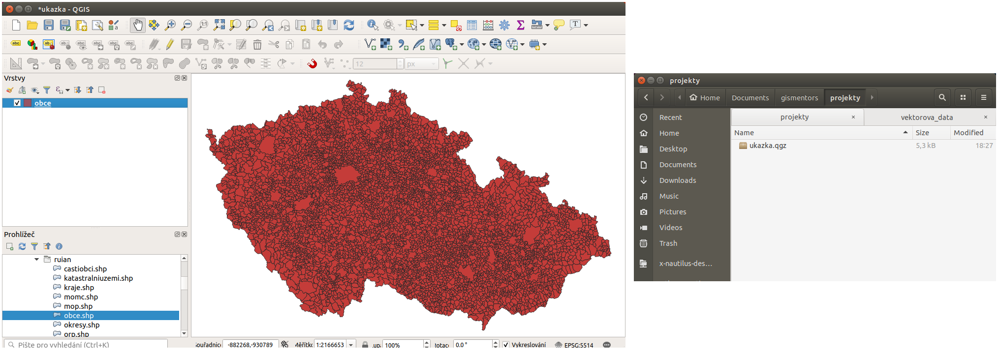
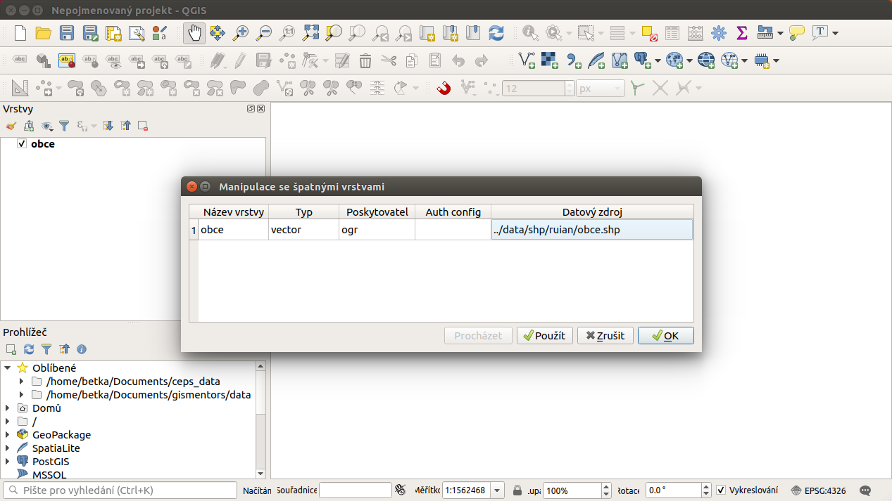
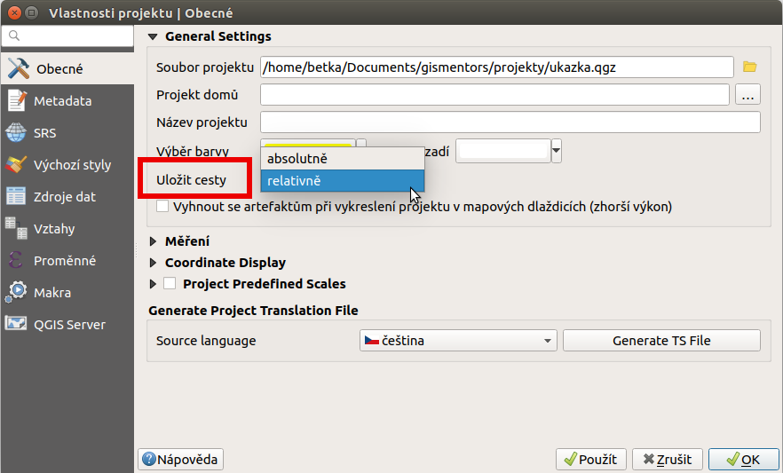
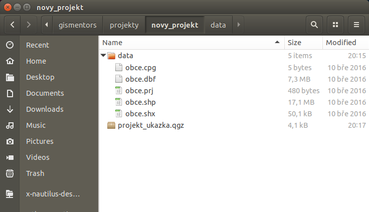
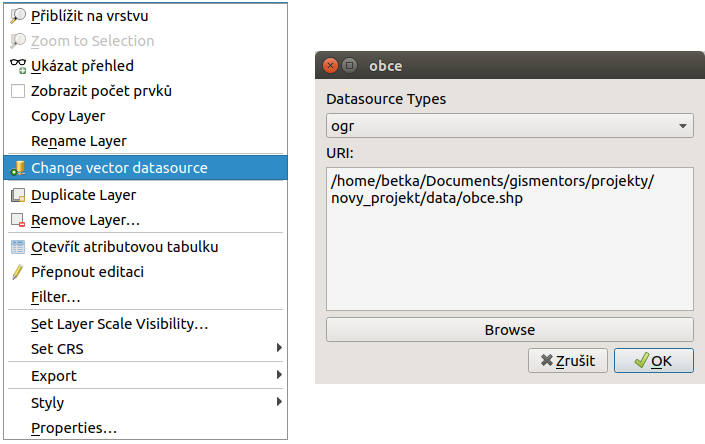

# Základní nastavení

QGIS je široce využitelný a zároveň lehce přizpůsobitelný pro různé typy
uživatelů. V této kapitole jsou popsané vybrané části nastavení, které
umožní uživateli upravit si rozhraní a pracovat co nejlépe s nastavením
programu. Část nastavení, které tematicky patří k určitému typu úloh
může být součástí jiných kapitol.

## Nastavování panelů a nástrojových lišt

Rozhraní QGISu se po instalaci zobrazuje ve výchozím nastavení. Součástí
tohoto nastavení jsou i `Nástrojové lišty` a `Panely`. Každý nástroj je
možné aktivovat nebo deaktivovat. Aktuální seznam je možné otevřít buď
kliknutím pravého tlačítka do prázdné části sekce s nástroji, nebo přes
`Zobrazit --> Panely`, `Zobrazit --> Nástrojové
lišty`.

<figure>

<figcaption>Menu pro aktivaci a deaktivaci Panelů a Nástrojových
lišt.</figcaption>
</figure>

(De)aktivace každé položky se provádí kliknutím na danou položku v
seznamu. Menu se automaticky zavře a změna aktivace se automaticky
aplikuje. Aktuální status každé položky je vyznačen formou zašktávacího
políčka před jeho názvem.

Nástrojovou lištu lze umístit, nebo přemístit dle potřeb tažením za část
lišty vyznačenou v obrázku. Modře se vyznačuje místo kam bude lišta
umístěna.

<figure>

<figcaption>Ukázka přesunu nástrojové lišty tažením.</figcaption>
</figure>

Panel je možné také přemístit tažením. Panely nemají speciální místo
uchycení, používá se volná část v záhlaví. Panel je možné zavít přímo
tlačítkem v jeho záhlaví (jeho opětovné zapnutí - aktivaci je nutné
provést jak je popsáno výše).

Pokud je to pro práci výhodné, tak je možné panel přemístit do
samostatného okna. Buď tažením mimo vyhrazený prostor, nebo pomocí
tlačítka v záhlaví panelu samotného.

<figure>

<figcaption>Samostatné okno panelu prohlížeče a ikony na jeho
ovlávání.</figcaption>
</figure>

single: QGIS projekt

## QGIS projekt

Aktuální nastavení systému QGIS při práci je možné uložit. Takovéto
nastavení se ukládá do tzv. projektu. Uložení do projektu umožňuje
opětovné načtení všech dat i s kompletním nastavením systému.

Uložit projekt lze ve dvou základních variantách. Jednou z nich je
samostatný `.qgs` soubor. Druhou je volba komprimovaného souboru `.qgz`,
který obsahuje samotný projekt ve formě `.qgs` a `.qgd` kde se ukládají
různá lokální nastavení a parametry.

<figure>

<figcaption>Volba typu uložení projektu.</figcaption>
</figure>

QGIS projekt je ukládán jako XML soubor. Vzhledem k tomu, že se jedná o
textový formát, lze jej editovat i mimo samotný QGIS. Je však nutné znát
strukturu formátu, a proto tento postup lze doporučit pro opravdu
pokročilé uživatele a spíše v extrémních případech. Soubor `.qgd` je
souborová SQLite databáze projektu. Lze ji také upravovat nezávisle na
projektu pomocí běžných nástrojů pro SQLite databázi.

## Nastavení projektu - uložení dat

Základím obsahem projektu jsou data. Každá vrstva v projektu má jasně
určený zdroj, ze kterého se do projektu načítá. Data mohou pocházet z
různých zdrojů, zde jsou různé způsoby ukládání dat včetně základních
typických příkladů: \* lokální souborová data (např. shapefile uložený
přímo na disku) \* sdílená souborová data (např. shapefile uložený na
sdíleném disku) \* databáze (data dostupná pomocí přiděleného
uživatelského připojení ke konkrétní databázi) \* veřejně dostupná data
(data třetích stran - pouze zdroj dat, je potřebné data někam uložit) \*
OGC webové služby (přístup k datům třetích stran pomocí
standardizovaných služeb)

Mezi nejpoužívanější typ dat patří lokální souborová data v různých
formátech. Pokud například přidáme do projektu vrstvu typu shapefile,
tak je cesta k souboru zapsána ve vlasnostech vrstvy, sekce
`vektor-informace`.

<figure>

<figcaption>Cesta k datům u vrstvy "obce".</figcaption>
</figure>

Na obrázku níže je vidět, že vrstva je uložená jako
`/home/betka/Documents/gismentors/data/shp/ruian/obce.shp`. Projekt je
uložený jako `ukazka.qgz` v samostatném adresáři. Celá cesta k souboru
je `/home/betka/Documents/gismentors/projekty/ukazka.qgz`.

<figure>

<figcaption>Projekt "ukazka" a jeho umístění.</figcaption>
</figure>

Pokud bude potřebné existující projekt zkopírovat, musí být dostupná i
všechna použitá data. V případě výše zobrazeného projektu, by tedy bylo
nutné zkopírovat minimálně soubory

- /home/user/Documents/gismentors/data/shp/ruian/obce.shp
- /home/user/Documents/gismentors/data/shp/ruian/obce.shx
- /home/user/Documents/gismentors/data/shp/ruian/obce.dbf

Při kopírování projektu a dat většinou dojde k jejich uložení do
odlišných adresářů. Následkem toho se při otevírání projektu otevře
dialog s popisem **Manipulace se špatnými vrstvami**. V dialogu jsou
vypsány všechny vrstvy projektu, u kterých nebyly na dané lokalitě
nalezeny potřebné soubory.

<figure>

<figcaption>Dialog s vrstvami, u kterých nebyl nalezen
zdroj.</figcaption>
</figure>

V případě, že se jedná o malý počet vrstev, tak je možné pomocí označení
vrstvy a tlačítka `Procházet` otevřít okno na prohlížení adresářů. Zde
je možné najít aktuální uložení dat a potvrzením výběru přepsat
nastavení cesty k datům přímo v projektu. Cestu lze manuálně přepsat
přímo v dialogu, ale je nutné dbát na to, aby byla validní. Pokud u
daných vrstev nebude nastavena správná cesta, tak po potvrzení dialogu
bude uživatel upozorněn, že dané vrstvy budou z projektu odstraněny.

Zapsání umístění dat v projektu je možné ve dvou režimech. První z nich
zapíše celou cestu k souboru - **absolutní**, druhý zapíše cestu od
složky uložení projektu - **relativní**. To jak se ukládá cesta k datům
v projektu je nastaveno v `Projekt --> Properties...`, záložka Obecné.

<figure>

<figcaption>Nastavení ukládání cest v projektu.</figcaption>
</figure>

Relativní ukládání dat je výhodné v případě, že předem víme, že budeme
dále kopírovat projekt i s daty, například kolegům. Ideální je vytvářet
projekt tak, že vytvoříme samostatný adresář, do kterého uložíme jak
data, tak projekt samotný. Pokud budeme chtít předat tento projekt, tak
zkopírujeme celý adresář. Ten bude fungovat bez jakýchkoli upozornění na
umístění dat.

<figure>

<figcaption>Adresář s projektem spolu s uloženými daty.</figcaption>
</figure>

V některých případech jsou k dispozici data na sdílených uložištích
(hlavně ve firmách a institucích) a jejich kopírování do každého
projektu je nežádoucí. Je samozřejmostí, že je nevyhutné mít právo
alespoň na čtení těchto dat. Pokud bude projekt obsahovat takováto data,
tak je vhodné používat absolutní cesty k datům.

Pokud je nutné kombinovat datové zdroje, tak je na zvážení, která z
možností je pro uživatele výhodnější.

> [!TIP]
> V projektu je cesta k datům zapsaná bez možnosti přímé editace. Cestu
> k datům je možné přepsat přímo v projektu - editovat ručně. Druhá
> možnost je použít plugin **changeDataSource**. Ten přidá do
> kontextového menu vrstvy novou položku. V případě vektorové vrstvy se
> jedná o položku `Change vector datasource`, která otevře dialogové
> okno, ve kterém je možné nastavit typ vrstvy a přepsat cestu manuálně,
> nebo přes tlačítko použít dialog pro vyhledání souborů. Po uložení
> nového zdroje dat se daná vrstva načítá z nově nastavené cesty.
>
> <figure>
>  alt="images/change_data_source.png" />
> <figcaption>Použití pluginu pro změnu zdroje dat.</figcaption>
> </figure>
