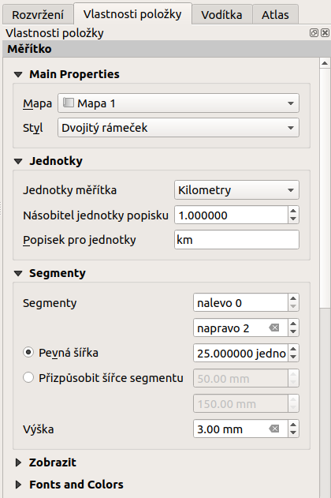

single: mapové elementy

# Prvky mapového výstupu

Mapový výstup může obsahovat různé součásti (mapové pole, legenda,
titulek, měřítko a jiné). Nastavení celého výstupu je popsáno krok po
kroku až po export výstupu.

pair: tvůrce map; nastavení pracovních panelů

## Zobrazení pracovních panelů

Pro příjemnou práci při tvorbě výsledků je vhodné mít nastavené
zobrazování jednotlivých panelů. *Vypnout/zapnout* panel je možné v menu
`Zobrazit --> Panely`, kde se nastaví viditelnost jednotlivým panelům.
Na obrázku `panels` je zobrazeno doporučené nastavení zobrazených
panelů.

<figure>

<figcaption>Nastavení zobrazení a skrytí jednotlivých
panelů.</figcaption>
</figure>

pair: mapové elementy; obsah mapového okna

## Obsah mapového okna

Pomocí ikony
 Přidat novou mapu se aktivuje funkce pro
přidání výřezu s mapovým oknem. Dalším krokem je umístění výřezu pro
mapové okno do pracovní plochy pomocí tažení myši. Po umístění se do
výřezu načte obsah mapového okna.

<figure>

<figcaption>Výřez s obsahem mapového okna a jeho detailní
nastavení.</figcaption>
</figure>

Velikost výřezu a jeho polohu lze měnit pomocí tahání za jeho hrany nebo
uchopení za jeho obsah a posun. Pokud potřebujeme posunout obsah mapy,
pak použijeme nástroj
 Posunout obsah položky a
interaktivně změníme rozsah pomocí tažení.

> [!TIP]
> Výřez s mapovým oknem má vícero dalších nastavení. Rozšířené nastavení
> je dostupné pro každý prvek přidaný do mapového výstupu. V části
> `Položky` se nachází přehled všech prvků přidaných v mapovém výstupu.
> Označením vybraného prvku se v části `Vlastnosti položky` otevře
> detailní nastavení konkrétního mapového prvku.
>
> <figure>
>  alt="images/map_items.png" />
> <figcaption>Dostupné položky u nastavení mapového okna.</figcaption>
> </figure>

Obsah výřezu byl při jeho umístění vygenerován dle aktuálního rozsahu
mapového okna. Manipulace obashu mapy a jeho překreslování je možné
ovládat pomocí sady tlačítek v horní části detailu prvku
`Vlastnosti položky`.

- Aktualizovat náhled mapy - aktualizace obsahu mapového okna
- Nastavit rozsah mapy tak, aby odpovídal hlavnímu rozsahu
  plátna
- Zobrazit aktuální rozsah mapy na hlavním plátně
- Nastavit měřítko mapy tak, aby odpovídalo měřítku hlavního
  plátna
- Nastavit hlavní plátno tak, aby odpovídalo aktuálnímu měřítku
  mapy
- Záložky nastavení mapového okna dle existujících záložek
-  Interaktivně upravit rozsah
  mapy totožná funkcionalita pro změnu rosahu tažením
- Nastavení tvorby popisků speciální chování popisků v
  mapovém výstupu - jejich posun na okrajích, blokování popisků

V první sekci nastavení lze nastavit přesné měřítko mapového okna, jeho
natočení, nebo specifický souřadnicový systém.

V části `Rozsahy` lze přesně nadefinovat rozsah mapového okna v
souřadnicovém systému mapového projektu.

<figure>

<figcaption>Hlavní nastavení položky mapového okna.</figcaption>
</figure>

pair: mapové elementy; souřadnicová mřížka

Častou součástí mapového výřezu je i souřadnicová mřížka - grid s
popisem souřadnic. Grid lze přidat a nastavit v položce `Mřížky`. Lze
nastavit styl gridu (linie, křížky, jiné symboly, jenom rám se
souřadnicemi) a dále nastavit interval a styl vykreslování.

> [!TIP]
> Pro grid lze definovat souřadnicový systém odlišný od projektu.

<figure>

<figcaption>Mapové okno s gridem a souřadnicemi.</figcaption>
</figure>

<figure>

</figure>

Nastavení popisků gridu je umístěno v části `Vykreslit
souřadnice`. Lze nastavit formát vystupu, počet desetinných míst font i
barvu. Popisky jsou rozděleny do jednotlivých částí mapového okna (levá,
pravá, horní, dolní). Každou stranu lze nastavit samostatně -zda se
zobrazuje, pozici vůči rámu, orientaci a řazení.

<figure>

<figcaption>Nastavení zobrazování popisových souřadnic
gridu.</figcaption>
</figure>

pair: mapové elementy; titulek

## Text (titulek, tiráž, doprovodný text)

Obvyklým požadavkem pro mapový výstup je textové pole s titulkem.
Textové pole se přidá pomocí ikonky
 Přidat nový popísek. Umístění textového
pole probíhá stejně jako je popsané u mapového výřezu.

Jednotlivá nastavení pro obsah tohoto pole jsou opět dostupná přes
záložku `Vlastnosti položky`. Lze zde nastavit samotný text, jeho font,
zarovnání, orámování, pozadí a další různé. Textové pole se dále využivá
např. pro vložení tiráže či dalšího doprovodného textu

pair: mapové elementy; legenda

## Legenda

Další obvyklou součástí mapového výstupu je legenda. Ta má popisovat
jednotlivé prvky, které jsou zobrazovány. Přidání legendy do mapového
výstupu je možné pomocí ikonky
 Přidat novou legendu. Umístění položky
legendy do mapového okna je provedeno stejně jako u předchozích položek.

Obsah legendy je vygenerován v momentě jejího umístění a na základě
nastavení stylů jednotlivých vrstev zobrazovaných v mapovém okně. V
ideálním případě se všechny úpravy provádí v nastavení vrstev tak, aby
byl minimalizovaný počet ručních úprav v tomto kroku.

Obsah legendy je možné upravovat podobným způsobem jako ostatní prvky
(`Vlastnosti položky`). Lze upravit název, zarovnání, odsazování a další
vizuální nastavení pro zobrazování legendy.

Dále lze upravit i jednotlivé položky legendy, ubrat, přidat novou,
změnit text i zařazení jednotlivých položek v rámci legendy samotné.

<figure>

<figcaption>Přidaná legenda a úprava jejích položek.</figcaption>
</figure>

> [!TIP]
> Pokud upravujete legendu, tak se může stát, že se změnami nebudete
> spokojeni. V případě, že nechcete změny v nastavení provést ručně,
> můžete legendu vygenerovat z dat znova pomocí tlačítka
> `Aktualizovat vše`.

pair: mapové elementy; atributová tabulka

## Atributová tabulka

V některých případech je vhodné umístit do mapového výstupu i část
atributové tabulky. Tuto lze přidat pomocí tlačítka
 Přidat atributovou tabulku.

Všeobecná nastavení tabulky a jejího vzhledu se nachází v části
`Vlastnosti položky`. Pokud je v projektu přidáno vícero vrstev, které
mají atributovou tabulku, tak se nastaví zdrojová vrstva pro atributovou
tabulku do mapového výstupu.

<figure>

<figcaption>Atributová tabulka vybrané vrstvy přidaná v mapovém
výstupu.</figcaption>
</figure>

Úprava samotné tabulky se nachází pod tlačítkem `Atributy...`. V tomto
menu jsou 2 základní části. V první části se manipuluje s atributy. Zde
se vyberou všechny atributy, které se v tabulce mají zobrazit

, jejich pořadí

, může se zde nastavit titulek pro atribut, ale i
zarovnávání hodnot.

V druhé části se nastavuje řazení dat v tabulce. Řazení se řídí
definovanými pravidly. Každé pravidlo musí obsahovat atribut, podle
kterého se tabulka bude řadit, a typ řazení (sestupně nebo vzestupně).
Takto nadefinované pravidlo se pak tlačítkem
 přidá do seznamu pravidel. Jednotlivá pravidla se vypisují
do pole pod sebe. Jejich pořadí je možné měnit a ovlivnit tak přesné
vypsání tabulky do mapového výstupu.

<figure>

<figcaption>Nastavení zobrazení atributové tabulky v mapovém
výstupu.</figcaption>
</figure>

pair: mapové elementy; měřítko

## Měřítko

Běžnou součástí výstupu je také měřítko. To lze přidat pomocí ikony
 Přidat nové grafické měřítko a vložením
prvku do výstupu. Výběr stylu a další nastavení je dostupné v záložce
`Vlastnosti položky` viz `legenda-nastaveni`. Nejdůležitější je výběr
stylu legendy v položce `Styl`. Lze vybrat z grafických měřítek nebo
zvolit číselné měřítko. Dále lze nastavit jednotky a jejich popisek.
Dále jsou pak ostatní nastavení pro vzhled měřítka.

<figure>

<figcaption>Detailní nastavení měřítka.</figcaption>
</figure>

pair: mapové elementy; směrová růžice

## Směrová růžice

Do mapového výstupu lze přidat také směrovou růžici - pomocí ikony
Přidat směrovou růžici. Pokud nemáme žádný obrázek růžice,
najdeme několik typů růžic v základní QGIS SVG knihovně. Zdrojový
obrázek zvolíme v záložce `Vlastnosti položky`, zde jsou dostupná také
další nastavení, např. rotace, která je za určitých okolností u směrové
růžice nutná a lze ji nastavit automaticky.

Na obrázku `arrow` je vidět nastavení synchornizace s vybraným mapovým
oknem a nastevní na *skutečný sever*, které nastaví rotaci růžice
automaticky.

<figure>

<figcaption>Nastavení směrové růžice.</figcaption>
</figure>

## Obrázek

Tento nástroj je totožný s nástrojem pro přidání směrové růžice. Je
dobré si uvědomit, že obsah přidaného obrázku je pouze na uživateli a do
mapového výstupu může přidat různý obsah.

## Šipka

Alternativní možností vytvoření směrové ružice může být pomocí ikony
 Přidat šipku. Tato funkce je primárně
určena ke kreslení šipek ve smyslu znázornění vztahů mezi jednotlivými
součástmi mapové kompozice. Držením klávesy `Shift` při kreslení šipky
se nám kurzor bude přichytávat po 45°. Směrová růžice může být
vykreslena různou symbologií. Výběr symbologie a další nastavení jsou
dostupné v záložce `Vlastnosti položky`. Lze zde ponechat defaultní styl
prvku, kdy se vykresluje jednoduchá šipka. Je možné použít i složitější
nastavení - například použít vlastní svg symboly pro začátek a konec
šipky.

<figure>

<figcaption>Detailní nastavení směrové šipky.</figcaption>
</figure>

pair: mapové elementy; další prvky mapového výstupu

## Další prvky

Do mapového výstupu můžeme také přidat základní geometrické tvary
 Přidat tvar, rýsovat polygony a linie
 Add Node item, nebo přidat HTML kód
 Přidat HTML rám.
