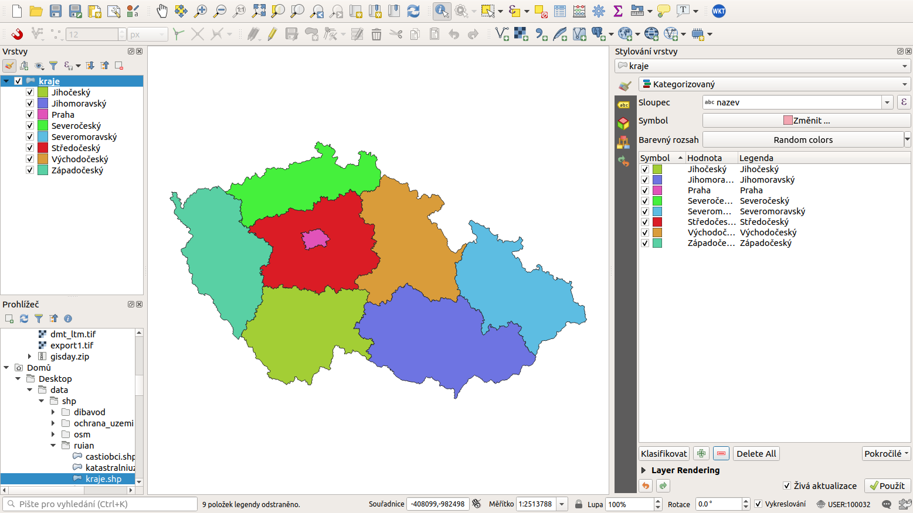
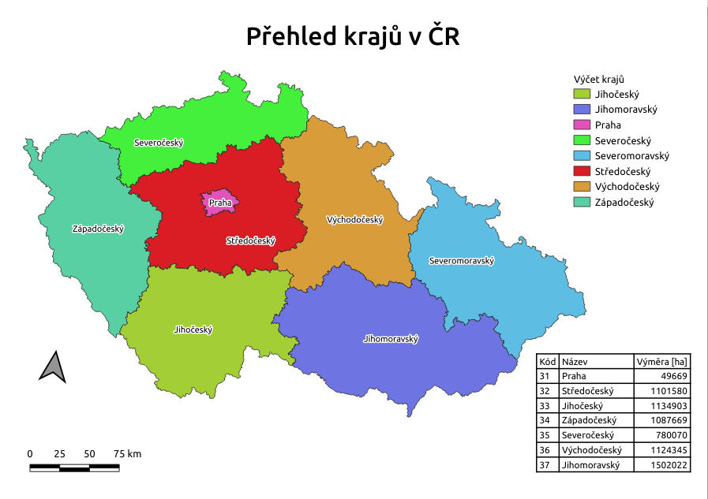
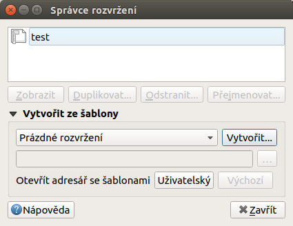
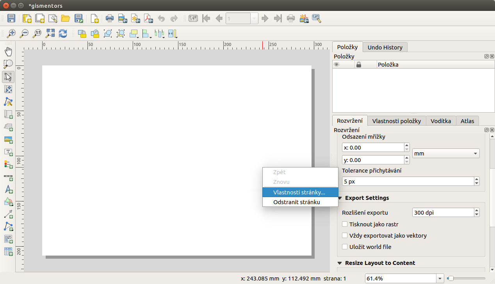
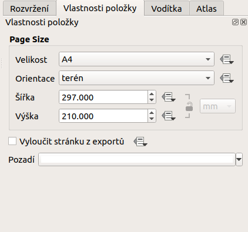
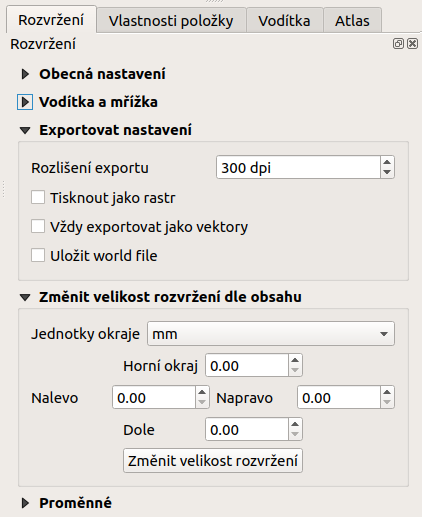

see: tvůrce map

# Tiskové rozvržení (Print Layout)

Systém QGIS dokáže pracovat s různými formáty a zobrazovat je v mapovém
okně (viz `map-window`). Obsah mapového okna lze jednoduše vyexportovat
jako obrázku (`Projekt -->
Import/Export --> Eportovat mapu jako obrázek.../pdf`). To však v řadě
případů nemusí stačit, hlavně když vyžadujeme mapový výstup určený pro
tisk.

Pro vytvoření mapového výstupu určeného pro tisk, který si zachová
nastavení vrstev (stylování, popisky a další) z projektu, slouží
samostatný nástroj *Rozvržení (Print Layout)*. Tento nástroj je dostupný
z menu `Projekt --> Správce rozvržení...`.

<figure>

<figcaption>Mapové okno zobrazující vrstvy dle jejich
stylování.</figcaption>
</figure>

<figure>

<figcaption>Ukázka možného výstupu z nástroje Rozvržení.</figcaption>
</figure>

Nástroj Rozvržení umožňuje vytvořit na základě dat mapový výstup v běžně
používaných formátech, jakými jsou např. `PDF, PNG, JPEG` a další.
Takovýmto způsobem je možné prezentovat jednotlivá data, jejich
kombinaci nebo výsledky různých analýz i bez potřeby speciálních
kartografických systémů.

pair: tvůrce map; správce tvorby mapy

## Správce vytváření map

Systém QGIS umožňuje vytvářet víc než jeden mapový výstup na daný
projekt. Zpravování jednotlivých mapových výstupů umožňuje *Správce
rozvržení* dostupný z menu `Projekt --> Správce rozvržení...`.

<figure>

<figcaption>Otevření Správce pro vytváření mapových
výstupů.</figcaption>
</figure>

Zde se nachází okno, kde jsou uvedeny všechny vytvořené mapové výstupy.
Pokud není doposud žádný vytvořený, tak je seznam prázdný a pomocí
tlačítka `Create...` se dá vytvořit nový.

<figure>

<figcaption>Zakládání nového mapového výstupu.</figcaption>
</figure>

Vyskočí okno pro zadání názvu nově vytvářeného mapového výstupu. Po
zadání názvu a potvrzení tlačítkem `OK` se tento vytvoří a následně se
otevře okno pro editaci a úpravu samotného mapového výstupu.

> [!TIP]
> Existující mapový výstup lze zkopírovat pomocí tlačítka
> `Duplicate...`. Mapový výstup ke zkopírování se označí a pak se
> stiskne zmíněné tlačítko. V otevřeném okně se pak nastaví nový název
> mapového výstupu.

Pokud chcete otevřít existující mapový výstup, tak jej v seznamu
*Správce rozvržení* vyberte a tlačítkem `Zobrazit` otevřete. Všechny
existující mapové výstupy jsou přístupné také z menu
`Projekt --> Rozvržení`.

pair: tvůrce map; nastavení pracovní plochy

## Nastavení pracovní plochy

Jako první je nutné nastavit základní vlastnosti pro pracovní plochu a
pro export.

První část je nastavení stránky. Toto je dostupné po kliknutí pravým
tlačítkem na plochu stránky pod položkou `Vlastnosti stránky...`. V
pravé části se otevře nastavení stránky v záložce `Vlastnosti položky`.

<figure>

<figcaption>Okno nového rozvržení výstupu.</figcaption>
</figure>

<figure>

<figcaption>Zakládání nového rozvržení- vlastnosti stránky.</figcaption>
</figure>

Zde se nastaví velikost "papíru", jeho orientace a barva pozadí. Tyto
hodnoty lze přenastavit i v průběhu práce.

Další část nastavení je v záložce `Rozvržení`. Zde je možné nastavit
další části výstupu jako je nastavení výstupu při exportu.

<figure>

<figcaption>Zakládání nového rozvržení - export.</figcaption>
</figure>

Do takto nastavené pracovní plochy lze začít přidávat jednotlivé prvky.

> [!TIP]
> Při tvorbě profesionálních mapových výstupů se doporučuje používat 400
> DPI. Pro běžné použití je vhodné ponechat původní nastavení 300 DPI.
>
> V některých případech je nutné najít vhodnou kombinaci měřítka
> zobrazovaného mapového výřezu, velikosti podkladového papíru a
> příslušného DPI.
>
> DPI je zkratka pro *Dots per inch*, více informací na
> `Wikipedii <DPI>`.
