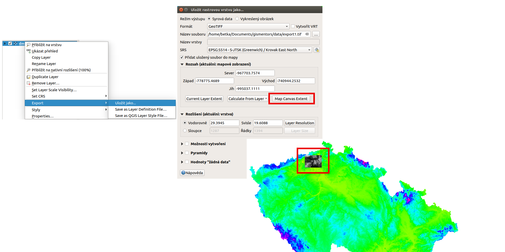
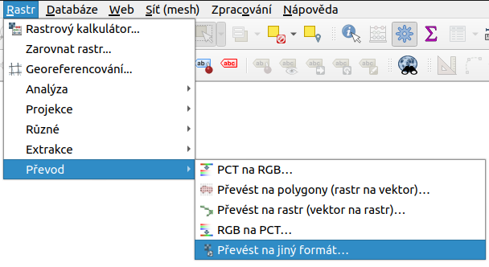
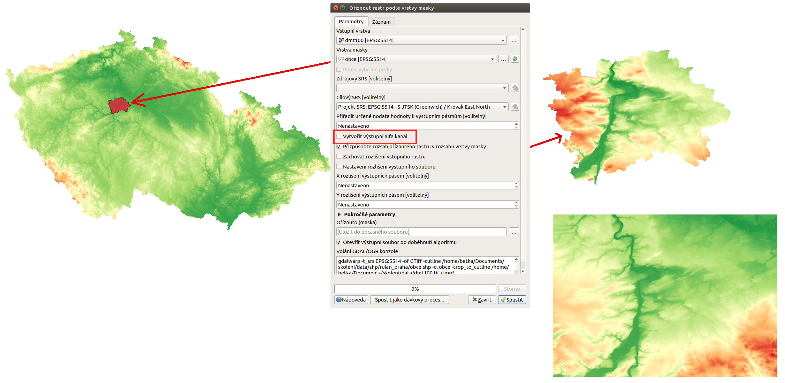
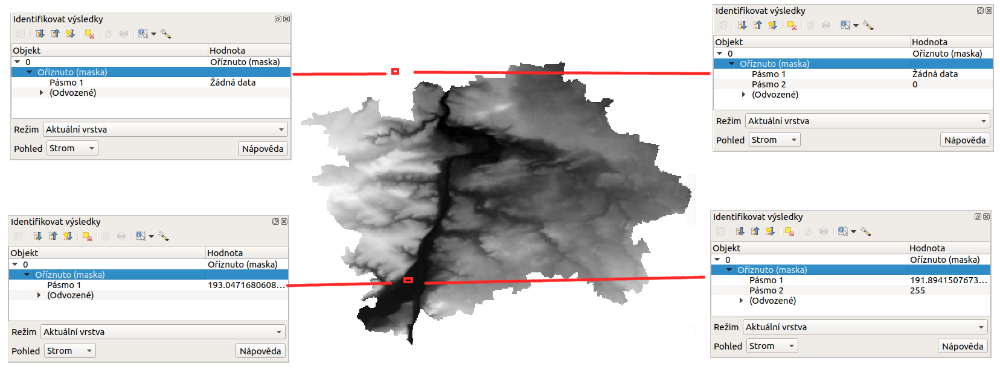

pair: rastrová data; export dat

# Export rastrových údajů

Existuje množství rastrových formátů, které jsou obvykle odlišené dle
přípony souborů. Díky knihovně GDAL umožňuje QGIS export do velkého
množství různých běžně používaných formátů.

Data je možné exportovat dvěma způsoby. Pokud potřebujeme vrstvu uložit
(exportovat) v tom samém formátu, protože pracujeme například jenom s
částí zájmového území, použijeme volbu `Export -->
Uložit jako...`. Tato volba je dostupná z kontextového menu na vybranou
vrstvou. Objeví se dialogové okno, kde se dá nastavit režim výstupu
(surová data nebo vykreslený obrázek), název, souřadnicový systém,
rozsah, rozlišení, možnosti vytvoření a další parametry nově exportované
vrstvy. Po spuštění se nová vrstva přidá do mapového okna (`saveas`).
Pomocí volby rozsahu lze vybrat rozsah aktuálního mapového okna, nebo
odvodit od rozsahu jiné vrstvy (i vektorové). Takto může export sloužit
na výběr území, transformaci do jiného souřadnicového systému, změnu
velikosti buňky rastru, použití komprese, nebo i vytvoření pyramid.

<figure>

<figcaption>Export rastrové vrstvy pomocí <code class="interpreted-text"
role="item">Uložit jako...</code>.</figcaption>
</figure>

Pokud potřebujeme rastrovou vrstvu uložit v jiném formátu, použijeme
`Rastr --> Převod --> Převést na jiný formát` (`menu-prevod`). V
dialogovém okně nastavíme vstupní vrstvu, cílový souřadnicový systém a
ostatní dle potřeby.

<figure>

<figcaption>Export rastrové vrstvy do jiného formátu.</figcaption>
</figure>

## Ořezání rastru

Výše popsaný nástroj pro export je poměrně komplexním nástrojem na
vytvoření odvozeného rastru. V podstatě se jedná o nástroj pro ořezávání
rastru rozsahem. Ať už zadáním přes mapové okno, nebo pomocí rozsahu
jiné vrstvy. Nástroj se stejnou funkcionalitou je k dispozici v horním
menu `Rastr -->
Extrakce --> Oříznout rastr podle rozsahu...`.

Dalším nástrojem na ořezání rastru je varianta pro ořez podle polygonové
vrstvy. Tento je umístěn ve stejném menu `Rastr -->
Extrakce --> Oříznout rastr podle masky...`.

Na obrázku `raster-extract` je vidět příklad ořezání rastrové vrstvy
celé ČR pomocí hranic hlavního města Prahy (polygonová vrstva krajů s
aplikovaným filtrem). Výslední vrstva má tvar pravoúhelné mřížky, za
použití tzv. "no data" hodnoty. Níže je výsledek ořezání pomocí
rozsahu - celý rastr obshauje hodnoty z původního rastru.

<figure>

<figcaption>Ořez rastru pomocí polygonové vrstvy, porovnání s výsledkem
ořezu rozsahem.</figcaption>
</figure>

Pokud při ořezání nezatrhneme volbu `Výstupní alfa kanál`, tak je
výstupem rastr s jedním kanálem, kde je použita hodnota "no data" mimo
oblast pokrytí masky. V místě pokrytí je pak ponechána hodnota původního
rastru. Ukázka je na obrázku `raster-ext-alpha` v levé sekci.

Pokud použijeme volbu na vytvoření alfa kanálu, tak výstupní rastr
obsahuje dva kanály, místo původního jednoho. V pravé části obrázku
`raster-ext-alpha` je pak vidět hodnoty ve výstupním rastru, který
obsahuje i alfa kanál.

<figure>

<figcaption>Porovnání ořezu rastru s použitím alfa kanálu a bez
něj.</figcaption>
</figure>

