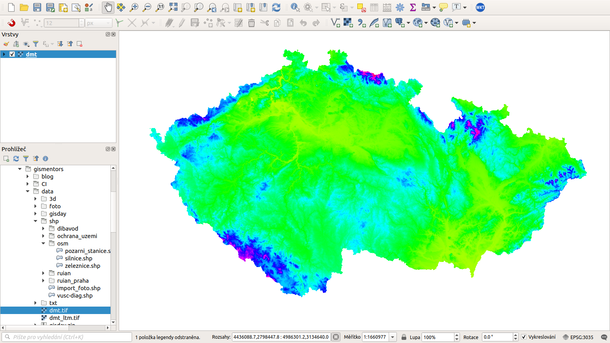

pair: rastrová data; import dat

# Nahrání rastrových údajů

Rastrová data je možné do prostředí QGIS přidat kliknutím na tlačítko
 Přidat rastrovou vrstvu,
výběrem z lišty menu
`Vrstva --> Přidat vrstvu --> Přidat rastrovou vrstvu` nebo současným
stlačením kláves `Ctrl+Shift+R`. Přidání je samozřejmě možné i přes
panel `Prohlížeče`. Na `addraster` je znázorněna rastrová vrstva
`dmt.tif` z datasetu `EU-DEM (GeoTIFF)`.

<figure>

<figcaption>Nahrání rastrové vrstvy do QGIS.</figcaption>
</figure>

> [!NOTE]
> Pokud by se vrstva nezobrazila v mapovém okně jako je to na
> `addraster`, je zapotřebí kliknout pravým tlačítkem na jméno vrstvy a
> zvolit  alt="mIconZoom" /> Přiblížit na vrstvu.

> [!TIP]
> V případě potřeby přidržením klávesy `Ctrl` v dialogu vybírání souborů
> lze současně nahrát vícero vrstev najednou.
