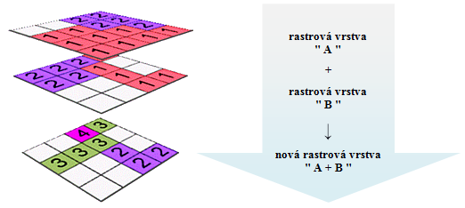
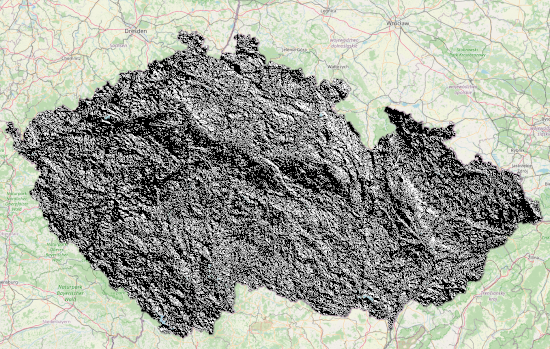
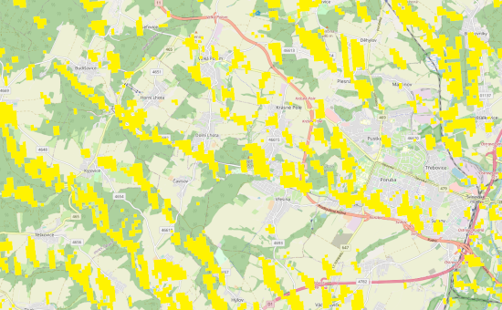
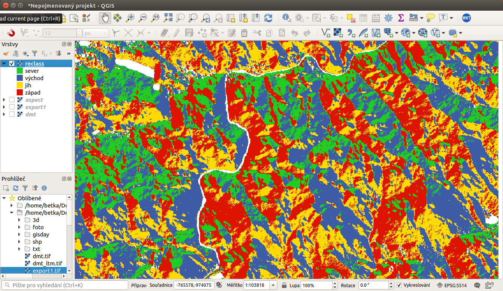

pair: algebra; mapová algebra

# Použití rastrového kalkulátoru

Při tvorbě mapy orientace vůči světovým stranám je lepší reklasifikovat
(rozdělit) rozsah hodnot do kategorií sever (1), východ (2), jih (3) a
západ (4), přičemž sever znamená `0°` a východ `90°`. Jednou z možností
je využití tzv. rastrového kalkulátoru. Ten je dostupný v menu `Nástroje
zpracování`, které je dostupné přes
 Sada nástrojů. Nástroj je ve
složce  `Rastrová analáza` pod názvem `Raster calculator`
nebo přes menu `Raster --> Rastrový kalkulátor`

Rastrový kalkulátor souvisí s mapovou algebrou. Jedná se o matematické
operace s rastrovými mapami, které jsou reprezentovány jako matice čísel
s prostorovým umístěním. Pomocí mapové algebry je možné matematickými,
ale i jinými operacemi kombinovat více rastrových vrstev a vytvářet tak
nové vrstvy.

<figure>

<figcaption>Princip mapové algebry.</figcaption>
</figure>

# Použití rastrového kalkulátoru pro určení míst potenciálně vhodných pro umístění solární elektrárny

Níže uvedený příklad je výpočet, kdy se konbinují dva rastry. První z
nich je sklon svahu a druhý je orientace svahu.

Pokud nás zajímají pouze místa se sklonem menším 15 stupňů, protože na
svahy s větším sklonem se solární elektrárny špatně instalují a pak
svahy orientované primárně na jih, pak můžeme zadat následující vzorec,
který nám vrátí výstup, kde budou pouze takto specifikované svahy.

`"Sklon@1" < 15 and "Aspekt@1" > 180 and "Aspekt@1" < 270`.

Výstupem pak je mapa s hodnotami 0 a 1, kde hodnotu 1 mají pixely, které
splnily naši podmínku.

<figure>

<figcaption>Zájmová místa pro solární elektrárnu.</figcaption>
</figure>

Vrstvu můžeme pak nastylovat tak, aby hodnota 0 byla průhledná a hodnota
1 měla výraznou barvu viditelnou na podkladu, např. žlutou.

<figure>

<figcaption>Stylování zájmových ploch pro solární
elektrárnu.</figcaption>
</figure>

# Použití rastrového kalkulátoru pro reklasifikaci

Níže uvedený příklad je výpočet tzv. reklasifiakce. Jde vlastně o
přepočet hodnot podle pravidla. Na tento konkrétní úkol je možné použít
i specifický nástroj určený pro reklasifikaci, například
`Reclassify by table`.

Pokud jsme mapu orientací nazvali `aspect`, výraz bude vypadat
následovně:
`(("aspect@1"  >= 315)  OR  ("aspect@1" < 45)) * 1 + (("aspect@1"  
>= 45)  AND  ("aspect@1" < 135)) * 2 + (("aspect@1"  >= 135)  AND  ("aspect@1" 
< 225)) * 3 + (("aspect@1"  >= 225)  AND  ("aspect@1" < 315)) * 4`.
Reklasifikované vrstvě následně nastavíme barevnost a popisy (`nesw` a
`aspectrecl`).

> [!WARNING]
> Je nutné vyplnit velikost buňky a i extent, automatické přiřazení
> hodnot prozatím nefunguje správně a výpočet vyhodí chybu. Nastavení
> souřadnicového systému není volitelný, ale povinný, jinak výpočet
> neproběhne a vypíše chybu.

<figure>

<figcaption>Reklasfikace orientace svahů vůči světovým stranám pomocí
mapového kalkulátoru.</figcaption>
</figure>

Symbologie se nastaví na přesné hodnoty 1,2,3,4, pomocí histogramu je
možné skontrolovat, zda jsme neudělali chybu a rastr neobsahuje jiné než
očekávané hodnoty. Pokud hodnoty v rastru reprezentují jakoukoli
charakteristiku, tak použít nastavení pospisků pro jednotlivé hodnoty či
skupiny.

V případě ukázky je vidět, že rastr obsahuje bílé plochy. To je
způsobeno tím, že v těchto místech je rovná plocha - bez orientace a
tyto místa mají extrémní hodnotu tzv. "No data". Tyto hodnoty nejsou
uvedeny v legendě, v případě potřeby je možné těmto hodnotámnastavit
samostatnou kategorii.

<figure>

<figcaption>Reklasifikovaná mapa orientací svahů vůči světovým
stranám.</figcaption>
</figure>

Pro reklasifikaci dat lze použít i nástroj systému GRASS `r.reclass`
(viz školení `GRASS GIS pro
začátečníky <grass-gis-zacatecnik>`), který je dostupný z
`Nástrojů zpracování`.

