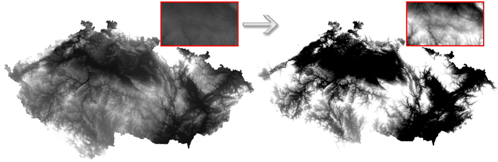
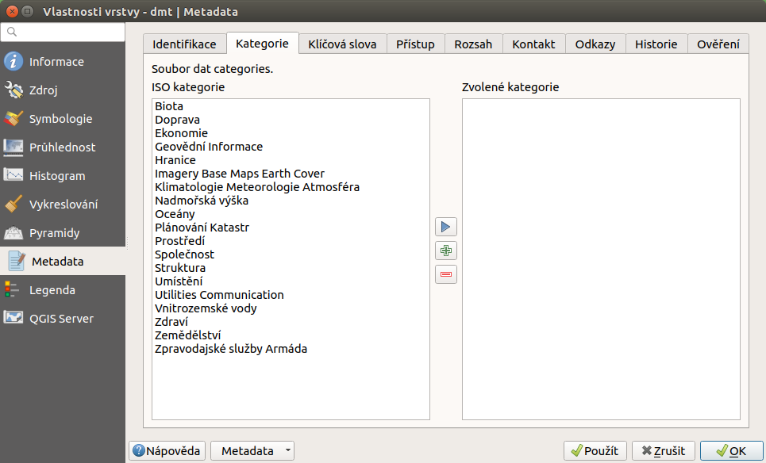

# Vlastnosti rastrové vrstvy

Dialog pro nastavení vlastností dané rastrové vrstvy vyvoláme buď levým
dvouklikem nad danou vrstvou, nebo pravým klikem z kontextového menu
zvolíme položku `Vlastnosti`.

Dialogové okno obsahuje deset záložek : *Informace*, *Zdroj*,
*Symbologie*, *Průhlednost*, *Histogram*, *Vykreslování*, *Pyramidy*,
*Metadata*, *Legenda* a *QGIS Server*.

## Informace

Tato záložka by měla poskytovat informace o dané rastrové vrstvě. Jedná
se zejména o technické parametry dat - počet sloupců a řádků, rozsah,
způsob uložení hodnot, místo uložení, souřadnicový systém, velikost
pixelu, počet pásem a jejich statistiky. Metadata popisující obsah,
poskytovatele a další infromace jsou v samostatné záložce `Metadata`.

## Zdroj

První záložka poskytuje základní informace o vrstvě jako je název
souboru, název vrstvy v legendě s možností editace a souřadnicový
referenční systém (ten je možno nastavit kliknutím na tlačítko
Vyberte SRS).

<figure>

<figcaption>Vlastnosti rastrové vrstvy.</figcaption>
</figure>

## Symbologie

Tato záložka slouží na nastavení barevnosti rastrových dat v mapovém
okně. Je možné nastavit vykreslování pásma, barvy nebo převzorkování. V
dané vrstvě mohou být barvy invertované, dá se vylepšit kontrast,
sytost, jas, rozsah vykreslovaných hodnot (`stylraster`).

<figure>

</figure>

### Typ vykreslování

Rastry se používají na spojitou definici vybraného jevu v prostoru. Z
tohoto důvodu se pro zobrazování nejčastěji používají barevné přechody.
Všechny dostupné typy stylování jsou vyjmenovány v položce
`Typy vykreslování`, jak je vidět na obrázku `styletyperaster`.

<figure>

</figure>

- **Mnohopásmová barva** - Pokud máme vícekanálový rastr, můžeme použít míchání  
  kanálů pro jednotlivá barevná pásma (červené, zelené a modré).

  <figure>
  
  <figcaption>Nastavení stylování pomocí míchání barev.</figcaption>
  </figure>

- **Paleta/Jedinečné hodnoty** - V případě dat charakterizující přesně dané  
  kategorie nebo nespojitá data. (Příkladem je například orientace vůči
  světovým stranám). Pro generování barev je možné vybrat předdefinované
  škály, ale i položku `Random Colors`. Použitím tlačítka `Klasifikovat`
  vygenerujeme všechny hodnoty pro vybraný kanál. Vygenerované kategorie
  je možné upravit pro zobrazení barev ale i změnit popisky pro legendu.

  <figure>
  
  <figcaption>Stylování unikátních nespojitých hodnot.</figcaption>
  </figure>

- **Jedno pásmo - šedi** - Vykreslování spojitých veličin v odstínech bílé až  
  černé. Pro zvolený kanál se vybere jedna ze dvou možností barevného
  přechodu. Dle požadavku na zobrazení je možné použít některou z metod
  pro vylepšení kontrastu.

  <figure>
  
  <figcaption>Stylování spojité veličiny pro 1 kanál v odstínech
  šedi</figcaption>
  </figure>

- **Jedno pásmo - pseudobarvy** - Vykreslování spojítých veličin pomocí různých  
  barevných palet - rozsahů. Pomocí dalších nastavení můžeme dosáhnout
  různé efekty. Prvním nastavením je `Interpolace`

  - **Nespojitý** - Klasifikace s tímto nastavením určí přesný počet barevných  
    tříd i s jejich rozsahem.

    <figure>
    
    <figcaption>Stylování spojité pro nespojitou interpolaci spolu s ukázkou
    výstupu.</figcaption>
    </figure>

  - **Lineární** - Barevný rozsah je spojitě rozdělen celému rozsahu
    hodnot.

    > <figure>
    >  alt="images/pseudocolors_style2.png" />
    > <figcaption>Stylování spojité pro lineární interpolaci spolu s ukázkou
    > výstupu.</figcaption>
    > </figure>

  - **Přesný** - K vybranému barevnému rozsahu jsou vygenerovány přesné hodnoty  
    spolu s barvou, kterou se budou vykreslovat. Vykreslují se pouze ty
    hodnoty, které jsou v tabulce uvedeny. Všechny ostatní se
    nezobrazují.

    <figure>
    
    <figcaption>Stylování spojité pro přesné hodnoty spolu s ukázkou
    výstupu.</figcaption>
    </figure>

  Dalším nastavením, kterým lze ovlyvnit zobrazení je parametr `Modus`.
  Ten ovlyvňuje určování mezních hodnot pro jednotlivé kategorie
  symbolů.

  - **Spojitý** - Při tomto nastavení se pouze jednoduše proloží barevná  
    škála zvoleným rozsahem.

  - **Stejný interval** - Při tomto nastavení je barevná škála rozdělena do  
    stanoveného počtu intervalů bez ohledu na četnost výskytů hodnot z
    těchto intervalů.

  - **Kvantil** - Rozdělení do stanovenáho počtu kategorií podle počtu  
    výskytů, tak aby kategorie měli stejný počet výskytů mezi sebou.

  Volba nastavení počtu tříd je aktivní pouze u některých typů
  nastavení.

Měnit hodnoty i barvy ve vygenerovaném nastavení lze interakvtivně.

Pro generování stylů je nutné mít definovaný rozsah hodnot, pro které se
stylování bude generovat. Toto nastavení má vícero variant. Jak je vidět
na obrázku `minmax`, tak se jedná o automaticky vypočtené hodnoty, nebo
o uživatelem určené hodnoty. Výpočet hodnot se buď vztahuje na celý
rastr, nebo na jeho část.

<figure>

</figure>

Možnost nastavení barevné škály je různých typů vykreslování. Vybírat je
možné z předdefinovaných škál pomocí otevření menu přes šipku. Základní
funkce je výběr z existujících škál, nebo její obrácení. Škály lze také
upravovat, nebo upravit existující na novou a pak ji uložit.

<figure>

</figure>

Menu pro úpravu škály vychází z nastavení přechodu mezi 2 základními
barvami. Mezi tyto 2 výchozí barvy lze přidat další body a upravit
jejich barevnost nebo průhlednost. Ve spodní části je možné upravovat
škálu z hlediska jejich vlastností jako je `Odstín`, `Sytost`,
`Světlost` a `Průhlednost`.

<figure>

</figure>

> [!NOTE]
> Nastavení hodnoty směrodatné odchylky dokáže zabezpečit, aby hodnoty,
> které se příliš liší od průměru pro vrstvu, nebyly zobrazené.

Další možnosti stylování nabízí lišta `Rastr`, která se zapíná přes
`Zobrazit --> Nástrojové lišty --> Rastr`. Například první položka zleva
Local Cumulative Cut Stretch automaticky vylepší kontrast na
základě minimální a maximální hodnoty buňky v aktuální lokální části
rastru, přičemž bere do úvahy výchozí limity a odhadnuté hodnoty.
Výsledek je na `stylrstpanel` vlevo. Volba Roztáhnout histogram na
celý dataset nástrojové lišty vrátí změny zpět jak byly na
`stylraster`, t.j. vyrovná kontrast vzhledem na celý rastr dle
skutečných hodnot. Pokud pravým kliknutím na název vrstvy zvolíme z
kontextového menu `Zoom na
nejvhodnější měřítko (100%)`, klikneme na Local Cumulative Cut
Stretch a zvolíme Přiblížit na vrstvu, čímž vytvoříme
styl znázorněný na `stylrstpanel` vpravo.

<figure>

<figcaption>Změna stylu rastrové vrstvy pomocí nástrojové lišty <code
class="interpreted-text" role="item">Rastr</code>.</figcaption>
</figure>

Pokud potřebujeme používat opakovaně stejné nastavení symbologie, nebo
jen poskytnout nastavení i jiným uživatelům, tak je možné styl uložit
stejným způsobem jako u vektorových dat. Ve spodní části záložky
`Symbologie` se nachází talčítko `Styl`. Zde se nachází jak možnost
uložit aktulání styl do souboru, tak možnost načíst styl ze souboru a
nastavit ho tak danému rastru. Styly se ukládají v souboru s příponou
`.qml`. Tento soubor je v podstatě `.xml` soubor, takže je možné ho
případně editovat podle potřeb.

<figure>

</figure>

## Průhlednost

QGIS umožňuje zobrazovat každou vrstvu v mapovém okně s různým stupněm
průhlednosti. To je velmi výhodné, pokud například chceme, aby kromě
aktuální rastrové vrstvy byla viditelná i jiná vrstva. Typickým
příkladem je překryv stínovaného reliéfu jakoukoli barevnou rastrovou
vrstvou. Překryv a vhodné nastavení průhlednosti způsobí prostorový
vzhled 2D vrstvy. Konkrétní příklad je uveden později.

Záložka umožňuje nastavit všeobecnou průhlednost, ale taktéž průhlednost
pro každý pixel. V části o uživatelských nastaveních transparentnosti
(viz `rsttransparency` s paletovým typem vykreslení pásma pro rastr) je
možné nastavit hodnoty pomocí tlačítek Zadat hodnoty ručně
nebo Přidat hodnoty z obrazovky, dále možno Odstranit
vybrané řádky, hodnoty Importovat z nebo
Exportovat do souboru. To má smysl hlavně u detailnějších,
časově náročných prací. Tato záložka umožňuje taky nastavení *no data*
hodnoty (tzv. žádná data).

<figure>

<figcaption>Možnosti nastavení průhlednosti rastrové
vrstvy.</figcaption>
</figure>

Některé rastry můžou obsahovat samostatný kanál, ve kterém je zapsán
předpis pro průhlednost jednotlivých buněk. Pokud takovýto kanál data
obsahují, tak je možné nastavit průhlednost přímo pomocí nastavení
tohoto kanálu.

## Histogram

QGIS nabízí nástroj pro generování histogramu rastrové vrstvy
(`rsthistogram`). Je vytvořen automaticky po vybrání záložky `Histogram`
ve vlastnostech vrtsvy.

<figure>

<figcaption>Výpočet histogramu rastrové vrstvy digitálního výškového
modelu terénu.</figcaption>
</figure>

## Vykreslování

U některých vrstev, rastrových i vektorových, se může stát, že jejich
vykreslování v mapovém okně má smysl pouze v rozmezí určitých měřítek.
Toto nastavení je možné provést v záložce `Vykreslování`. Typickým
příkladem může být rastrové vykreslení druhů pozemků v kontextu celé
republiky.

Toto nastavení se často používá při WMS.

<figure>

<figcaption>Nastavení měřítkového rozsahu ve které se vrstva bude
vykreslovat.</figcaption>
</figure>

## Pyramidy

Pyramidy jsou datové struktury, které typicky obsahují větší množství
dat. Cílem je snížit výpočetní náročnost při práci s daty. Podstatou je,
že se kromě původního rastru v plném rozlišení vytvoří zjednodušená
verze (kopie s nižším rozlišením pro konkrétní přiblížení). Na
převzorkování se použijí různé metody, nejčastěji jde o metodu průměru
(*Average*) nebo metodu nejbližšího souseda (*Nearest Neighbour*).

<figure>

<figcaption>Schéma vzniku pyramid jako zjednodušených náhledových
vrstev.</figcaption>
</figure>

> [!NOTE]
> Pro vytvoření pyramid musíte mít právo zápisu do adresáře s původními
> daty.

> [!IMPORTANT]
> Je potřebné vědět, že vytvoření pyramid může pozměnit originální
> rastr, a proto se doporučuje vytvoření zálohy původní bezpyramidové
> verze dat.

## Metadata

Zde je možné číst a editovat metadatové údaje o vrstvě. Uvádění těchto
definic je nutné zejména v případě, že se jedná o oficiálně poskytovaná
data a je dobré u nich uvádět detaily o poskytovateli, jako i o datech
samotných.

<figure>

<figcaption>Metadatové položky u rastrové vrstvy.</figcaption>
</figure>

## Legenda

Tato položka v menu umožňuje rozšiřovat funkcionalitu dostupnou přímo v
panelu vrstev. Ve vchozím nastavení je možné přidat pouze ovládání
průhlednosti. Přidání dalších nástrojů je možné pomocí rozšiřujících
pluginů. Přidávání a odebírání je možné pomocí šipek nebo .

<figure>

<figcaption>Dialog pro přidávání tzv. "widgets". Následně je pak
dostupný v panelu vrstev.</figcaption>
</figure>

## QGIS Server

Pomocí nastavení v této záložce je možné pracovat se základními
parametry pro publikaci dat pomocí technologie QGIS Server. Jedná se o
pokročilou finkcionalitu.
