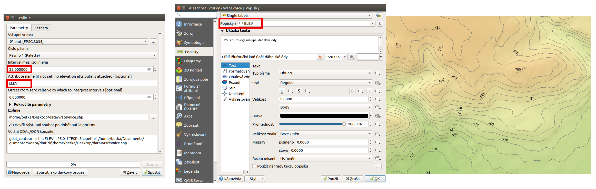

Generování vrstevnic
--------------------

Z digitálního modelu terénu se dá pomocí volby :menuselection:`Rastr -->
Extrakce --> Izolinie` vygenerovat vektorová vrstva izolinií. V dialogovém menu
je zapotřebí nastavit vstupní a výstupní soubor, hodnotu intervalu mezi
vrstevnicemi a případně název atributu výšky ve výsledné vektorové vrstvě. Po
výpočtu se vektorová vrstva automaticky objeví v mapovém okně. Je 
potřebné nastavit jí styl, popis a další vlastnosti. Jak může výsledek vypadat,
je uvedeno na :numref:`izo`.

.. _izo:

   Tvorba vektorové mapy vrstevnic z rastru digitálního modelu terénu.
   
 
Zpracování dat popisujících výškové poměry vede k zobrazování dat ve 3D.
Od verze 3.0 je součástí QGISu **3D mapové okno**, kde lze zobrazovat data jako
prostorová a ne jenom rovinná. Práce s tímto nástrojem je součástí kurzu pro
pokročilé.

.. todo:: Po vypublikování přidat odkaz na přílslušnou kapitolu v pokročilých
