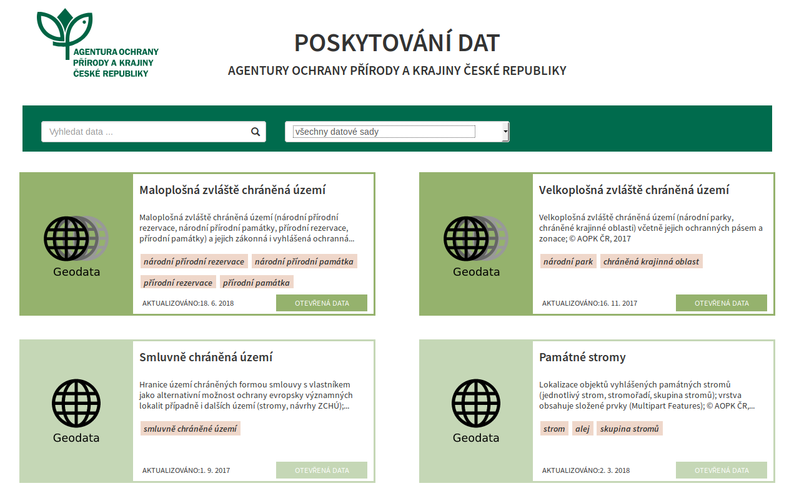
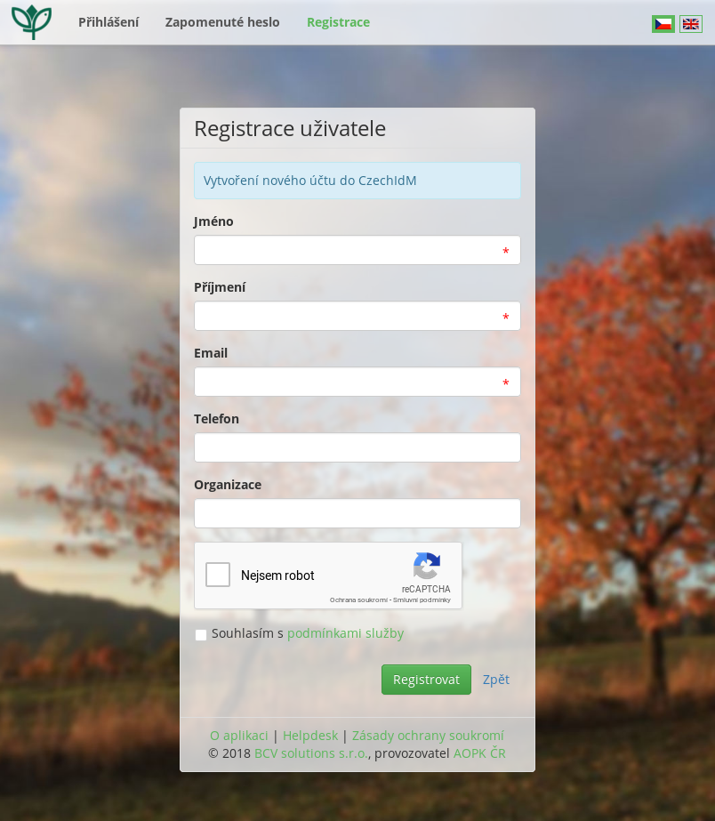
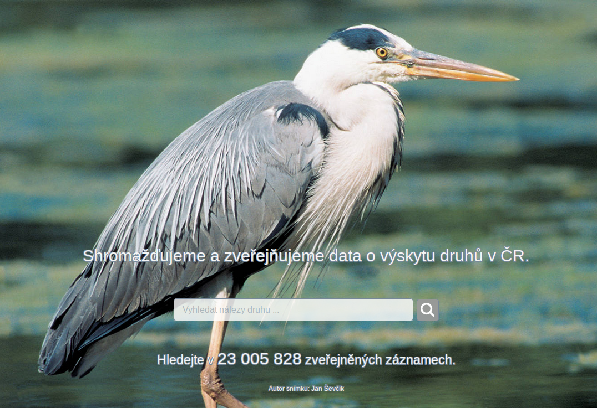
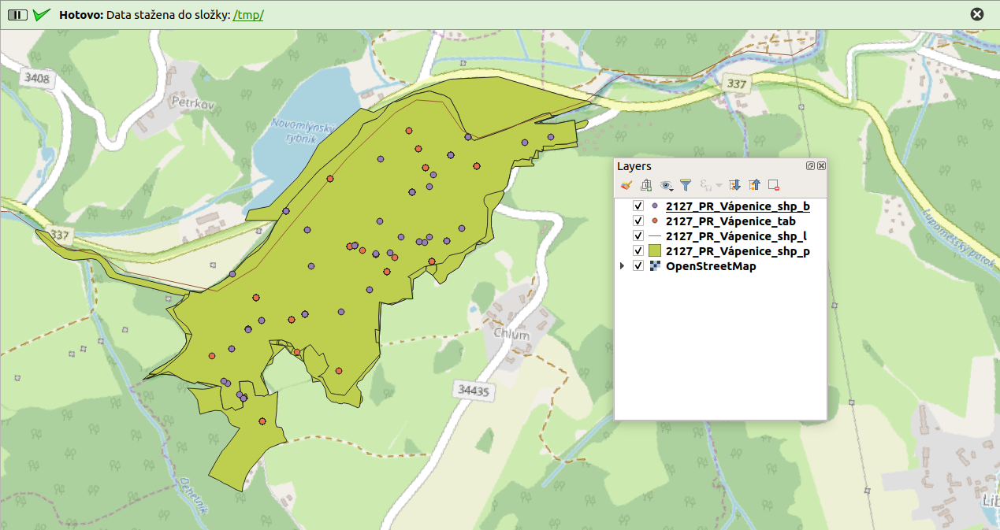
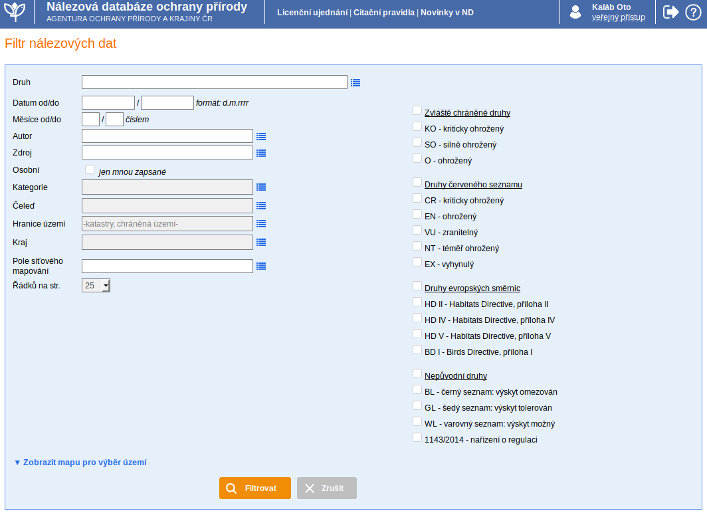
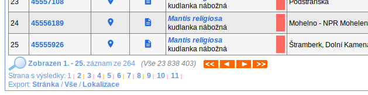

.. |ndop_downloader| image:: images/icon.png
   :width: 1.5em

Data AOPK
=========
Agentura Ochrany Přírody a Krajiny ČR
(`AOPK ČR <http://www.ochranaprirody.cz/>`_) poskytuje různá data týkající se
ochrany přírody (oblasti chráněných území, `VMB - vrstva mapování biotopů <https://portal.nature.cz/publik_syst/ctihtmlpage.php?what=1035>`_ , nálezy
organismů) v různé podobě (souborové formáty, webové služby - WMS,WFS, ...).
Obecné informace k získávání a poskytování dat můžeme nalézt na Portálu
informačního systému ochrany přírody (`Portál ISOP <https://portal.nature.cz/publik_syst/ctihtmlpage.php?what=3&nabidka=hlavni>`_). Obecně jsou data poskytována ve třech úrovních a to jako otevřená data,
otevřená data po registraci, a data poskytovaná na základě žádosti (smlouvy).

Jako rozcestník k získání dat můžeme použít stránky `https://data.nature.cz/
<https://data.nature.cz/>`_. Ke každé datové sadě je zde základní popis,
licenční podmínky, odkaz ke stažení dat popř. na webovou službu.

   Přehled dostupných dat AOPK na `https://data.nature.cz/` 

V případě, že datová sada vyžaduje registraci, odkaz stažení dat Vás přesměřuje
na přihlášení do ISOP (pokud již nejste přihlášení). Pokud nemáte zaregistrovaný
účet můžete použít odkaz `Založit nový účet v informačním systému AOPK ČR <https://idm.nature.cz/idm/#/registration>`_ přímo z přihlašovacího formuláře.

.. figure:: images/login.png 
   :class: small 
   :scale-latex: 40 

   Přihlašovací formulář ISOP

V současné době je nutná registrace u datových sad **Aktualizace základního
mapování biotopů** a **Nálezová databáze ochrany přírody**.

   Registrační formulář

Nálezová databáze ochrany přírody
---------------------------------

`Nálezová databáze ochrany přírody <https://portal.nature.cz/nd/>`_ je databáze
nálezů organismů, které jsou lokalizované v čase a prostoru. Od roku 2017 je
databáze, s výjimkou citlivých nálezů chráněných druhů, plně dostupná
veřejnosti, nutné je pouze se zaregistrovat. Přístup do nálezové databáze
ochrany přírody je umožněn prostřednictvím aplikce `Filtr nálezových dat <https://portal.nature.cz/nd/find.php?>`_. Pokud potřebujeme přístup ke všem
druhům bez výjimky, lze požádat o *plný přístup*. Ten je potom poskytován na
základě smlouvy.

   Úvodní stránka nálezové databáze

Databáze obsahuje údaje z různorodých zdrojů. Jsou zde uvedeny záznamy z
vědeckých publikací, informace z odborných pracovišť, výsledky projektů
zaměřených na mapování a monitoring, importovaná data (Fytocenologická databáze
, AVIF, ...), data z inventarizačních průzkumů, historické záznamy, náhodná
pozorování, citizen science - data od veřejnosti (aplikace BioLog). Zastoupení
jednotlivých zdrojů lze prohlížet ve `statistikách
<https://portal.nature.cz/nd/x_nd_statistiky.php>`_ na stránkách ISOP. Každý
rok zde přibývá přibližně 1 až 1.5 milionu nových záznamů.

NDOP Downloader
***************

Pro stažení nálezových dat přímo v QGIS můžeme použít zásuvný modul 
`NDOP Downloader  <https://opengeolabs.github.io/qgis-ndop-downloader/>`_
|ndop_downloader|. Tento zásuvný modul lze nainstalovat pomocí menu 
`Zásuvné moduly --> Spravovat a instalovat zásuvné moduly`. První je 
nutné povolit experimentální zásuvné moduly. V záložce nastavení 
zaškrtneme políčko `Zobrazit také experimentální zásuvné moduly`.

Po zadání přihlašovacích údajů lze stáhnout nálezy podle 
zadaného taxonu nebo oblasti (KÚ,ZCHÚ). Pokud zaškrtnete položku `Uložit 
přihlašovací údaje`, údaje se uloží do konfiguračního souboru `.ndop.cfg` 
v domovském adresáři.

.. figure:: images/ndop_downloader.png 
   :class: middle 
   :scale-latex: 40 

   Okno NDOP Downloaderu v QGIS

Výstupem jsou dostupná data lokalizací (.shp komprimované v .zip) a 
tabulková data (.csv) pro všechny záznamy. Lokalizace se po ukončení 
stahování nahrají do projektu. Tabulková data se nahrají do projektu 
jako Oddělený text a zobrazí se jako body (na základě souřadnic v 
tabulce). Tato data obsahují body a centroidy většiny polygonů a linií.

**Parametry**:

- **Taxon** - Lze vybrat pomocí rolovací nabídky, nebo vepsáním názvu s funkcí
  našeptávače. Lze zadávat česká i latinská jména.

- **Region** - Obdobně jako u taxonu. V případě že položka zůstane nevyplněná, 
  získáme data z clého území ČR. Naopak, pokud vybyreme území 
  regionu a necháme prázdné políčko taxonu, získáme data všech taxonů ve 
  vybraném regionu.

- **Výstupní složka** - Vybereme výsupní složku kam se nám data uloží. Pokud 
  ponecháme prázdné, stáhnou se data do složky dočasných souborů. 
  V případě, že nechceme stahovat tabulková data zaškrtneme možnost 
  `Nestahovat tabulková data`. Stažené soubory se nahrají do projektu a 
  ponesou název odvozený od použitého filtru a typu dat. Pokud je do 
  filtru zadán taxon, bude název odvozen od názvu druhu 
  (např. `Mantis_religiosa_shp_b` - bodová vrstva (.shp)). Poukd 
  filtrujeme pouze podle regionu bude název odvozen od názvu regionu. 

Po potvrzení tlačítkem Ok se okno zavře a spustí se filtrace a stahování. 
QGIS během stahování **nelze v současné době používat**. Stejně jako při 
použití oficiálního webové filtru, stahování může trvat několik minut, 
v závislosti na počtu záznamů, stažení tabulkových dat atd.

V informačním panelu v horní části obrazovky uvidíte informace o průběhu 
stahování. Při stahování se také vypíše počet záznamů a hrubý odhad doby 
trvání konkrétního kroku. Po úspěšném stažení se objeví zelený panel s 
odkazem na složku kam byla data stažena.

   Data stažené pomocí zásuvného modulu NDOP Downloader

Webový filtr nálezových dat
***************************
Základní způsob jak stahovat data z nálezové databáze je použití webového filtru 
přímo na stránkách `Nálezová databáze ochrany přírody AOPK <https://portal.nature.cz/nd/>`_. 
Na úvodní stránce nálezové databáze lze zadat název druhu, a po zadání vyhledání
nás stránka přesměřuje na *Filtr nálezových dat*, kde můžeme data filtrovat
na základě více parametrů např: autora nálezu, datumu/období, území (katastry,
CHÚ, síťové mapování, ...), ručně zakresleného území v mapě (max. 25km:sup:`2`)
, kategorie ochrany, ...

   Filtr nálezových dat veřejného přístupu

Po zadání parametrů pro filtrování stiskneme tlačítko :item:`Filtrovat`.
Výsledky filtru se nám vypíší jako jednotlivé záznamy, ve formě tabulky. Zde
uvidíme základní a nejdůležitější informace o nálezu (co? - kde? - kdy? - kdo?).
Výsledky je také možné zobrazit v mapě nebo síťové mapě, popř. pokud jsme
nefiltrovaly na základě druhů lze využít *Sumarizace výsledků podle druhů*.

.. figure:: images/priklad_filtr.png 
   :class: middle 
   :scale-latex: 40 

   Příklad filtrování druhu *Mantis religiosa*

Ve výpisu výsledků lze otevřít *Kartu nálezu* - podrobné informace o konkrétním
nálezu, *Kartu akce* - podrobné informace o mapovací akci, zobrazit konkrétní
nález v mapě (*Mapa*) nebo otevřít *Kartu druhu*, kde jsou shrnuty informace o
konkrétním druhu.

Karta nálezu - data o nálezu
^^^^^^^^^^^^^^^^^^^^^^^^^^^^
U každého nálezu je k dispozici mnoho údajů:

    - ID nálezu
    - CO - informace o druhu -  název druhu, taxonomické zařazení, ochrana;
      doplňující informace -  počet, druh pozorování, poznámky
    - KDE - území, souřadnice (v případě území - centroid), typ zákresu, id
      lokalizace
    - KDY - datum, id akce
    - KDO - autor
    - zdroj dat - projekt, datová sada
    - věrohodnost, validace - lze zpochybnit
    - mapa zákresu, popř. fotografie

.. figure:: images/karta_nalezu.png 
   :class: middle 
   :scale-latex: 40 

   Karta konkrétního nálezu

Ve spodní části výpisu filtru máme možnost exportu tabulkových dat (CSV, XML,
HTML, TXT) i lokalizace nálezů (SHP):

    -  tabulková data - lze exportovat i souřadnice centroidů, ty následně
    zorbazit v QGIS jako body
        - *Stránka* - export informací o nálezech na dané stránce
        - *Vše* - export informací o všech naálezech (omezeno na prvních 1000
        nálezů)
    - *Lokalizace* -  export lokalizací nálezů v .shp, obsahuje pouze atribut
    *id_lokalizace* - po stažení lze spárovat s exportovanými tabulkami

   Možnost exportu ve filtru nálezů

.. figure:: images/export_tab.png 
   :class: middle 
   :scale-latex: 40 

   Export tavulkových dat výsledku filtru
