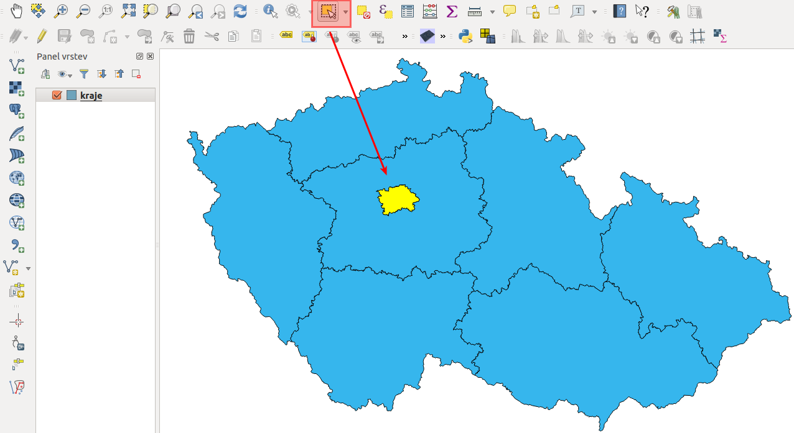
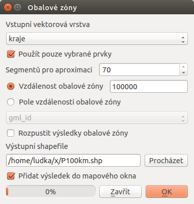
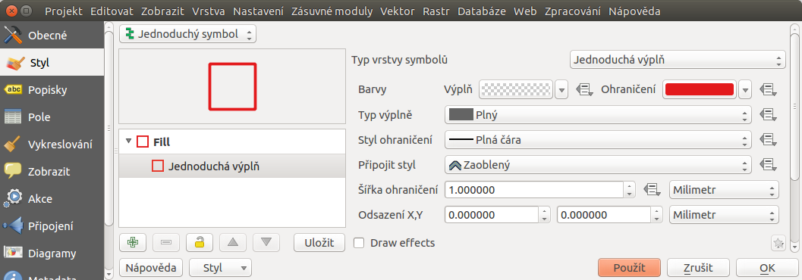
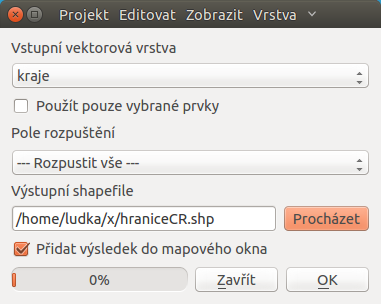
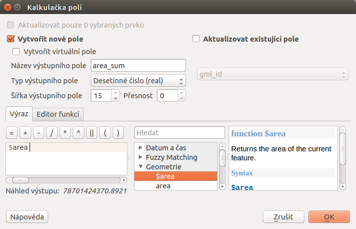
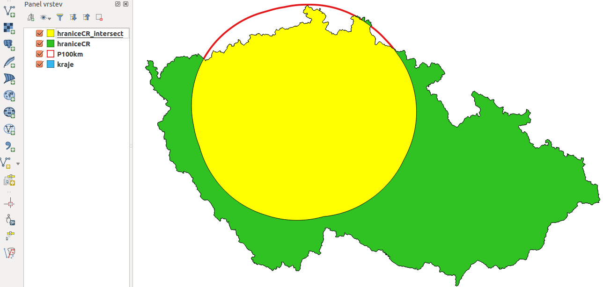

# Ukázka jednoduchých prostorových funkcí

Kolik procent území ČR je ve vzdálenosti do 100 km od hranice Hlavního
města Prahy?

## Data

`kraje.shp`

## Řešení

1.  Nástrojem *Buffer* vytvoříme obalovou zónu 100 km kolem Prahy.
2.  Nástrojem *Dissolve* sloučíme kraje a vytvoříme hranici ČR.
3.  Vypočteme plochu ČR.
4.  Nástrojem *Intersect* vytvoříme průnik obalové zóny s hranicí ČR.
5.  Vypočteme plochu průniku a procenta vybrané plochy k původní ploše.

> [!NOTE]
> Postup řešení v programu ArcGIS Desktop je dostupný
> [zde](http://maps.fsv.cvut.cz/frvsgis/web.html). S Open Source
> programem QGIS však lze dosáhnout stejného výsledku.

## Postup v QGIS

Po spuštění programu QGIS se zobrazí standardní rozhraní, viz
`Popis rozhraní <popisrozhrani>`. Souřadnicový systém projektu je
přednastavený na WGS 84 (`4236`), což lze zkontrolovat ve stavovém řádku
vpravo dole. Budeme pracovat s daty České republiky, kde se obvykle
používá souřadnicový systém S-JTSK (`5514`).

V prvním kroku proto nastavíme souřadnicový systém projektu. Z menu
lišty vybereme `Nastavení --> Možnosti`. Otevře se dialogové okno, kde v
záložce `SRS` nastavíme `Vždy začít nové projekty s tímto SRS` na
`EPSG:5514 - S-JTSK (Greenwich)/Krovak East North`, a to kliknutím na
ikonku Vyberte SRS. Tento souřadnicový systém nastavíme i pro
nové vrstvy v položce `SRS pro nové vrstvy` a `Použít výchozí SRS`. Na
závěr povolíme
 `"on-the-fly" SRS transformaci` pro případ, že bychom v
projektu pracovali s vrstvami v souřadnicovém systému, který je odlišný
od systému projektu. Postup je popsaný v kapitole
`Souřadnicový systém<sour-system>`.

V dalším kroku kliknutím na Přidat vektorovou vrstvu do
mapového okna přidáme vrstvu `kraje.shp`. Tlačítkem Vybrat prvky
oblastí nebo jednoklikem klikneme do mapy na místo, kde se nachází
kraj Hlavního města Prahy (`u-select-praha`).

> [!NOTE]
> V případě, že by šlo o složitější výběr, použijeme Vybrat prvky
> pomocí vzorce a prvky vybereme atributovým dotazem.

<figure>

</figure>

Následně vytvoříme obalovou zónu 100 km od hranice Prahy. Použijeme
prostorovou analýzu Buffer. Z menu lišty vybereme `Vektor 
--> Nástroje geoprocessingu --> Obalové zóny`. V dialogovém okně
nastavíme vstupní vrstvu, t.j. `kraje`, zaklikneme
 Použít pouze vybrané prvky, protože chceme
obalovou zónu jen kolem konkrétního vybraného kraje. Míru aproximace
zvýšíme na `70`, protože předvolená hodnota `5` segmentů je málo na to,
aby obalová zóna odpovídala kruhu. Dále nastavíme velikost obalové zóny
v metrech, název výstupního souboru a povolíme
 Přidat výsledek do mapového okna a potvrdíme
`OK` (`u-p100km`).

> [!NOTE]
> Maximální možný počet segmentů na aproximaci je `99`. Výhodou je sice
> přesnější výsledek, nicméně výpočty budou trvat delší dobu.

<figure>

<figcaption>Tvorba obalové zóny velikosti 100 km kolem hranice
Prahy.</figcaption>
</figure>

Do mapového okna se přidá nová vektorová vrstva `P100km`. Nastavíme jí
styl `pravým tlačítkem myši --> Vlastnosti --> Styl`, například jako na
`u-p100km-styl` transparentní výplň, červené ohraničení široké 1 mm.

<figure>

<figcaption>Nastavení stylu obalové zóny.</figcaption>
</figure>

Dále provedeme sjednocení všech krajů, resp. vrstvu České republiky.
Budeme ji potřebovat na určení plochy ČR. Využijeme nástroj
geoprocessingu Rozpustit. Před touto funkcí ještě zrušíme
výběr kraje Prahy pomocí Zrušit výber prvků ve všech
vrstvách. Výstupní vektorovou vrstvu pojmenujeme `hraniceCR`, viz
`u-dissolve`.

<figure>

<figcaption>Spojení všech krajů do jednoho polygonu pomocí nástroje
<em>Dissolve</em>.</figcaption>
</figure>

Otevřeme atributovou tabulku vrstvy `hraniceCR` (pravým
`Otevřít atributovou tabulku`) a pak použijeme kalkulačku polí - ikona v
horní liště atributové tabulky Otevřít kalkulátor polí.
Vytvoříme nový atribut (pole) s názvem `area_sum` (desetinné číslo), do
kterého vložíme hodnotu plochy polygonu. Datový typ nastavíme tedy jako
`real`, šířka např. `15` a jako výraz napíšeme `$area` (`u-area`). Změny
uložíme ikonou a editovací režim vypneme opětovným stisknutím .

> [!NOTE]
> Výraz nemusíme psát ručně. V středním poli dialogového okna kalkulačky
> je množství položek. V našem případě vybereme
> `Geometrie --> $area (dvojklik)`.

<figure>

<figcaption>Vytvoření atributu s výměrou České republiky.</figcaption>
</figure>

Poté použijeme nástroj Průsečník, kde vstupem budou vrstvy
`hraniceCR` a `P100km`. Výsledek je zobrazen na `intersect-map`.

<figure>

</figure>

Posledním krokem je určení procentuálního zastoupení plochy republiky do
100 km od Prahy. Nejdřív vypočteme plochu průniku `hraniceCR_intersect`,
přičemž postupujeme obdobně jako při ploše vrstvy `hraniceCR` (vytvoříme
sloupec s názvem `area`).

> [!TIP]
> Kvůli přehlednosti vymažeme všechny nepotřebné sloupce v atributové
> tabulce vrstvy `hraniceCR_intersect` tak, že nejdříve zapneme
> editovací mód kliknutím na Prepnout režim editaci, potom
> zvolíme Smazat sloupec a označíme názvy těch atributů,
> které chceme vymazat. Ponecháme jenom pole `area_sum` a `area`.

Pak přidáme nový atribut `procento`, do kterého pomocí mapové kalkulačky
vložíme výsledek `"area"/"area_sum * 100"`. Ten je na `vysledok-u1`
(48,6 % území České republiky je ve vzdálenosti do 100 km od hranic
Prahy).

<figure>

<figcaption>Výpočet procentuálního zastoupení území ve vzdálenosti do
100 km od Prahy.</figcaption>
</figure>

