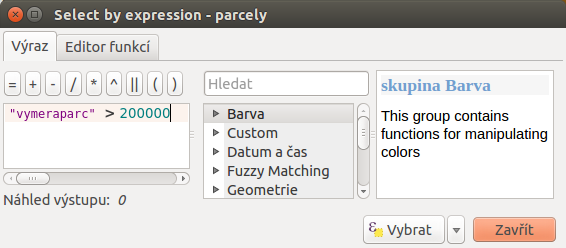

# Ukázka kombinace prostorových funkcí a dotazů

Najděte vhodné parcely na území Hlavního města Prahy pro výstavbu nového
stavebního objektu. Kvůli případnému hluku musí být vzdálené alespoň 500
m od železnic, jejich výměra musí být minimálně 20 ha a měly by se
nacházet mimo městské části Praha 6, 7 a Praha 8.

## Data

`spravniobvody.shp, parcely.shp, zeleznice.shp`

## Řešení

1.  Nástrojem *Dissolve* sloučíme správní obvody a vytvoříme polygonovou
    vrstvu Prahy.
2.  Nástrojem *Clip* ořežeme vrstvu železnic podle polygonu Prahy.
3.  Nástrojem *Buffer* vytvoříme obalovou zónu 500 m kolem pražských
    železnic.
4.  Vybereme správní obvody Praha 6, 7 a 8 a nástrojem *Union* je
    sjednotíme s obalovou zónou kolem železnic (negativní oblasti).
5.  Vybereme všechny parcely s rozlohou větší než 20 ha.
6.  Z vybraných parcel vybereme ty, které nejsou v negativní oblasti.
7.  Výsledek zobrazíme.

## Postup v QGIS

Do mapového okna pomocí <sup>Přidat vektorovou vrstvu</sup> přidáme
potřebná `data <data-ul2>`. Vidíme, že vrstva železnic je pro celou
Českou republiku. Části mimo Prahy ale nebudeme potřebovat, proto vrstvu
ořežeme. Musíme si vytvořit hranici města. Z menu
`Vektor --> Nástroje geoprocessingu` vybereme nástroj
<sup>Rozpustit</sup>, kde jako vstupní vektorovou vrstvu nastavíme
`spravniobvody`, pole rozpuštění na `--- Rozpustit vše ---` a výstup
uložíme jako `praha`. Potom použijeme nástroj na ořezání
<sup>Ořezávač</sup>. Vstupem bude vektor železnic České republiky,
ořezávat budeme podle nově vytvořené polygonové vrstvy `Praha` a
výsledek uložíme jako `zeleznice_p`, tedy železnice pouze na území
Prahy. Dialogová okna nástrojů *Dissolve* a *Clip* jsou zobrazeny na
`dissolve-clip`. Následně můžeme každé vrstvě
`nastavit styl<styl-vrstvy>`, čímž si vstupní data přehledně zobrazíme
(`vstup-ul2`).

<div id="dissolve-clip">

<figure>

<figcaption>Použití nástrojů <em>Dissolve</em> a
<em>Clip</em>.</figcaption>
</figure>

</div>

<div id="vstup-ul2">

<figure>

</figure>

</div>

> [!NOTE]
> Na `vstup-ul2` je pro vektorovou vrstvu `parcely` nastavena jednoduchá
> průhledná výplň a šedé ohraničení s transparentností `10%`, symbol
> vrstvy `zeleznice_p` je nastavený na `Resident`, správní obvody jsou
> barevně kategorizované dle pole `nazev`, pričemž hodnoty tohoto
> atributu jsou vykresleny.

> [!TIP]
> V tomto kroku je dobré si projekt uložit, a to pomocí
> `Projekt --> Uložit`.

Teď přistoupíme k tvorbě obalové zóny kolem pražských železnic, na to
využijeme nástroj <sup>Buffer</sup>. V jednom dialogovém okně nastavíme
vstup, míru aproximace na `70`, velikost obalové zóny na `500 m`,
zaklikneme  <sup>Rozpustit výsledky obalové zóny</sup>, aby byla
obalová zóna celistvá a výstup uložíme jako `zeleznice_pb`, povolíme
 <sup>Přidat výsledek do mapového okna</sup> a spustíme
`OK`, viz `zeleznice-buffer`.

<div id="zeleznice-buffer">

<figure>

<figcaption>Obalová zóna 500 m kolem vektorové vrstvy pražských
železnic.</figcaption>
</figure>

</div>

Pokračujeme výběrem správních obvodů, kde se parcela pro nový stavební
objekt nemá nacházet. V okně vrstev označíme vektor `spravniobvody` a v
menu klikneme na <sup>Vybrat prvky pomocí vzorce</sup>. V střední části
dialogového okna najdeme položku `Pole a hodnoty`, dvouklikem zvolíme
`nazev`, v pravé části klikneme na `všechny jedinečné hodnoty` a tímto
způsobem napíšeme do levého okna výraz (`vyraz678`), kterým z vrstvy
správních obvodů vybereme Prahu 6, 7 a 8.

``` sql
"nazev" = 'Praha 6' OR "nazev" = 'Praha 7' OR "nazev" = 'Praha 8'
```

Pak přes pravé tlačítko myši nad vrstvou `spravniobvody` výběr uložíme
pomocí <span class="title-ref">Uložit jako</span>, nazveme jej
`praha_neg`. Dbáme na to, aby políčko
 <sup>Uložit pouze vybrané prvky</sup> bylo zaškrtnuté
 a zkontrolujeme i souřadnicový systém `5514`.

> [!NOTE]
> Operátor `OR` se nachází v položce `Operátory`.

<div id="vyraz678">

<figure>

<figcaption>Výběr správních obvodů, kde budeme hledat vhodné
parcely.</figcaption>
</figure>

</div>

> [!NOTE]
> Po exportu zrušíme vybrané obvody Prahy pomocí <sup>Zrušit výběr prvků
> ve všech vrstvách</sup>.

Následuje spojení "negativních" zón. Cílem je dostat vektorovou vrstvu,
která je sjednocením obalové zóny železnic a nepožadovaných správních
obvodů. Využijeme nástroj <sup>Sjednotit</sup>. Vznikne výstup
(například `oblasti_neg1`), na který opět použijeme
<sup>Rozpustit</sup>. Výsledek pojmenujeme `oblasti_neg` (`neg`).

<div id="neg">

<figure>

</figure>

</div>

Pak pokračujeme krokem č. 5, viz `Řešení<reseni-ul2>`. Postup je obdobný
jako při výběru správních obvodů pomocí <sup>Vybrat prvky pomocí
vzorce</sup>. Výraz `"vymeraparc" > 200000` je ten, kterým vybereme
parcely s výměrou nad 20 ha (`parcely20ha`). Vybrané prvky uložíme jako
nový vektor `parcely_20ha` a výběr zrušíme ikonkou .

<div id="parcely20ha">

<figure>

<figcaption>Výběr parcel s výměrou nad 20 hektarů.</figcaption>
</figure>

</div>

Z těchto parcel je potřebné vybrat ty, které nejsou v negativní oblasti.
Nejdříve označíme všechny prvky vrstvy `parcely_25ha`, například
vybereme všechny `gml_id` pomocí <sup>Vybrat prvky pomocí vzorce</sup>.
Následně z hlavní lišty spustíme dialogové okno
 <sup>Vybrat podle umíštění</sup>. Najdeme jej v
položce `Vektor --> Výzkumné nástroje`. Zaškrtneme
 <sup>Include input features that intersect the
selection features</sup>,
 <sup>Zahrnout vstupní prvky, které překrývají/protínají
prvky výběru</sup>, a jelikož chceme právě ty parcely, které zadané
podmínky nesplňují, zvolíme možnost `odstraněním z aktuálního výběru`
(`vybrat-umisteni`).

<div id="vybrat-umisteni">

<figure>

<figcaption>Výběr parcel podle umístění metodou odstranění z aktuálního
výběru.</figcaption>
</figure>

</div>

Výsledek (podmnožina `parcely_20ha`) uložíme pomocí `Uložit jako` a
zobrazíme na podkladě původního zájmového území (`vysledok-ul2`). Pro
lepší detail použijeme <sup>Přiblížit na vrstvu</sup>.

> [!NOTE]
> Pro zvýraznění výsledku je průhlednost vrstvy správních celků
> nastavena na `70` (`Vlastnosti --> Styl --> Průhlednost vrstvy`).

<div id="vysledok-ul2">

<figure>

</figure>

</div>
