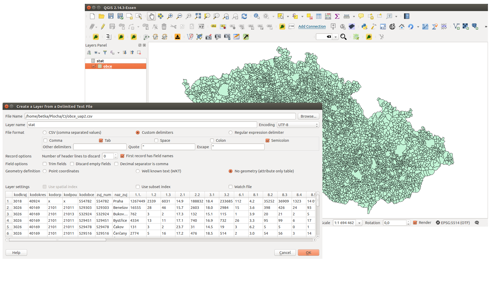
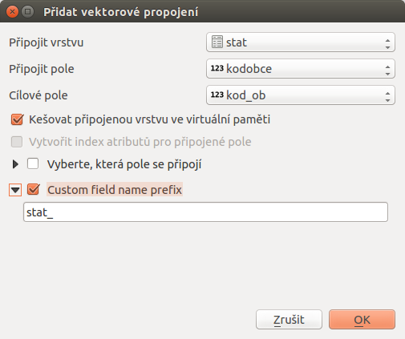
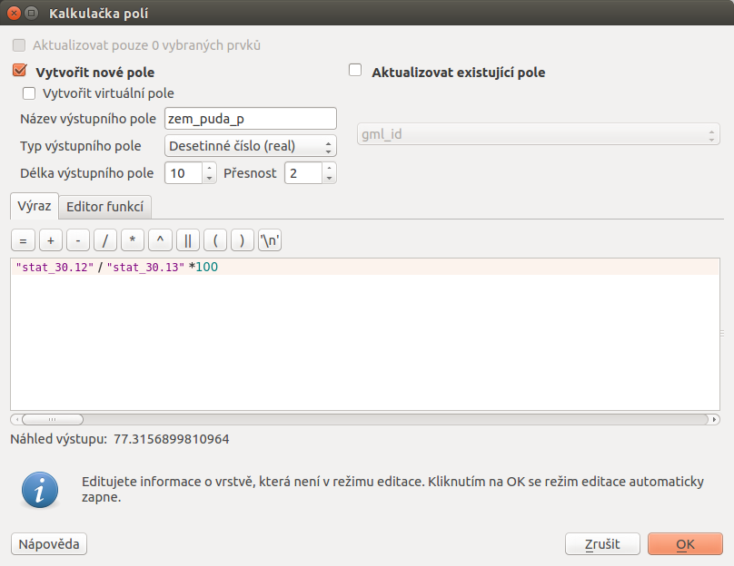
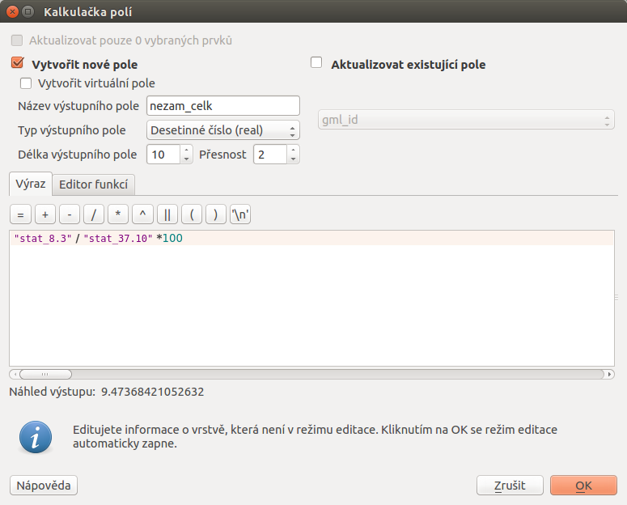
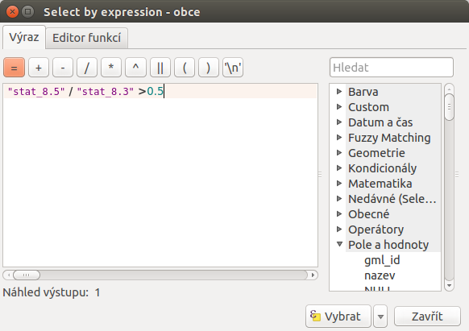
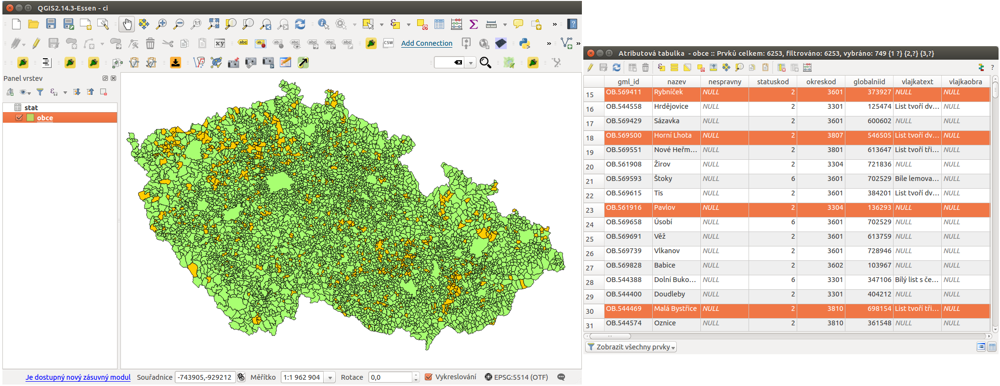
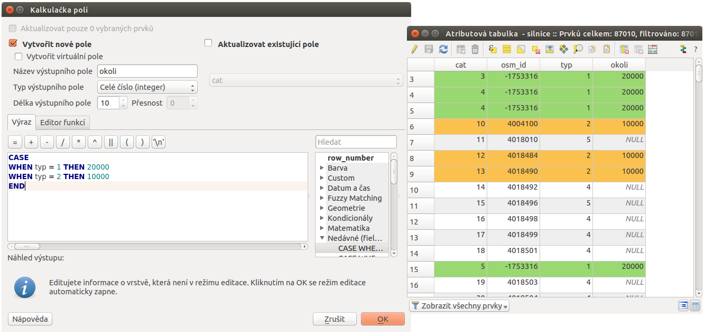
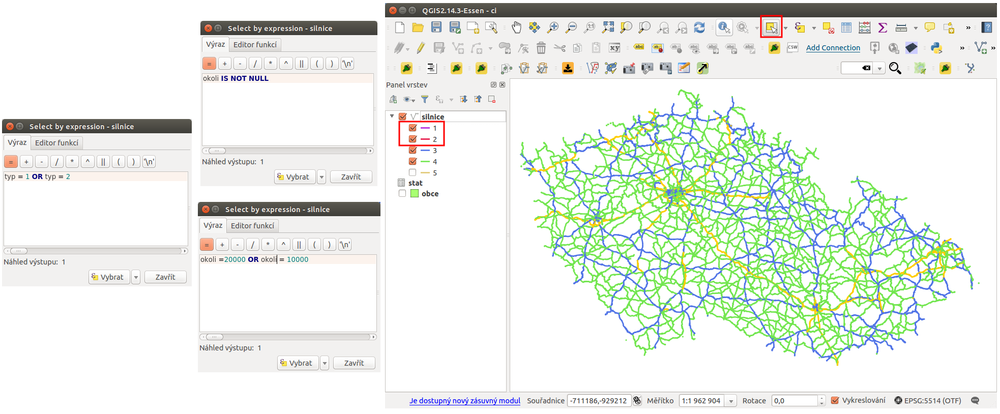
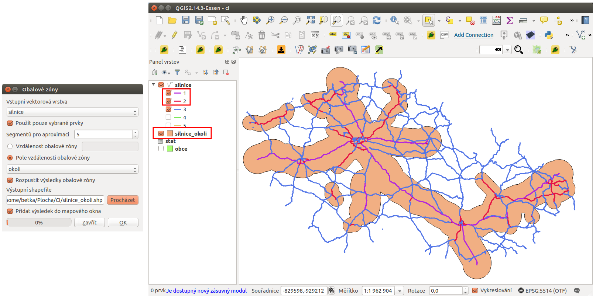
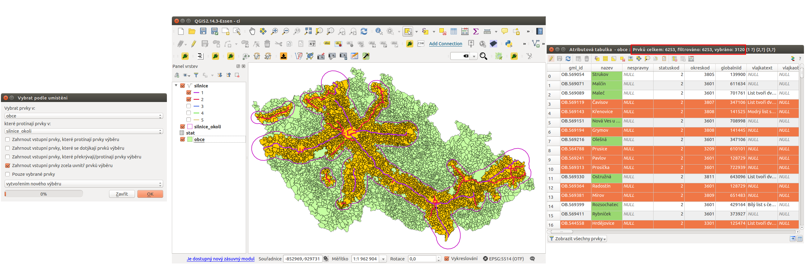

# Ukázka zpracování dat

V následující ukázce je popsán postup zpracování informací o obcích ČR,
které jsou získány z registru
[RÚIAN](http://www.cuzk.cz/ruian/RUIAN.aspx). Tato data zkombinujeme z
daty, která jsou poskytována [Českým statistickým
úřadem](https://www.czso.cz/).

Požadovaným výsledkem je jednak grafická vizualizace různých
statistických údajů, které jsou odvozeny ze základních ukazatelů, ale
také kombinace dat pomocí prostorových analýz s jinými datovými sadami.

## Podkladová data

Jak již bylo zmíněno, budeme používat datovou sadu *obcí ČR* z datasetu
*RÚIAN*.

Další datová sada pochází ze statistického úřadu. Tyto data poskytují
různorodé údaje definující sadu faktorů pro každou obec. Data je možné
získat
[zde](https://www.czso.cz/csu/czso/csu_a_uzemne_analyticke_podklady)
(*Aktuální údaje za všechny obce ČR (data mimo SLDB)*) i s popisem
evidovaných hodnot.

## Příprava dat

Jako první si načteme vrstvu obcí. Můžeme použít předpřipravená data ze
[školení QGIS](http://training.gismentors.eu/geodata/qgis/data.zip).

Data ze statistického úřadu nejprve upravíme. Jako první si odstraníme
řádky 1-3,5,6 a takto upravenou tabulku si uložíme do formátu `CSV`.

> [!WARNING]
> Některé sloupce, které mají číslenou hodnotu je vhodné upravit.
> Například sloupce spadající pod kategorii 30 (výměry druhů pozemků)
> obsahujou pomlčku. Při importu takovýchto dat bude pak atribut
> používán jako *textový řetězec* a ne jako *číslo*.
>
> Takovéto hodnoty je lepší hromadně nahradit vhodnou hodnotou. Podobný
> případ se týká například sloupce 8.5 (počet dlouhodobě
> nezaměstnaných). Zde jsou sice uvedeny všude *čísla*, ale pokud je
> celé číslo čtyřciferné tak jsou stovky a tisíce *odděleny mezerou*. I
> tento případ je nutné opravit, jinak *není možné provádět matematické
> operace*.
>
> Obě opravy je možné udělat jak před importem, tak až po importu. Výběr
> záleží na uživateli.

Takto upravený soubor načteme podle `postupu
<../vektorova_data/import_delim>` s ohledem na to, že importujeme *data
bez geometrie*. Vrstvu pro naše účely pojmenujeme `stat`.

<figure>

</figure>

## Připojení dat

Dalším krokem je připojení dat z vrstvy `stat` k vrstvě `obce` tak,
abychom u každé obce viděli všechny atributy z obou vrstev.

Klíčovým je atribut podle kterého se data z obou vrstev propojí. V tomto
případě použijeme kód obce. Tento atribut se nachází v obou vrstvách - v
jedné je pojmenován *kod_ob* a v druhé *kodobce*. Je to číselný
identifikátor unikátní pro každou obec v ČR. Samotné připojení je
popsáno v kapitole `../vektorova_data/join`. V našem případě bude
definice připojení vypadat jako na následujícím obrázku `join`.

<figure>

</figure>

Po tomto kroku máme všechna data z vrstvy `stat` připojené ke stávajícím
atributům vrstvy `obce` a můžeme je využít na další zpracování.

## Výpočet podílu zemědělské půdy v obcích

Data, která jsme si v předchozím kroku připojili obsahují i atribut
určující *rozlohu zemědělské půdy v daném území* `30.12` a také
*celkovou rozlohu území obce* `30.13`. Z těchto hodnot spočteme *podíl
zemědělské půdy pro všechny obce v procentech*. Tuto hodnotu uložíme
jako nový atribut (můžeme a nemusíme) a následně provedeme vizualizaci
těchto hodnot.

Pomocí Kalkulčka polí si nadefinujeme výpočet hledané hodnoty
a jejich uložení do nového atributu. Na `fieldcalc1` je zadáno vytvoření
nového atributu `zem_puda_p` (desetiné čílo). Výpočet hodnoty je *podíl
atributu zemědělské plochy k celkové ploše a převod na procenta*.

<figure>

<figcaption>Po dokončení výpočtu se přidá nový atribut definující
procento území, které zabírá zemědělská plocha v každé obci. Nově
přidaný atribut je nutné uložit.</figcaption>
</figure>

### Dalším krokem je vizualizace těchto hodnot

U vrstvy obce nastavíme *odstupňované stylování* podle atributu
`zem_puda_p` a zvolíme si další možnosti - jako je barevný rozsah, počet
kategorií a jejich rozdělení a další. Při stylování je nutné dbát na
následné použití dat.

<figure>

</figure>

## Výpočet nezaměstnanosti v obcích

Jedná se o podobný příklad jako je ten předešlý. Použijeme data o *počtu
obyvatelů ve věku 15-64 let* `37.10` a *počet nezaměstnaných* `8.3`.
Zajímavý může být i výpočet s hodnotou *nezaměstnaných absolventů* `8.4`
anebo *nezaměstnaných nad 12 měsíců* `8.5`.

Opět použijeme Kalkulčka polí . Vytvoříme nové pole s názvem
`nezam_celk` a hodnotu spočteme jako *podíl nezaměstnaných a obyvatelů
mezi 14 a 65 přepočten na procenta*. Nově vytvořený atribut obsahuje
hodnoty procentuální nezaměstnanosti pro každou obec.

<figure>

</figure>

Pro vizualizaci zopakujeme postup tvorby stylu z předchozího příkladu.
Možné stylování a výsledek je zobrazen na `clasification2`.

<figure>

</figure>

## Výběr obcí podle vícero atributů

Tato data lze samozřejmě použít i k výběru. Jedním z příkladů je výběr
území, kde dlouhodobě nezaměstnaní (`8.5`) tvoří víc než 50% všech
nezaměstnaných (`8.3`).

> [!TIP]
> `Atributové dotazování <atrdotaz>` je popsáno v samostatné kapitole.

Použijeme funkci Vybrat prvky pomocí vzorce. Tento nástroj
nám umožní napsat podmínku, pomocí které se vyberou pouze prvky, které
ji splňují.

V našem případě bude vypadat vzorec jako na `attrib`. Po provedení se
výběr aplikuje v mapovém okně i atributové tabulce -`attrib2`. Je zde
vidět, že z celkového počtu 6253 obcí *podmínku splňuje 749 obcí*.

<figure>

</figure>

<figure>

</figure>

## Výběr obcí, které leží do 20 km od dálnic a do 10km od rychlostních silnic

K této analýze potřebujeme vrstvu obcí, jako v předešlých případech.
Druhou vrstvou je vrstva silnic z datasetu OpenStreetMap - opět lze
použít data připravené pro školení -
[zde](http://training.gismentors.eu/geodata/qgis/data.zip).

### Nový atribut s hodnotou vzdálenosti

Ze zadání vyplývá, že budeme hledat obalovou zónu silnic. Nejde ale o
konstantní vzdálenost, ale o hodnotu odvíjející se od existující
kategorie silnice.

Stávající atributy vrstvy `silnice` doplníme o nový atribut `okoli`,
který vyplníme pro *typ = 1* (dálnice) hodnotou 20000 a pro *typ = 2*
(rychlostní komunikace) 10000.

Použijeme Kalkulčka polí pro nový atribut typu *integer* a
pomocí výrazu *CASE* vyplníme hodnoty dle požadavku - jako na obrázku
`fieldcalc3`.

<figure>

</figure>

> [!NOTE]
> Prostorové analýzy pracují s mapovými jednotkami souřadnicových
> systémů. V případě S-JTSK (`5514`) se jedná o metry. Proto zadáváme 20
> kilometrů jako 20 000 metrů.

### Výběr dálnic a rychlostních silnic

Dalším krokem je *výběr pouze dálnic a rychlostních silnic*. Tento výběr
lze provést různými způsoby:

1.  použijeme *výběr prvku pomocí vzorce* a jako vzorec použijeme vzorec
    `typ = 1 OR typ = 2`
2.  použijeme *výběr prvku pomocí vzorce* a jako vzorec použijeme nově
    vytvořený atribut `okoli IS NOT NULL` (hodnota NULL je u ostatních
    kategorií) anebo `okoli = 20000 OR okoli = 10000`
3.  použijeme *kategorizované stylování* podle atributu `typ`, necháme
    zobrazit pouze hledané kategorie a provedeme *výběr prvků v mapovém
    okně* (můžeme vybrat pouze prvky, které se v mapovém okně zobrazují)

<figure>

<figcaption>Tři různé způsoby jak vybrat pouze silnice a rychlostní
cesty.</figcaption>
</figure>

### Tvorba obalové zóny

Pokud máme vybrané jenom požadované kategorie silnic, tak kolem nich
můžeme vytvořit obalovou zónu. Použijeme prostorovou analýzu
`obalová zóna <buffer>` `Vektor --> Nástroje
geoprocessingu --> Obalové zóny ...`.

Podstatné je použít *pouze vybrané prvky*, velikost bufferu určíme
atributem `okoli`. V tomto případě použijeme i možnost *rozpustit
obalovou zónu*.

Výsledkem této analýzy je nová *polygonová vrstva*. Po přidání do
mapového okna a překrytí obou vrstev je vidět, že analýza má očekávaný
výsledek.

<figure>

</figure>

### Prostorový dotaz

Posledním krokem je výběr na základě prostorových vztahů. Vybereme
*všechny obce, které se nachází v obalové zóně* vytvořené v předchozím
kroku.

Použijeme tedy funkci `Vektor --> Výzkumné nástroje -->
Vybrat podle umísténí...` . Podstatné je dobře nadefinovat její kroky -
vybíráme prvky z vrstvy `obce`, které protínají prvky v `silnice_okoli`.
Co je nejdůležitější - jestli chceme vybrat obce, které do vrstvy okolí
zasahují částečně anebo musí být celé uvnitř, což záleží na požadavcích.

V našem případě hledáme obce, které *leží celou svou plochou uvnitř
obalové zóny*. Celé nastavení výběru, zobrazení výsledku výběru v
mapovém okně i ukázka atributové tabulky je uvedeno na `selectedareas`.

<figure>

</figure>

Výsledkem tohoto výběru je *3120 obcí*, které se nachází v zadané
vzdálenosti od dálnic a rychlostních komunikací.

Pro zobrazení v mapovém okně je nutné pohrát si s vykreslováním
jednotlivých vrstev a jejich průhledností.
