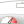
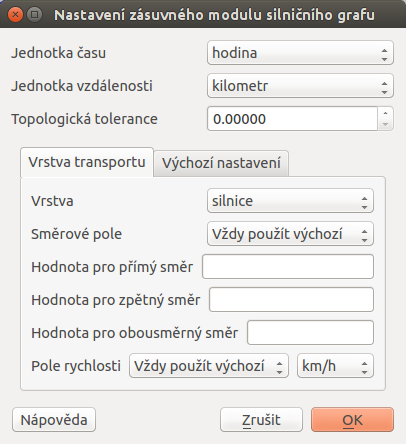
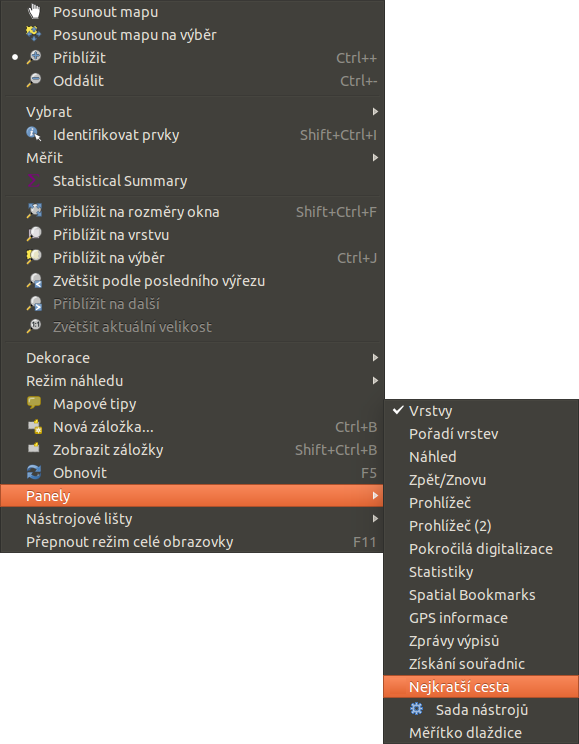

# QGIS pluginy

QGIS umožňuje práci se zásuvnými moduly, tzv. `pluginy
<https://en.wikipedia.org/wiki/Plug-in_(computing)>`. Ve všeobecnosti se
jedná o software, které nepracuje samostatně, ale jako doplňkový modul
jiné aplikace a tím rozšiřuje její funkčnost. V současnosti existuje pro
QGIS víc než 300 zásuvných modulů. Všechny jsou napsané v programovacím
jazyku [Python](https://www.python.org/) nebo
[C++](https://isocpp.org/). Mnohé z nich jsou stále ve vývoji. Jejich
kompletní seznam spolu s příslušnou charakteristikou, informacemi
například o použití, potřebné minimální verzi QGISu, domovské stránce,
autorech, o počtu stáhnutí, o tom, které jsou označené jako
nejoblíbenější je dostupný [zde](https://plugins.qgis.org/plugins/).

Moduly jsou udržované vývojovým týmem QGISu ([QGIS Development
Team](http://qgis-development-team.software.informer.com/)) a jsou
automaticky součástí každé jeho distribuce. Externí pluginy jsou napsané
v programovacím jazyce Python a jsou udržovány příslušnými autory.
Chyby, angl. *bugy* v modulech by měly být zveřejnovány a dostupné na
stránkách [projektu](http://hub.qgis.org/projects/qgis-user-plugins).

## Správce zásuvných modulů

V prvním kroku v menu zvolíme `Zásuvné moduly --> Spravovat a instalovat
zásuvné moduly`, ikona . Spustí se dialogové okno (`vse`), které slouží
k prohlížení, vypínání a zapínání dostupných modulů příslušné verze
QGISu.

<figure>

<figcaption>Správce zásuvných modulů v prostředí QGIS.</figcaption>
</figure>

Pod položkou Instalované najdeme ty, které byly nainstalované
automaticky při instalaci QGISu. Z nich jsou některé načtené, jiné lze
dočasně povolit nebo zakázat zaškrtnutím ikonky
. V případě, že klikneme na některý z modulů,
zobrazí se jeho charakteristika nebo účel, spolu s dalšími informacemi
jako je název, popis, počet hodnocení a stáhnutí modulu, reprezentující
ikona, kategorie, instalovaná nebo dostupná verze, autor, seznam změn a
další. Na `plugininfo` je znázorněný příklad zásuvného modulu s názvem

Qgis2threejs.

<figure>

</figure>

Seznam všech dostupných pluginů je možno zobrazit a konkrétní modul
načíst zvolením Nenainstalováno a spuštěním
Instalovat zásuvný modul. Následně se dá
tento modul přeinstalovat nebo úplně odinstalovat (`p-instal`).

<figure>

</figure>

Pod záložkou Aktualizovatelný se nachází zásuvné moduly,
které jsou dostupné i v novější verzi. Záložka Nastavení
obsahuje nastavení týkající se kontroly aktualizací modulů,
experimentálních a neschválených modulů a zobrazuje i seznam repozitářů,
které lze přidávat, editovat nebo mazat, viz `akt-nast`. Po zaškrtnutí
políček
 při položkách
Zobrazit také experimentální a
neschválené moduly je k dispozici téměř
500 zásuvných modulů.

<figure>

<figcaption>Záložky související s aktualizacemi a nastavením zásuvných
modulů.</figcaption>
</figure>

> [!TIP]
> Seznam zásuvných modulů může uživatel uspořádat dle svých potřeb. Po
> stisknutí pravého tlačítka myši v seznamu modulů je k dispozici jejich
> uspořádání dle abecedy, počtu stáhnutí, hlasů nebo stavu (`rad`).
>
> 

>
> <figure>
> 
> <figcaption>Možnosti seřazení zásuvných modulů.</figcaption>
> </figure>
>
> 

> [!NOTE]
> Je zapotřebí připomenout, že zásuvné moduly v oficiálních repozitářech
> byly testovány, nicméně jednotlivé repozitáře mohou obsahovat i méně
> ověřené moduly různé kvality a stadia vývoje. Proto je dobrou pomůckou
> zobrazení hodnocení či počtu
> 
> 
> .

> [!TIP]
> Pokud známe alespoň přibližný název konkrétního modulu, při
> vyhledávání může pomoci vyplnění políčka
> Hledat v dialogovém okně.

## Příklady zásuvných modulů

V další části si částečně ukážeme některé z užitečných a často
používaných zásuvních modulů programu QGIS:

latex

p{10cm}\|

html

border

| Zásuvný modul \| Charakteristika \|                                                                                                                |     |
|----------------------------------------------------------------------------------------------------------------------------------------------------|-----|
|  Another DXF Importer \| importuje formát `*.dxf`\|                                                                            |     |
|  Získání souřadnic \| získává souřadnice myši \|                                                                               |     |
|  Zásuvný modul síťových analýz \| řeší problém nejkratší cesty \| |     |
|  Quick Map Services \| načítání mapových služeb \|                                                                             |     |
|  GeoData CZ/SK \| mapové služby a jiné zdroje z ČR a SR                                                                        |     |
|  RUIAN \| načítání dat z RÚIAN \|                                     |     |

###  Another DXF Importer

V případě, že máme k dispozici soubor AutoCAD DXF ([Drawing Exchange
Format](https://en.wikipedia.org/wiki/AutoCAD_DXF)), do prostředí
programu QGIS ho umíme načíst buď přímo přes GDAL/OGR, pokud však import
nedopadne podle očekávání pak je možné využít zásovný modul Another DXF
Importer. V předchozích verzích byl dostupný také modul Konvertor
Dxf2Shp, ten se však již dále nevyvíjí.

<figure>

<figcaption>Dialogové okno modulu pro import AutoCAD DXF
souboru.</figcaption>
</figure>

Po načtení modulu ze `správce zásuvných modulů <spravce-plugin>` se po
kliknutí na ikonu
 objeví dialogové okno, kde je zapotřebí nastavit vstupní
`*.dxf` soubor, název, cestu a typ nového `*.shp` souboru nebo
GeoPackage.

> [!NOTE]
> Pokud se po spuštění modulu tlačítkem `OK` zobrazí dialogové okno
> související se souřadnicovými systémy, systém nastavíme.

###  Získání souřadnic

Tento zásuvný modul se používá velmi jednoduše a umožňuje zobrazení
souřadnic myši pro dva vybrané souřadnicové systémy. Dialogové okno je
zobrazeno na `zis-sur`. Kliknutím na ikonu
 nastavíme požadovaný souřadnicový systém, zvolením
 Zapnout získávání se symbol myši změní na
. Po kliknutí do mapového okna se objeví malá červená
tečka. Její souřadnice v souřadnicovém systému projektu se zobrazí v
okně vedle symbolu
. Na `zis-sur` jsou na ukázku zobrazené souřadnice
vybraného bodu v souřadnicových systémech s EPSG 4326 (WGS 84) a 5514
(S-JTSK (Greenwich) / Krovak East North). Ikona
 umožňuje souřadnice kopírovat do schránky v podobě
čtyř hodnot (pro `zis-sur` by to bylo
`13.71955,49.85887,-796222.963,-1061087.065`).

<figure>

<figcaption>Dialogové okno modulu na zobrazení souřadnic z mapového
okna.</figcaption>
</figure>

> [!NOTE]
> Pro novou verzi QGIS byl tento modul portován a aktuálně není přeložen
> do češtiny. Funkcionalita však zústává v zásadě stejná.

###  Zásuvný modul síťových analýz

Ve vrstvě polylinií modul vypočte a následně vykreslí nejkratší cestu
mezi dvěma zvolenými body. Je napsaný v programovacím jazyku C++.
Umožňuje určit optimální trasu na základě délky nebo času. Výsledek je
automaticky exportován jako nová vektorová vrstva.

> [!NOTE]
> Při výpočtu nejkratší cesty se doporučuje nastavit souřadnicový systém
> projektu dle souřadnicového systému vrstvy polylinií.

Zásuvný modul aktivujeme v `panelu správce zásuvných modulů 
<spravce-plugin>`. V liště menu přejdeme na `Vektor --> 
Silniční graf --> Nastavení`. Zobrazí se okno, kde vyplníme základní
nastavení jako jednotku času, vzdálenosti, topologickou toleranci a
další, viz `path-nast`. Na nastavení modulu použijeme vektorovou vrstvu
cest České republiky zobrazenou na `path-vector` dle typu.

<figure>

<figcaption>Nastavení zásuvného modulu cestného grafu.</figcaption>
</figure>

<figure>

<figcaption>Silnice České republiky zobrazené dle jejich
typu.</figcaption>
</figure>

V panelu Nejkratší cesta použijeme
 a v mapovém okně kliknutím zvolíme počáteční a koncový bod
cesty. Zobrazí se jako zelená, resp. červená tečka. Následně nastavíme
kritérium, t.j. délku nebo čas a potvrdíme stisknutím
Vypočítat. Po proběhnutí výpočtu se v
mapovém okně zobrazí výsledek v podobě polylinie, která se dá exportovat
jako nová vektorová vrstva (použitím
Export). Tlačítko
Vyčistit slouží na smazání obsahu
políček. Postup je znázorněný na `path`.

<figure>

</figure>

> [!TIP]
> Pokud nevidíme panel Nejkratší cesta,
> přidáme ho z menu lišty Zobrazit
> (`Zobrazit --> Panely --> Nejkratší cesta`), jak je to znázorněno na
> `path-menu`.
>
> 

>
> <figure>
>  alt="images/p_path_menu.png" />
> <figcaption>Zobrazení dialogového okna na výpočet nejkratší
> cesty.</figcaption>
> </figure>
>
> 

> [!NOTE]
> Tento modul je možno nahradit interním algoritmem, který je dostupný
> mezi nástroji zpracování.

<figure>

<figcaption>Dialogové okno algoritmu pro hledání nejkratší
cesty.</figcaption>
</figure>

###  Quick Map Services

Pomocí tohoto zásuvného modulu je možné připojovat různé mapové služby
postavené na protokolech XYZ nebo WMS. V základním nastavení jsou např.
Open Street Map. Je však možno přidat další a také vyhledávat dle
pozice. K dispozici jsou např. i mapy.cz.

Se zásuvným modulem začneme pracovat tak, že z menu jako
`Web --> QuickMapServices --> ???` vybereme zdroj, který nás zajímá.

<figure>

</figure>

<figure>

<figcaption>Přidáná mapová služba Open Street Map.</figcaption>
</figure>

###  GeoData CZ/SK

*GeoData CZ/SK Plugin*
(`Zásuvné moduly --> GeoData --> Procházet datové zdroje`) umožňuje
přidávat do mapového okna množství dat z oblasti České a SLovenské
republiky obrazových služeb z XYZ a WMS zdrojů a také jiných typů zdrojů
Na `p-geodata` je dialogové okno pluginu.

<figure>

<figcaption>Ukázka dialogového okna pluginu</figcaption>
</figure>

###  RUIAN

*RUIAN Plugin* umožňuje přidávat do mapového okna dat z registru RÚIAN
(Registr územní identifikace, adres a nemovitostí). Na `p-ruian` je
dialogové okno pluginu.

<figure>

<figcaption>Ukázka dialogového okna pluginu</figcaption>
</figure>

> [!NOTE]
> Další ze zmíněných modulů budou obsahem školení QGIS pro pokročilé, a
> to především GRASS plugin.
