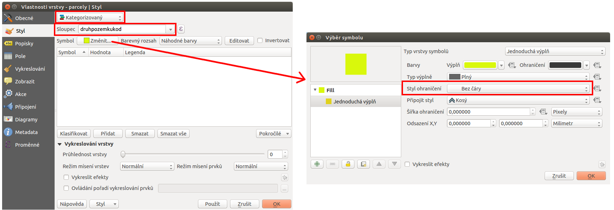
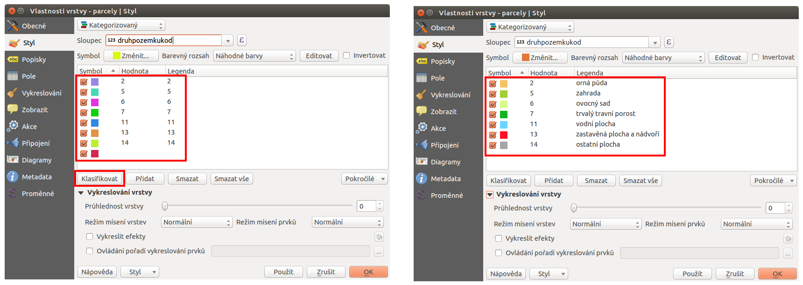
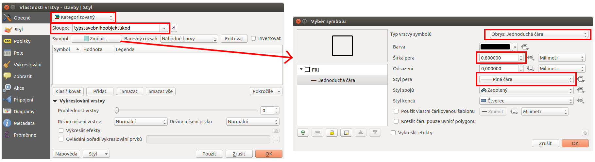
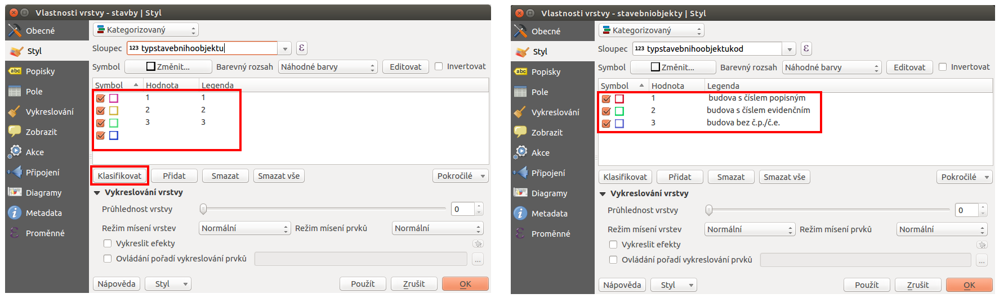
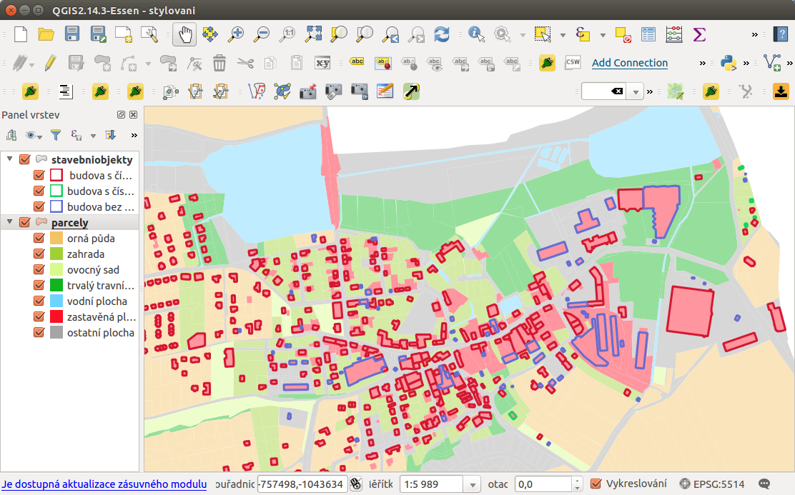
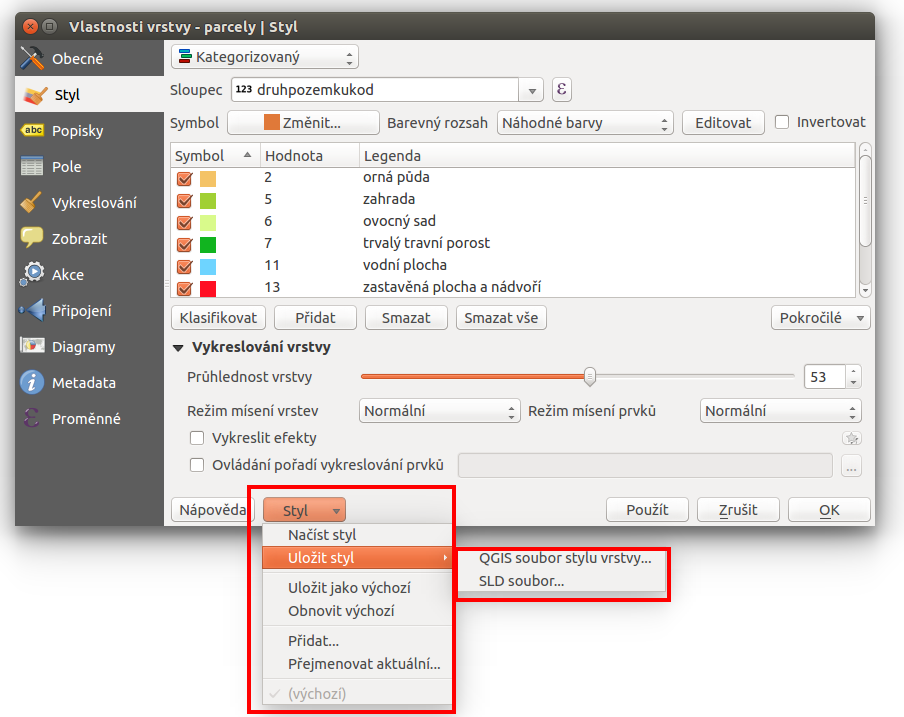

# Příklad stylování kategorizovanou obrysovou čárou

V některých případech, zejména pokud tvoříme symbologii pro prezentaci
dat, je nutné věnovat stylování dat větší péči. Níže je uveden případ
stylování dvou vrstev - `parcel a budov`, které se vzájemně překrývají.
Data jsou získána z RÚIANu.

## Zadání

Nastavit styl vrstvy `parcel` podle *druhu pozemku*. Podobně nastavit
styl vrstvy `stavebních objektů` a to na základě *typu stavebního
objektu*. Jelikož se obě vrstvy vzájemně překrývají, tak bude vrstva
`stavebních objektů` vykreslena pouze obrysem, tedy bez výplně.

## Nastavení stylu vrstvy parcel

Druh pozemku (orná půda/zahrada/zastavěná plocha a nádvoří/...) je
uveden jako jeden z atributů pomocí příslušného kódu -`druhpozemkukod`.

Ve vlastnostech vrstvy `parcely` v záložce Styl zvolíme typ stylování
`kategorizovaný`. U položky `Sloupec` vybereme atribut, podle kterého
chceme stylovat - v našem případě `druhpozemkukod`. Vzhledem k tomu, že
přes vrstvu parcel budeme vykreslovat ještě vrstvu budov, tak budeme
parcely stylovat pouze výplní bez ohraničení. V nastavení `Symbolu`
proto upravíme položku `Styl ohraničení` na hodnotu `Bez čáry`.

Při takovémto nastavení bude mezi jednotlivými parcelami jemná mezera,
nebude ale působit rušivě. Pokud by bychom preferovali styl bez mezery,
tak nastavíme barvu ohraničení na stejnou barvu jako je barva výplně.
Jednotlivé podstatné části nastavení jsou zvýrazněny v `no-outline`.

<figure>

<figcaption>Jednotlivé kroky nastavení kategorizovaného stylování a
úprava výchozího symbolu.</figcaption>
</figure>

Dalším krokem je vytvoření barevného stylu pro každou hodnotu druhu
pozemku. Pomocí tlačítka `Klasifikovat` se vygenerují všechny existující
hodnoty pro zvolený atribut a jedna navíc. V tomto případě pro
generování používáme `náhodnou paletu barev`. Zvolené barvy ručně
opravíme dle svého uvážení. Kliknutím do položky `symbol` u každé
hodnoty si můžeme nastavit barvu. Dalším požadavkem je, aby se nám v
legendě nezobrazoval kód druhu pozemku ale přesná hodnota podle
číselníku
[ČÚZK](http://www.cuzk.cz/Katastr-nemovitosti/Poskytovani-udaju-z-KN/Ciselniky-ISKN/Ciselniky-k-nemovitosti.aspx#SC_D_POZEMKU).
Položky legendy lze upravovat přímo. Ukázka automaticky vygenerovaného
stylování a již upravených stylů i s popiskami pro legendu je na
zobrazena `change1`.

<figure>

<figcaption>Automaticky vygenerované stylování podle zvoleného atributu
a jeho manuální úprava - symbologie i legendy.</figcaption>
</figure>

Výsledek stylování se projeví po uložení stylu v mapovém okně
(symbologie) i panelu vrstev (legenda).

<figure>

</figure>

## Nastavení stylu stavebních objektů

Stavební objekty vykreslíme pouze obvodem nad vrstvou `parcel`. Styl
vykreslení jejich obvodu se bude lišit podle hodnoty atributu
`typstavebnihoobjektukod`.

Ve vlastnostech vrstvy `stavby` v záložce opět zvolíme typ stylování
`kategorizovaný`. U položky `Sloupec` vybereme atribut
`typstavebnihoobjektukod`. V položce nastavení `symbolu` změníme Typ
vrstvy symbolů na položku `Obrys:Jednoduchá čára`. Dle potřeby nastavíme
i `šířku pera
a styl`. V případě potřeby je ještě možné použít různé typy efektů pro
vykreslování.

<figure>

<figcaption>Nastavení symbolu pro vykreslování pouze obrysové čáry
prvků.</figcaption>
</figure>

Tak jako v předchozím kroku provedeme klasifikaci podle zvoleného
atributu. V tomto případě zvolený atribut obsahuje pouze 3 různé
hodnoty. Každý vygenerovaný styl si opět můžeme upravit podle vlastních
potřeb, jako i popisky pro legendu.

<figure>

</figure>

Výsledná kombinace obou stylů vrstev je ještě upravena změnou
průhlednosti vrstvy `parcel` (barvy jsou na `vysledek` jemnější).

<figure>

<figcaption>Zobrazení obou vrstev v mapovém okně. V panelu vrstev je
vidět upravené legendy u každé vrstvy.</figcaption>
</figure>

> [!TIP]
> Vytvořený styl se ukládá jako součást QGIS projektu. Styl každé vrstvy
> je však možné uložit jako samostatný soubor a pak jej použít u další
> vrstvy.
>
> Volba pro uložení se nachází přímo v záložce styl ve spodní části.
> Tlačítkem `Styl` se otevře menu (`save`), které slouží jak pro uložení
> stávajícího stylu vrstvy, tak pro načtení uloženého stylu.
>
> 

>
> <figure>
> 
> <figcaption>Možnost exportu a import stylů pro vrstvu.</figcaption>
> </figure>
>
> 

>
> Styly je možné uložit do dvou různých formátů - *SLD* (OGC Styled
> Layer Descriptor) a *QML* (interní soubor pro ukládání stylů QGISu).
> Oba formáty jsou soubor typu XML, takže je možné jej jednoduše
> editovat i mimo QGIS.
