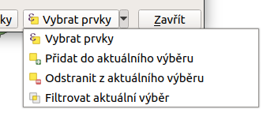
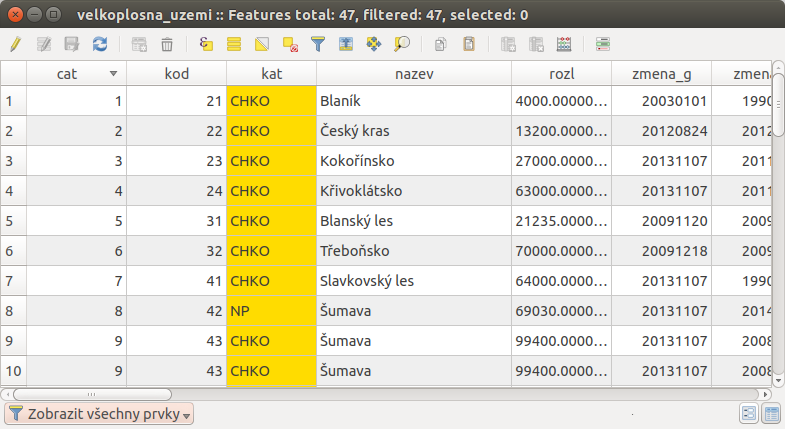
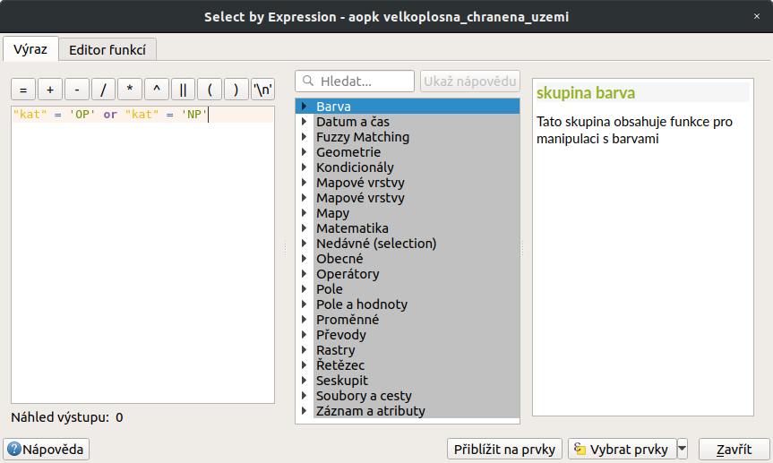
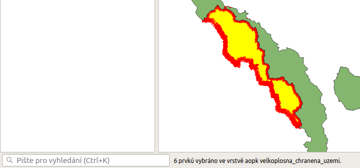
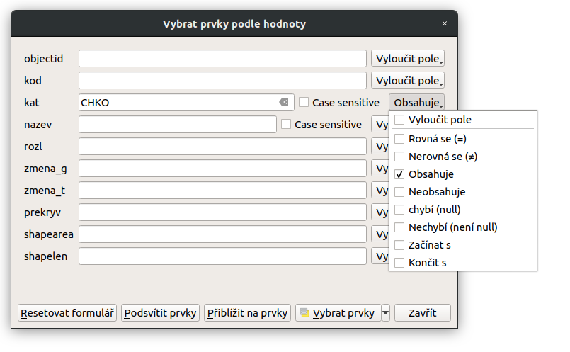
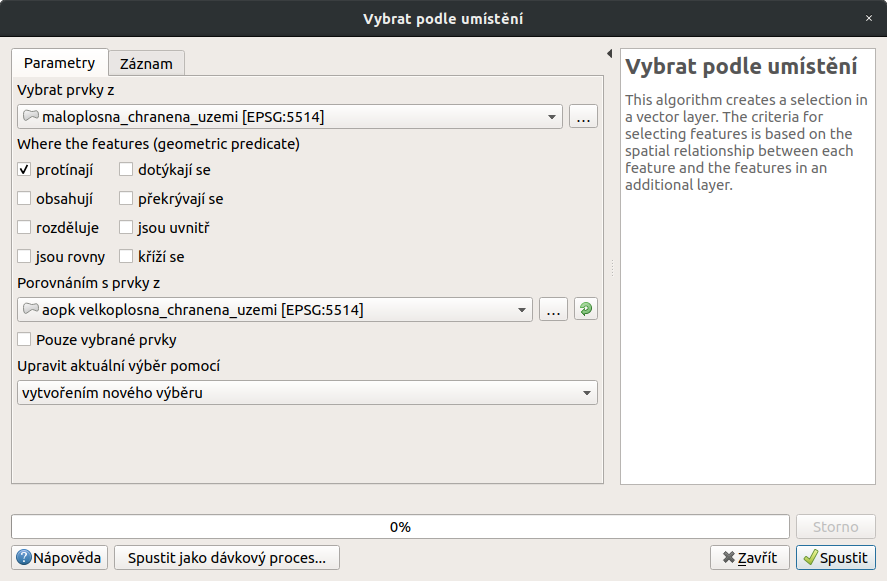
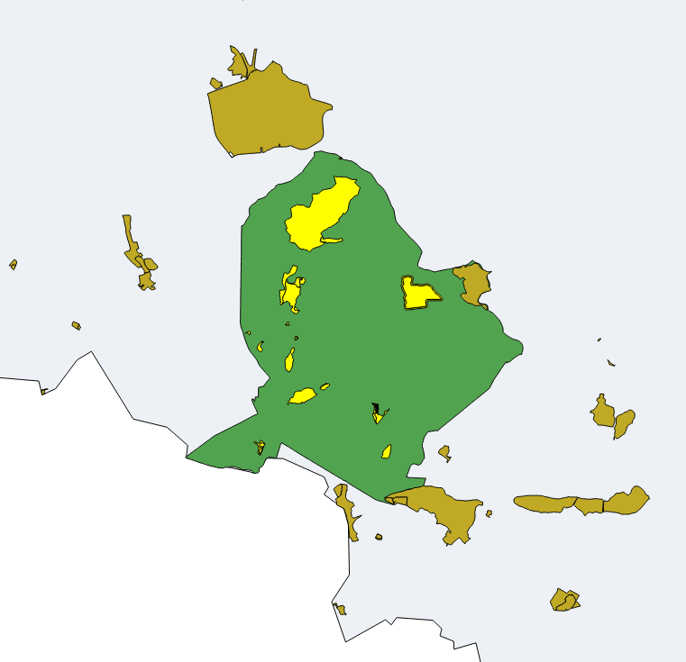

# Atributové a prostorové dotazování

## Atributové dotazování

Atributové dotazování slouží k vytvoření výběru prvků z vektorové vrstvy
dle námi zadaných kritérií. Funkce, která toto umožňuje, je <sup>Vybrat
prvky pomocí výrazu...</sup> a můžeme ji spustit buď z nástrojového
panelu, nebo z atributové tabulky dané vrstvy. Dialogové okno vypadá
obdobně jako okno kalkulátoru polí a zadávání výrazu zde funguje na
stejném principu. Tedy v levé části okna (`Výraz`) je prostor pro zadání
požadovaného výrazu a pravá část okna (`Funkce`) slouží k rychlému
přidání funkcí nebo parametrů do výrazu.

<figure>

<figcaption>Okno atributového dotazování.</figcaption>
</figure>

Po zadání našeho výrazu potvrdíme tlačítkem `Vybrat prvky`, čímž se nám
vytvoří požadovaný výběr. Z nabídky vedle tlačítka můžeme vybrat další
možnosti práce s výběrem pomocí atributového dotazu. Tlačítkem
`Přiblížit na prvky` přblížíme na výsledné prvky bez provedení výběru.

<figure>

<figcaption>Další možnosti práce s výběrem pomocí atributového
dotazu.</figcaption>
</figure>

> [!TIP]
> V levé části stavového řádku vidíme aktuální počet vybraných prvků
> (viz `expstatus`).

Uvedeme si jednoduchý příklad atributového dotazu. Z vrstvy
*Velkoplošných zvláště chráněných území*, potřebujeme vybrat národní
parky a jejich ochranná pásma. Podmínkou samozřejmě je, že musíme mít
takovou informaci o prvcích v atributové tabulce.

<figure>

<figcaption>Informace o prvcích v atributové tabulce.</figcaption>
</figure>

Formulace našeho dotazu by v mluveném slově vypadala přibližně takto:
"Vyber takové prvky, které mají buď atribut `KAT` s hodnotou `NP` nebo
atribut `KAT` s hodnotou `OP`". Výraz, který potřebujeme vepsat do
dialogového okna:

``` sql
"kat" = 'OP' or "kat" = 'NP' 
```

<figure>

<figcaption>Výsledek atributového dotazu ("kat" = 'OP' or "kat" = 'NP')
ve vrstvě Velkoplošných zvláště chráněných území .</figcaption>
</figure>

<div id="expstatus">

<figure>

<figcaption>Výpis počtu vybraných prvků (v levé části stavového
řádku).</figcaption>
</figure>

</div>

### Vybrat prvky podle hodnoty

Pro rychlé a zjednodušené atributové dotazovaní lze také využít formulář
funkce <sup>Vybrat prvky podle hodnoty...</sup> (klávesová zkratka
`F3`), kde lze zadat hodnoty a pravidla výběru k jednotlivým atributům.

<figure>

<figcaption>Formulář funkce <sup>Vybrat prvky podle
hodnoty...</sup></figcaption>
</figure>

## Prostorové dotazování

Prostorové dotazování slouží k vytvoření výběru prvků na základě
prostorového vztahu dvou vektorových vrstev. Funkce, která toto
umožňuje, je <sup>Vybrat podle umístění...</sup> a najdeme ji v menu
`Vektor --> Výzkumné nástroje --> Vybrat podle umístění...`

<figure>

<figcaption>Okno <code class="interpreted-text"
role="guilabel">Vybrat podle umístění</code>.</figcaption>
</figure>

- `Vybrat prvky z` - vybereme vrstvu, ve které chceme tvořit výběr

- `Geometric predicate` (typ vztahu, který se bude vyhodnocovat),
  množina možností se generuje podle vstupních vrstev - `protínají` -
  vybere prvky, které se jakkoliv protínají s prvky v průnikové vrstvě -
  `dotýkájí se` - vybere prvky se společnou hranicí nebo lomovým bodem s
  prvky v průnikové vrstvě - `obsahují` - vybere pouze prvky, které
  osahují prvky z průnikové vrstvy (např. celý polygon uvnitř
  polygonu) - `překrývají se` - vybere pouze prvky, které se svoji částí
  protínají s prvky v průnikové vrstvě - `rozděluje` - vybere prvky,
  které nijak neprotínají prvky v průnikové vrstě - `jsou uvnitř` -
  vybere pouze prvky, které leží celou rozlohou uvnitř prvku průnikové
  vrstvy (např. celý polygon uvnitř polygonu) - `jsou si rovny` - vybere
  prvky, které jsou totožné - `kříží se` - vybere prvky, které se
  křižují s prvky v průnikové vrstvě (u linií)

- `Porovnáním s prvky z` - vybereme vrstvu, podle které se prvky budou
  vybírat - `Pouze vybrané prvky` - pokud chceme aby vstupovaly pouze
  vybrané prvky vrstvy

- Upravit aktuální výběr pomocí

  > - `vytvořením nového výběru` - zruší stávající výběr a vytvoří zcela
  >   nový
  > - `přidáním do aktuálního výběru` - k aktuálnímu výběru přidá
  >   nadefinovaný výběr
  > - `vybráním v rámci aktuálního výběru` - vytvoří nový výběr pouze z
  >   prvků které jsou aktuálně ve výběru
  > - `odstraněním z aktuálního výběru` - z aktuálního výběru odebere
  >   prvky, které nadefinujeme

Příklad prostorového dotazu (`sellocpriklad`) - zajímá nás, která
maloplošná chráněná území leží celou rozlohou ve velkoplošném chráněném
území. Prostorový dotaz bude vypadat takto: vyber prvky z vrstvy
`maloplosna_uzemi`, které jsou prvky zcela uvnitř prvků ve vrstvě
`velkoplosna_uzemi`.

<div id="sellocpriklad">

<figure>

<figcaption>Výběr maloplošných chráněných území, které leží uvnitř
velkoplošných chráněných územích.</figcaption>
</figure>

</div>

<div class="noteadvanced">

Pomocí funkcí <sup>Náhodný výběr...</sup>/ <sup>Náhodný výběr v
podmonožinách...</sup> můžeme tvořit náhodné výběry z prvků. Tyto funkce
najdeme v hlavním menu `Vektor --> Výzkumné nástroje`.

</div>
