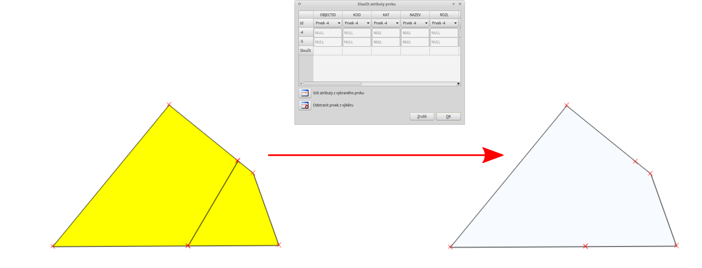
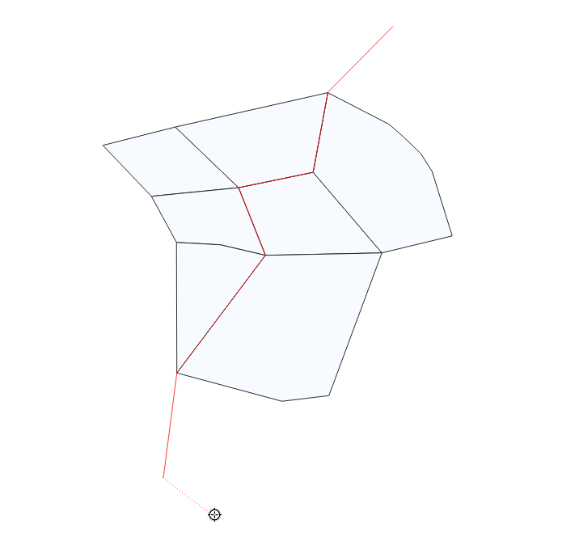
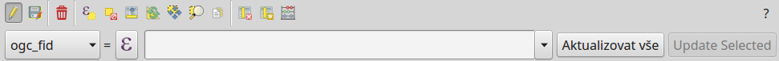

# Tvorba nových vrstev a jejich editace

## Vytvoření Shapefile vrstvy

Novou vrstvu lze vytvořit pomocí tlačítka Nová Shapefile
vrstva nebo v hlavním menu `Vrstva --> Vytvořit
vrstvu --> Nová Shapefile vrstva`.

<figure>

<figcaption>Nová vektorová vrstva.</figcaption>
</figure>

V první řadě je nutné zadat cestu, kam se nová vrstva vytvoří. Dále při
vytváření zvolíme typ vrstvy (bod, linie nebo polygon), souřadnicový
systém vrstvy, a pokud je třeba, přidáme nové atributy. Také lze
nastavit vytvoření Z hodnot (nadmořské výšky) nebo M hodnot (další
měřené hodnoty).

Vytváření nového atributu:

- `Název` - název atributu (max. 10 znaků) - toto omezení vychází z
  formátu Esri Shapefile, který je zde použit

- `Typ`

  > - `Textová data` (String) - formát buněk je text, nelze použít pro
  >   výpočty (max. 255 znaků)
  > - `Celé číslo` (Integer) - formát buněk je celé číslo, tedy bez
  >   desetinných míst (max. 10 znaků)
  > - `Desetinné číslo` (Real) - formát buněk je desetinné číslo (max.
  >   10 znaků)
  > - `Datum` (Date) - formát buněk je datum (max. 20 znaků)

- `Délka` - počet znaků

- `Přesnost` - počet desetinných míst

- pro přidání atributu vrstvy je nutné kliknout na tlačítko
  `Přidat do seznamu polí`

Ve spodní části okna máme seznam atributů, které máme ve vrstvě
připravené. Atributy lze odstranit označením a kliknutím na tlačítko
`Odstranit pole`. Automaticky je zde přidaný atribut "id", pokud ho
nechceme, lze jej také vymazat.

Pokud máme vše nastaveno, potvrdíme tlačítkem `OK` a nová vrstva se
automaticky nahraje do projektu.

## Editace vrstvy

Editaci vrstvy spustíme pomocí tlačítka Přepnout editaci nebo
v hlavním menu `Vrstva -->
Přepnout editaci`. Spuštěním režimu editace se aktivují editační funkce
v panelu a bude nám umožněno vytvářet nové prvky a jejich atributy nebo
editovat stávající. Vrstva, která je momentálně v režimu editace, je v
seznamu vrstev znázorněna s editační ikonkou .

<figure>

<figcaption>Znázornění režimu editace vrstvy v seznamu
vrstev.</figcaption>
</figure>

Režim editace ukončíme opět pomocí tlačítka Přepnout editaci.
Provedené změny je vhodné průběžně ukládat pomocí ikony Uložit
změny vrstvy. Pokud při editaci zapomeneme uložit změny, QGIS se
nás při ukončení editace zeptá, zda chceme provedené změny uložit, či
nikoliv.

> [!TIP]
> Aktuální změny - hromadné ovládání změn a zapínání/vypínaní
> editací ve vrstvách.

Základní nástroje editace jsou dostupné ve výchozím nastavení mezi
ostatními Nástrojovými lištami. Některké
nástroje jsou ale dostupné v samostatné liště `Pokročilá digitalizace`.
Tu můžeme aktivovat v seznamu všech dostupních položek a to pomocí
pravého kliku a následné aktivace vybrané
položky.

<figure>

</figure>

Zapnutí panelu Pokročilá digitalizace.

### Základní editace geometrie

, , Přidat ... prvek - kliknutím vytvoříme prvek (bod), nebo
lomové body prvku (linie, polygon). V druhém případě ukončíme tvorbu
prvku kliknutím pravým tlačítkem a přidáme případné atributy. Při
přidávání lomových bodů je možné se vrátit o krok zpět pomocí klávesy
`Backspace` nebo `Del`.

<figure>

<figcaption>Vytváření nového prvku ve vrstvě polygonů. Pokud by v tomto
momentě byla tvorba prvku pravým kliknutím ukončena, polygon by měl tři
uzly (tvar trojúhelníku).</figcaption>
</figure>

Nástroj na lomové body - pomocí nástroje uzlů lze  
- přidávat body kliknutím na křížek ve středu hrany a umístěním bodu
- přidávat body dvojklikem na hranu a umístěním bodu
- posunovat existující body kliknutím na bod a umístěním bodu
- mazat body označením bodu (nebo více bodů pomocí `Shift`) a stisknutím
  klávesy `Backspace` nebo `Del`
- posouvat celé hrany kliknutím na hranu a umístěním hrany

<figure>

<figcaption>Přidání a přesunutí lomového bodu (uzlu,
vertexu).</figcaption>
</figure>

Nástroj uzlů lze použít ve dvou módech, buď pouze pro vrstvu kterou
editujeme, nebo pro všechny vrstvy které jsou v módu editace

Vymazat vybrané - smaže vybrané prvky

Přesunout prvek/prvky - jednotlivé prvky přesuneme kliknutím
na prvek, posunutím a opětovným kliknutím

<figure>

<figcaption>Přesun prvku.</figcaption>
</figure>

Další variantou funkce je Kopírovat a přesunout prvek/prvky,
kdy stejným principem prvky kopírujeme. Pro přesun nebo kopírování více
prvků můžeme pracovat s více prvky, které máme ve výběru.

Rozdělit objekt - naklikáme "řez" přes místa, které chceme
rozdělit a pro ukončení klikneme pravým tlačítkem, prvek se nám v
místech průsečíků rozdělí.

<figure>

<figcaption>Rozdělení polygonu na dva.</figcaption>
</figure>

Sloučit vybrané prvky - nejdříve pomocí výběru označíme
prvky, které chceme spojit. Při sloučení vyskočí okno, ve kterém je
možné zadat hodnoty atributů "nového" - sloučeného prvku. Tyto hodnoty
můžeme odvodit z konkrétního vstupního prvku, nebo je lze vypočítat
(např. suma, průměr). Výchozí hodnota atributů je `NULL`, tedy prázdná
hodnota.

<figure>

</figure>

Změnit tvar prvků - obdobně jako při rozdělení nebo tvorbě
nového prvku lze naklikáním nového tvaru změnit tvar stávajícího prvku.
Pro změnu tvaru musí být při naklikávání "řezu" vždy minimálně dva
průsečíky. V případě změny tvaru polygonu bude část s menší plochou
vymazána (`resh1`).

<figure>

<figcaption>Změna tvaru polygonu - zmenšení.</figcaption>
</figure>

<figure>

<figcaption>Změna tvaru polygonu - zvětšení.</figcaption>
</figure>

<figure>

<figcaption>Změna tvaru linie.</figcaption>
</figure>

#### Přichytávání (snapping)

Pro topologicky čistou editaci můžeme pomocí lišty `Přichytávání`
nastavit přichytávání kurzoru s určitou citlivostí k uzlům či segmentům
konkrétních vrstev. Přichytávání je nejdříve nutné aktivovat kliknutím
na ikonu Enable Snapping, nebo využít klávesovou zkratku `S`.
Přichycení kurzoru se zobrazí výrazně růžovým čtverečkem v případě
lomového bodu (viz `snapvert`) nebo křížkem v případě segmentu
(`snapsegm`).

<figure>

<figcaption>Základní okno možnosti přichytávání.</figcaption>
</figure>

<figure>

<figcaption>Přichycení kurzoru pouze k lomovému bodu.</figcaption>
</figure>

<figure>

<figcaption>Přichycení kurzoru k segmentu.</figcaption>
</figure>

- Nastavení :

  > - Všechny vrstvy - přichytávání ke všem viditelným
  >   vektorovým vrstvám projektu
  > - Aktivní vrstva - přichytávání pouze v rámci editované
  >   vrstvy, ostatní vrstvy ignoruje
  > - Pokročilé nastavení - režim pokročilého nastavení, lze
  >   nastavit různé nastavení pro jednotlivé vrstvy a nabízí možnost
  >   Vyvarovat se protnutí
  > - `Open snapping Options...` - otevře nastavení přichytávání v
  >   samostatném okně

- Přichytit k :

  > - Lomový bod - pouze k lomovým bodům (uzlům/vertexům,
  >   `snapvert`)
  > - Lomový bod a segment - k obojímu
  > - Segmentu - pouze k segmentům (hranám/liniím,
  >   `snapsegm`)

- Tolerance - vzdálenost, od které se kurzor bude k lomovému bodu nebo
  segmentu přichytávat, hodnotu lze zadat v mapových jednotkách
  (vzdálenost na mapě) nebo pixelech (vzdálenost na monitoru)

- Zapnout topologickou editaci - při aktivaci lze pomocí
  Nástroj uzlú posouvat společný lomový bod přichycení obou
  prvků najednou. Pokud není aktivní, lomový bod lze oddělit

- Zapnout přichytávání na protnutí - při aktivaci se bude
  kurzor přichytávat i na případné místo "překřížení" segmentů (linií)

- Zapnout trasování - trasování umožňuje vytvářet nové prvky
  tak aby na sebe přímo navazovaly (topologicky čistá data). Funguje na
  principu vyhledání nejkratší vzdálensoti na segmentech mezi zadanými
  body. Trasování může být problematické v případě, že máme vrstvu s
  více navazujícími polygony, kdy nejkratší vzdálenost nemusí vést po
  vnější hraně skupiny polygonů (`snapping_trace_poly`). To lze vyřešit
  přidáním více bodů při trasování, popř. u polygonů využitím funkce
  Vyvarovat se protnutní

<figure>

<figcaption>Trasovaní k linii při tvorbě polygonu.</figcaption>
</figure>

<figure>

<figcaption>Trasovaní s nejkratší vzdáleností při tvorbě
line.</figcaption>
</figure>

> [!TIP]
> Nastavení přichytávání lze měnit i v momentě, kdy vytváříme prvek a
> potřebujeme změnit parametry jen pro přidání konkrétního uzlu (např.
> `snapvert` a `snapsegm`).

##### Pokročilý režim přichytávání

<figure>

<figcaption>Režim pokročilého nastavení přichytávání.</figcaption>
</figure>

V pokročilém režimu lze jednotlivé parametry nastavit pro každou vrstvu
zvlášť, navíc je zde u polygonových vrstev funkce
Vyvarovat se protnutí, která zabraňuje
polygonům jejich překryv, což lze mimo jiné využít jako alternativu k
funkci trasování. Nový polygon potom můžeme zakreslit s přesahem do
sousedícího polygonu, tento přesah bude potom automaticky vymazán. Takto
snadno docílíme čistě navazujících polygonů.

<figure>

<figcaption>Příklad použití <code class="interpreted-text"
role="option">Vyvarovat se protnutí</code>. a) bez <code
class="interpreted-text" role="option">Vyvarovat se protnutí</code> -
polygon se vytvoří tak, jak jsme ho zakreslili, a překrývá předchozí
polygon. Při odstranění nového polygonu bychom viděli opět hranici
polygonu jako v prvním kroku. b) <code class="interpreted-text"
role="option">Vyvarovat se protnutí</code> - polygon se vytvoří bez
překryvu, hranice na sebe čistě navazuje.</figcaption>
</figure>

### Editace atributové tabulky

Pokud máme aktivní editaci ( Přepnout editaci), můžeme
editovat nejen geometrii, ale i atributovou tabulku vrstvy. V okně
atributové tabulky lze editaci ukládat Uložit změny vrstvy i
mazat vybrané prvky Vymazat vybrané:

> - kliknutím do libovolného pole můžeme vepisovat a upravovat hodnoty
>   tabulky
> - Nové pole - přidá nový atribut do tabulky
> - Smazat pole - vyvolá nabídku, ze které vybereme sloupce k
>   vymazání
> - Spravovat sloupce - vyvolá nabídku, ve které můžete
>   upravit viditelnost sloupce
> - Otevřít kalkulátor polí - pomocí kalkulátoru polí lze
>   vytvářet nebo aktualizovat sloupce (atributy) na základě zadaného
>   výrazu (vzorce)

## Kalkulátor polí

Pomocí funkce Otevřít kalkulátor polí můžeme zadáním výrazu
provádět výpočty na základě existujících hodnot v atributové tabulce
nebo funkcí (např. výpočet rozlohy polygonu). Výsledek výrazu můžeme
nechat zapsat do nového sloupce, do virtuálního sloupce, nebo lze
aktualizovat již existující sloupec.

<figure>

<figcaption>Okno kalkulačky polí.</figcaption>
</figure>

Nejdříve je nutné nastavit, zda chceme výsledek zapsat do nového pole,
virtuálního pole, nebo pouze aktualizovat existující pole.

- `Vytvořit nové pole` - vytvoří nové pole, zde je třeba definovat
  parametry nového atributu

- `Vytvořit virtuální pole` - vytvoří virtuální pole, které se při každé
  změně automaticky aktualizuje. Nevýhodou může být, že se pole neukládá
  do zdrojových dat, ale pouze do souboru projektu

- `Aktualizovat existující pole` - přepíše hodnoty ve vybraném poli

  > - \- vybereme z nabídky vrstvu, kterou cheme přepsat

Nyní můžeme přejít k zadání vlastního výrazu - záložka `Výraz`.

Levá část okna (`Výraz`) je prostor zadání výrazu, v horní části máme
několik tlačítek s vybranými operátory a ve spodní části potom náhled
výstupu.

<figure>

</figure>

Pravá část okna (`Funkce`) slouží k rychlému zadání funkcí nebo
parametrů do výrazu, v pravé části se k vybrané funkci/parametru
zobrazuje nápověda. Požadované položky lze vyhledat pomocí filtru nebo
prohledáním příslušných kategorií. Přidání funkce nebo hodnoty pole
pomocí okna funkcí se provádí dvojklikem na položku.

<figure>

</figure>

Při zadávání parametru pole nebo hodnoty pole (`Pole a hodnoty`) je
možné nechat si zobrazit všechny hodnoty (tlačítko: `všechny
jedinečné hodnoty`) nebo prvních 10 hodnot (tlačítko: `10 vzorků`)
atributu.

<figure>

</figure>

<figure>

</figure>

Druhá záložka - `Editor funkcí` umožňuje definovat vlastní funkce pomocí
jazyka Python

> [!TIP]
> Editovat stávající atributy lze i přímo z atributové tabulky, a to
> pomocí panelu (`editpanel`), který se aktivuje po přepnutí do režimu
> editace. Zde vybereme atribut, který chceme editovat, a zadáme
> požadovaný výraz (ručně nebo pomocí dialogu ), potom potvrdíme
> aktualizaci buď pro všechny prvky, nebo jen pro prvky vybrané.
>
> 

>
> <figure>
>  alt="images/field_edit_panel.png" />
> <figcaption>Panel editace atributů v atributové tabulce.</figcaption>
> </figure>
>
> 

