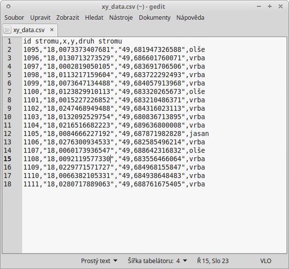
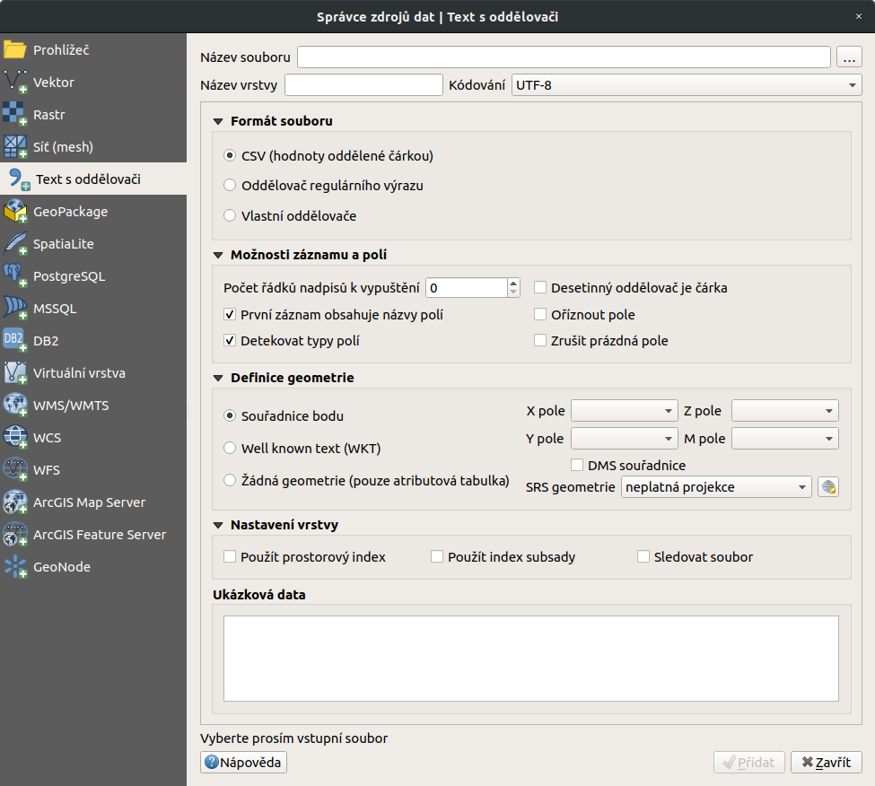
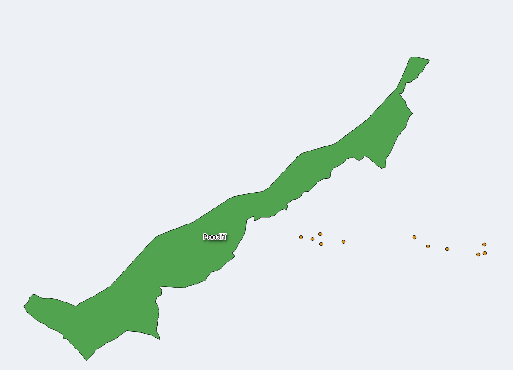

# Import dat s oddělenými hodnotami a GPS dat

## Data s oddělenými hodnotami

Jestliže máme tabulková data obsahující geografické souřadnice, můžeme
tato data poměrně snadno naimportovat a vytvořit z nich vektorovou
vrstvu. Při importu pracujeme s daty s oddělenými hodnotami
(`DSV <delimiter-separated values>`).

### Tabulková data

Data s oddělenými hodnotami jsou tabulková data uložená v textovém
souboru. V takovém souboru jsou sloupce odděleny specifickým oddělovacím
znakem a řádky koncem řádku. Pro oddělení hodnot můžeme použít jakýkoliv
znak, ale nejčastěji se setkáváme s hodnotami oddělené čárkou (`CSV`)
nebo tabulátorem (`TSV
<Tab-separated_values>`). Soubory tabulkových procesorů lze snadno
exportovat do textového souboru s oddělenými hodnotami, tyto soubory lze
potom prohlížet jak pomocí tabulkových procesorů, tak i textových
editorů.

Existují dva způsoby, jak mohou být geodata v souboru s oddělenými
hodnotami uložena:

> - jako x,y souřadnice bodů v oddělených sloupcích (tzv. XY data)
> - jako well-known text (`WKT <Well-known_text>`)

<figure>

</figure>

<figure>

<figcaption>Tabulková data (<code class="interpreted-text"
role="numref">xydata</code>) převedená do formátu CSV.</figcaption>
</figure>

> [!NOTE]
> Na obrázku `xydatacsv` si můžeme všimnout zápisu desetinných čísel
> oddělenými čárkou v souboru s hodnotami oddělenými čárkou. V takovém
> případě musí být hodnota vymezená uvozovkami. Pokud by zde uvozovky
> nebyly, znamenala by čárka oddělení nového sloupce.

> [!TIP]
> Pokud máme v tabulce souřadnice zapsané v takové formě, že je
> nedokážeme importovat, můžeme pro úpravu použít jednoduché funkce
> tabulkového procesoru (LEFT, RIGHT, MID atd.)

### Import dat

Import se provadí pomocí funkce Přidat vrstvu s odděleným
textem.

<figure>

<figcaption>Okno funkce Přidat vrstvu s odděleným
textem.</figcaption>
</figure>

- `Název souboru` - cesta a název souboru, můžeme vyhledat soubor pomocí
  tlačítka `Procházet...`

- `Název vrstvy` - název nově vzniklé vrstvy

- `Formát souboru` - vybereme typ oddělení hodnot v textovém souboru

  > - CSV (hodnoty oddělené čárkou) - standardní .csv soubor
  >   s hodnotami oddělenými čárkou
  > - Oddělovač regulárního výrazu - použití regulárního
  >   výrazu
  > - Vlastní oddělovače - výběr libovolného oddělovače

- `Kódování` - vybereme kódování textu

- `Možnosti záznamu a polí`

  > - `Počet řádků nadpisů k vypuštění` - vynechá zadaný počet rádků na
  >   začátku
  > - `První záznam obsahuje názvy polí` - zaškrtneme, pokud máme v
  >   tabulce jako první řádek názvy sloupců
  > - `Detekovat typy polí` - detekuje datový typ sloupce
  > - `Desetinný oddělovač je čárka` - zaškrtneme, pokud v datech nemáme
  >   oddělena desetinná čísla tečkou, ale čárkou (např. `xydatacsv`)
  > - `Oříznout pole` - smaže přebytečné mezery v datech např. na konci
  >   nebo začátku záznamu
  > - `Zrušit prázdná pole` - odstraní prázdné sloupce

- `Definice geometrie`

  > - Souřadnice bodu - body definovány souřadnicemi X a Y
  >   (XY Data)
  >
  >   > - `X pole`, `Y pole` - výběr sloupců, ve kterých jsou zapsané
  >   >   souřadnice. `Z pole`, `M pole` vybíráme, pokud data obsahují
  >   >   hodnoty Z a
  >   >   M
  >   > - `DMS souřadnice` - zaškrtneme, pokud máme souřadnice ve tvaru
  >   >   DMS (degrees-minutes-seconds) - stupně, minuty, vteříny
  >
  > - Well known text (WKT) - souřadnice uložené jako řetězec
  >   WKT (např. `POINT(1.525622 51.20836)`)
  >
  >   > - `Pole geometrie` - výběr sloupce, ve kterém jsou zapsané
  >   >   souřadnice
  >   > - `Geometrický typ` - typ geometrie
  >
  > - Žádna geometrie (pouze atributová tabulka) -přidá pouze
  >   tabulku
  >
  > - SRS geometrie - souřadnicový systém, ve kterém jsou
  >   souřadnice uložené

- `Nastavení vrstvy`

  > - `Použít prostorový index` - vytvoří prostorový index pro rychlejší
  >   práci s daty - vhodnější pro objemné soubory
  > - `Použít index subsady` - vytvoří index podmnožiny (filtrovaných)
  >   prvků
  > - `Sledovat soubor` - sledování změn souboru za běhu QGIS, při
  >   aktualizaci se projeví změny souboru (např. přidání dalších dat do
  >   řádků) ve vrstvě
  > - ve spodní části okna vidíme náhled vkládaných dat

Pokud chceme naimportovaná data uložit jako vrstvu, musíme exportovat
(`Uložit jako...`).

<figure>

</figure>
