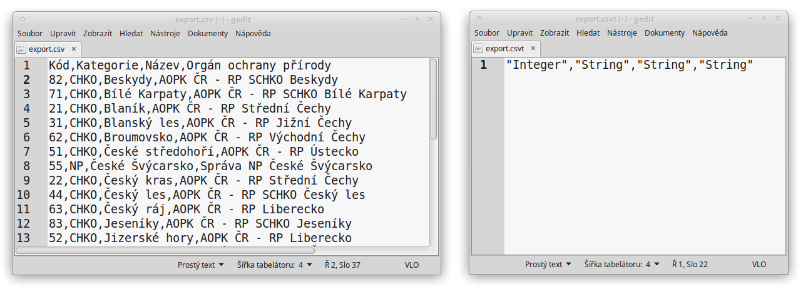
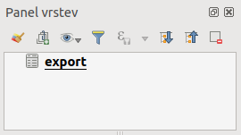
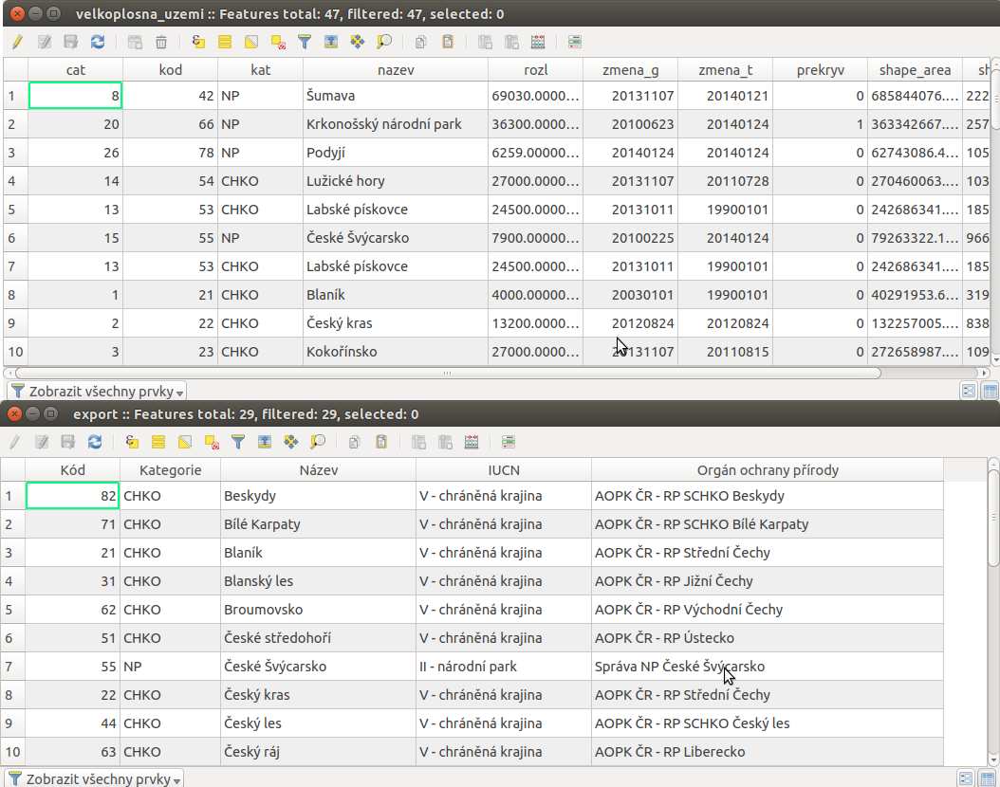
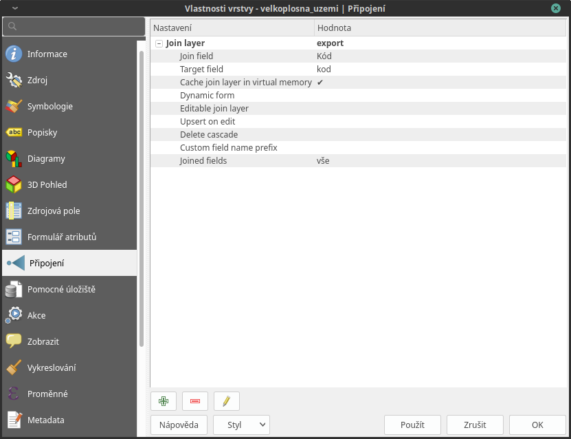
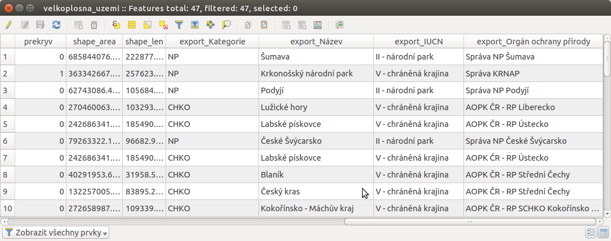

# Připojení tabulkových dat

V této kapitole si ukážeme funkci Připojení resp. její
využití k připojení tabulkových dat k atributové tabulce vrstvy, kterou
máme v projektu. Funkce připojení umožňuje na základě shodných hodnot
jednoho atributu připojit atributovou tabulku k vektorové vrstvě. Takto
k sobě můžeme připojit atributové tabulky dvou vektorových vrstev. Díky
knihovně GDAL však lze jako atributovou tabulku nahrát i tabulková data
bez geometrie (formáty \*.csv, \*.dbf, \*.ods, \*.xls aj.). To má
využití zejména pokud potřebujeme připojit získané tabulky s informacemi
o prvcích ve vektorové vrstvě nebo pokud potřebujeme připojit data
naměřená v terénu ke známým prvkům nebo např. naměřeným GPS bodům.

Postup si ukážeme na připojení tabulky získané z databáze chráněných
území (<http://drusop.nature.cz>) k vektorové vrstvě velkoplošných
zvláště chráněných území (AOPK). Připojením získáme informaci, pod jaké
orgány ochrany přírody spadají jednotlivá území.

> \- připojení získaných informací o prvcích ve vektorové  
> vrstvě
>
> \- připojení naměřených dat z terénu k prvkům ve vektorové  
> vrstvě

## Postup připojení

Nejprve je vhodné převést naši tabulku na data s oddělenými hodnotami,
např. formát `CSV`, což provedeme přímo v tabulkovém procesoru - při
ukládání nebo exportu vybereme formát \*.csv.

Existují dva hlavní způsoby jak nahrát tabulková data jako vrstvu do
QGIS:

1\. Pomocí Přidat vrstvu s odděleným textem stejně jako při
přidání XY dat, pouze zvolíme Žádna geometrie (pouze atributová
tabulka)

> \- nelze editovat přímo v QGIS
>
> \+ rozpozná typ atributu (`text`, `Celé číslo` atd.)

2\. Stejně jako vektorovou vrstvu, přetažením z prohlížeče nebo pomocí
Přidat vektorovou vrstvu.

> \+ lze editovat přímo v QGIS
>
> \- interpretuje všechny atributy jako `text`, lze ošetřit vytvořením
> doplňujícího textového souboru \*.csvt
>
> > - \*.csvt soubor musí být umístěn ve stejném adresáři a mít stejný
> >   název jako přidávaný \*.csv soubor. Dále musí obsahovat pouze
> >   jeden řádek, ve kterém jsou uvedeny typy atributů k odpovídajícím
> >   sloupcům \*.csv ("Integer","Real","String").

<figure>

<figcaption>Ukázka tabulkových dat ve formátu *.csv (vlevo) a
odpovídající soubor *.csvt (vpravo)</figcaption>
</figure>

<figure>

<figcaption>Zobrazení tabulkových dat v seznamu vrstev.</figcaption>
</figure>

<figure>

<figcaption>Atributové tabulky vektorové vrstvy (nahoře) a importované
tabulky (dole). V tomto případě budeme připojovat pomocí atributů "kod"
a "Kód", které jsou souhlasné.</figcaption>
</figure>

Jakmile máme přidána tabulková data, otevřeme vlastnosti vektorové
vrstvy, ke které chceme tabulku připojit, zvolíme záložku
Připojení a přidáme nové připojení pomocí tlačítka . V
dialogovém okně (`join_dial`) potom nastavíme parametry připojení.

<figure>

<figcaption>Okno přidání připojení.</figcaption>
</figure>

### Základní nastavení připojení

- `Připojit vrstvu` - vybereme vrstvu (.csv tabulku)
- `Připojit pole` - vybereme atribut (týká se tabulky .csv), přes který
  chceme data připojit
- `Cílové pole` - vybereme souhlasný atribut (vektorové vrstvy), ke
  kterému se bude tabulka připojovat

### Další volitelné nastavení

- `Kešovat připojenou vrstvu ve virtuální paměti` -pro rychlejší práci s
  daty

- `Dynamický formulář` - automatické načtení, v případě změn hodnot v
  "Cílovém poli"

- `Editovatelné spojení na vrstvu` - umožňuje editovat atributy
  připojené vrstvy z atributové tabulky cílové vrstvy. Obě vrstvy musí
  být v režimu editace

  > - `Vložit nebo aktualizovat řádek při editaci` - při vytvoření
  >   nového prvku v cílové vrstvě se automaticky vytvoří záznam v
  >   připojené vrstvě
  > - `Kaskádové mazání` - při smazání prvku v cílové vrstvě se
  >   automaticky smaže záznam v připojené vrstvě

- `Připojená pole` - lze zvolit konkrétní atributy pro připojení

- `Vlastní předpona názvu pole` - zde můžeme zvolit vlastní předponu
  názvů připojených atributů (jejich sloupců)

Po přidání se připojení a jeho nastavení objeví v seznamu. Pomocí
tlačítek lze připojení editovat nebo odstranit .

<figure>

<figcaption>Seznam připojení ve vlastnostech vrstvy.</figcaption>
</figure>

Zobrazením atributové tabulky vrstvy můžeme překontrolovat připojení.
Připojené atributy se zobrazí na konci tabulky.

<figure>

</figure>

S takto připojenou tabulkou můžeme dále pracovat stejně, jako by byla
přímo ve vektorové vrstvě (např. měnit symbol, provádět dotazování a
analýzy)

> [!NOTE]
> Při připojení se zdrojová data (vektorové vrstvy ani připojené
> tabulky) nemění. Data z tabulky jsou připojením pouze odkazována k
> odpovídajícím prvkům atributové tabulce vrstvy.
>
> - po odebrání tabulky ze seznamu vrstev, nebo přímo vymazání souboru
>   .csv se připojení zruší
> - pro trvalé uložení připojených dat do vektorové vrstvy lze použít
>   funkci exportu vrstvy (`Export --> Save Features As...`)
