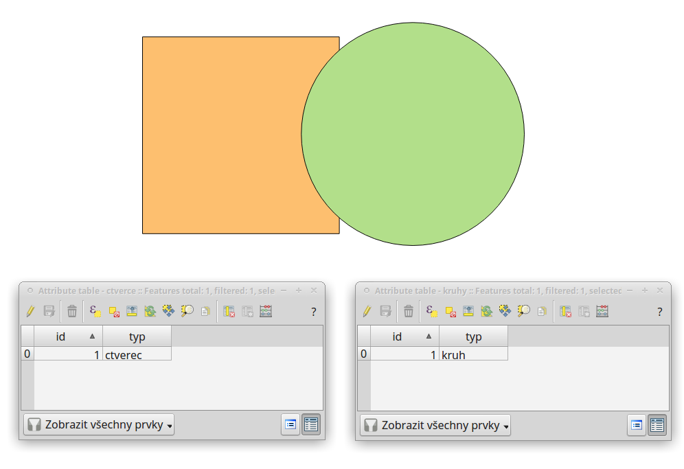

přidat u překryvných analýz obrázky prakticých příkladů (i na bodech)

# Prostorové analýzy

V prostředí QGIS máme k dispozici širokou škálu funkcí pro prostorové
analýzy vektorových dat. Základní funkce nalezneme v hlavním menu
`Vektor --> Nástroje geoprocessingu`.

Další možností jak spouštět analýzy je pomocí okna
`Nástroje zpracování`, které sdružuje funkce z knihovny GDAL a dalších
dostupných externích nástrojů, jako jsou například GRASS GIS, SAGA nebo
R. Jednotlivé funkce lze rychle vyhledávat pomocí filtru v horní části
okna (nutno zadat anglický název funkce).

<figure>

<figcaption>Okno <code class="interpreted-text"
role="item">Nástroje zpracování</code>.</figcaption>
</figure>

## Obalová zóna dle pevné vzdálenosti (buffer)

Jednou z nejzákladnějších prostorových analýz je obalová zóna (tzv.
buffer). Obalové zóny jsou reprezentovány polygony s hranicí o dané
vzdálenosti od prvků. U bodových prvků má obalová zóna tvar kruhu (nebo
aproximace kruhu), u linií a polygonů se hranice obalové zóny generuje
vzdálenostmi od uzlů. Cílem analýzy je tedy vytvořit novou polygonovou
vrstvu obalových zón. Tuto funkci najdeme v menu
`Vektor --> Nástroje geoprocessingu --> Obalová
zóna dle pevné vzdálenosti`. Velikost bufferu lze nastavit i jako
proměnlivou hodnotu.

<figure>

<figcaption>Dialogové okno obalové zóny.</figcaption>
</figure>

- `Vstupní vrsvta` - vstupní vrstva pro vytvoření obalových zón

- `Vzdálenost` - vzdálenost obalové zóny v metrech (v závislosti
  nastavení QGIS a použitého SRS)

- `Segmenty` - počet liniových segmentů při zaoblených částěch obalové
  zóny (`aprox`)

  > - nízká hodnota (min. 5) - méně uzlů - rychlejší výpočty, ale méně
  >   přesné
  > - vysoká hodnota (max. 99) - více uzlů - pomalejší výpočty, zaoblené
  >   části více odpovídají kruhu kruhu

<figure>

<figcaption>Obalová zóna s rozdílným počtem segmentů pro aproximaci
(vlevo 5, vpravo 50).</figcaption>
</figure>

\- `Styl zakončení` - styl zakončení obalové zóny na konci linií
(kulatý,
plochý,
čtverec) `zakonceni` - `Připojit styl` -
styl obalové zóny při rozích (kulatý,
kosý,
zaoblený) `spoj` - `Miter limit` -
maximální vzdálenost od odsazené křivky při vytváření kosého spoje

<figure>

<figcaption>Typy stylů zakončení (kulatý
, plochý, čtverec).</figcaption>
</figure>

<figure>

<figcaption>Typy stylů připojení (kulatý,
kosý, zaoblený).</figcaption>
</figure>

- `Výsledek rozpuštění` - zaškrtneme, pokud nechceme, aby se nám
  výsledné obalové zóny překrývaly, výsledkem analýzy je jeden prvek
- `Obalová zóna` - zadáme cestu a název výstupního souboru
- `Otevřít výstupní soubor po doběhnutí algoritmu`
  - výsledná vrstva se přidá do projektu

V následujícím příkladu jsme vytvořili obalovou zónu 10 km kolem dálnic
(s možností rozpuštění výsledků).

<figure>

</figure>

## Překryvné analýzy

Další skupinou prostorových analýz jsou tzv. překryvné analýzy.
Principem je vytvořit novou vektorovou vrstvu na základě interakce prvků
jedné nebo více vektorových vrstev. Pro dosažení správného výsledku je
nutné, aby vrstvy byly ve shodném souřadnicovém systému. Překryvné
operace opět nalezneme v menu `Vektor --> Nástroje geoprocessingu`.

<figure>

</figure>

- `Vstupní vrsvta` - vstupní vrstva
- `Oříznout vrsvtu` - druhá vrstva, která vstupuje do analýzy
- `Oříznuto` - zadáme cestu a název výstupního souboru
- `Otevřít výstupní soubor po doběhnutí algoritmu` - výsledná vrstva se
  nahraje do projektu

<figure>

<figcaption>Původní vrstvy vstupující do ukázkových
příkladů.</figcaption>
</figure>

### Ořezávač (Clip)

Vytvoří novou vrstvu, ve které je Vstupní
vektorová vrstva ořezána vrstvou vybranou v nabídce
Oříznout vrstvu. Prvky výstupní vrstvy
nesou atributy pouze z vrstvy zadané jako
Vstupní vektorová vrstva.

<figure>

<figcaption>Výsledek funkce Ořezání... - čtverec jsme ořezali podle
kruhu.</figcaption>
</figure>

### Průsečík (Interesction)

Vytvoří novou vrstvu s prvky pouze v místech překryvu vstupních vrstev.
Každý prvek nese atributy obou vstupních vrstev.

<figure>

<figcaption>Výsledek funkce Průsečík.</figcaption>
</figure>

### Sjednotit (Union)

Vytvoří novou vrstvu se všemi původními prvky, v místech překryvu vrstev
jsou vytvořeny nové prvky.

<figure>

<figcaption>Výsledek funkce Sjednotit.</figcaption>
</figure>

### Symetrický rozdíl (Symmetric difference)

Vytvoří novou vrstvu, kde v místech překryvu vrstev nejsou vytvořeny
prvky. Prvky vznikají tedy pouze tam, kde se vstupní vrstvy
nepřekrývají.

<figure>

<figcaption>Výsledek funkce Symetrický rozdíl.</figcaption>
</figure>

### Rozdíl (Difference)

Vytvoří novou vrstvu, která je rozdílem vstupních vrstev. Ve
Vstupní vektorové vrstvě se odstraní
plochy, které se překrývají s vrstvou v nabídce
Rozdíl ve vrstvě.

<figure>

</figure>

### Rozpustit (Dissolve)

Vytvoří novou vrstvu, ve které jsou definované prvky jedné vrstvy
sloučeny do jednoho. Pokud chceme aplikovat pro všechny prvky, zvolíme
`Dissolve all (do not use fields)`. Pokud chceme metodu aplikovat podle
atributů, tak v nabídce `Unique ID fields` můžeme vybrat atributy, pro
které chceme rozpuštění aplikovat.

<figure>

</figure>

<figure>

<figcaption>Výsledek funkce Rozpustit (vstupní vrstva: výsledek
Sjednocení).</figcaption>
</figure>

V následujícím příkladu provedeme sjednocení vrstvy velkoplošných
chráněných území a obalové zóny dálnic (10 km).

<figure>

<figcaption>Sjednocení vrstvy velkoplošných chráněných území a obalové
zóny dálnic (10 km).</figcaption>
</figure>

Díky tomu, že vytvořená vrstva sjednocení nese atributy obou vstupních
vrstev (obalová zóna nesla pouze atribut "typ" s hodnotou "dalnice"),
můžeme zjistit různé informace. Například odfiltrováním 10. prvku, tedy
prvku, který představuje obalovou zónu nezasahující do žádného
velkoplošného chráněného území, můžeme snadno vypočítat poměr chráněného
území, do kterého zasahuje obalová zóna 10 km od dálnic.

> > [!NOTE]
> > Pokud máme vybrané nějaké prvky, je automaticky aktivováno.
