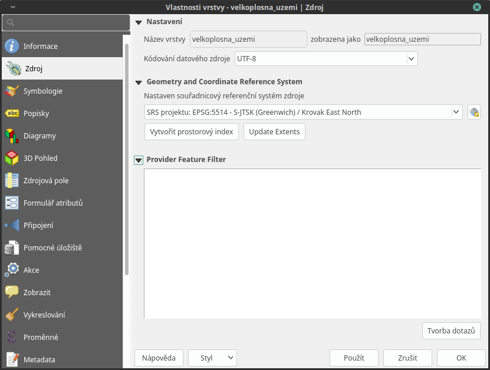

# Vlastnosti vrstvy

## Atributová tabulka

Vektorová data se skládájí ze dvou základních složek -- geometrie (body,
linie, polygony) a informací o jednotlivých prvcích tzv. atributů.

Atributovou tabulku otevřeme pomocí ikony Otevřít atributovou
tabulku (klávesová zkratka `F6`), nebo pravým kliknutím vyvoláme
kontextové menu a zvolíme `Otevřít atributovou tabulku`. Tabulka slouží
k prohlížení a editaci atributové složky dat. V názvu okna je vypsaný
název vrstvy, celkový počet prvků (Features
total), počet odfiltrovaných prvků
(filtered) a počet prvků ve výběru
(selected).

<figure>

<figcaption>Atributová tabulka vrstvy.</figcaption>
</figure>

Okno atributové tabulky lze otevírat ve dvou režimech, a to buď v
samostatném okně, nebo jako panel. Přepínat tyto režimy lze v liště
atributové tabulky pomocí funkceAtributová tabulka jako
panel. Výchozí chování lze nastavit v hlavním nastavení QGISu
(`Nastavení -> Nastavení...` záložka `Zdroje dat`).

V okně atributové tabulky můžeme zobrazit jak atributovou tabulku
(výchozí), tak i formulář atributů. Tato zobrazení se přepínají pomocí
tlačítek v pravém dolním rohu: Přepnout na zobrazení tabulky
a Přepnout na zobrazení formuláře.

**Základní funkce atributové tabulky**

- kliknutím na název pole, lze hodnoty seřadit.

- kliknutím na číslo řádku můžeme označit jednotlivé prvky do výběru

- pomocí tlačítka Přesunout výběr nahoru lze zobrazit vybrané
  prvky na prvním místě tabulky, což nám vybraná data zpřehlední.

- lze použít funkce výběru, které jsou dostupné i v hlavním okně:

  > - Vybrat prvky pomocí vzorce
  > - Vybrat prvky pomocí vzorce
  > - Převrátit výběr prvků
  > - Zrušit výběr ve všech vrstvách
  > - Posunout mapu na výběr
  > - Přiblížit na výběr

- tlačítko Vybrat/filtrovat prvky pomocí formuláře (Ctrl+F)
  umožňuje vytvářet výběr nebo fltrovat prvky za pomocí formuláře (viz
  `vybrat-prvky` ). Pro návrat do atributové tabulky stiskněte tlačítko
  Přepnout na zobrazení tabulky.

- pomocí tlačítka Uspořádat sloupce tabulky lze měnit pořadí
  sloupců, nebo jednotlivé sloupce skrýt.

<figure>

<figcaption>Možnost uspořádání sloupců.</figcaption>
</figure>

> [!TIP]
> Pomocí nabídky v levém dolním rohu lze zvolit filtr zobrazených prvků.
> Ve výchozím nastavení filtr zobrazuje všechny prvky ve vrstvě, tedy
> hodnota: `Zobrazit všechny 
> prvky`
>
> Pomocí funkce Pravidla podmíněného formátování lze pole v
> atributové tabulce stylizovat na podle námi definovaných pravidel

## Vlastnosti

Vlastnosti vyvoláme dvojklikem na vrstvu nebo pravým tlačítkem myši
kontextové menu a zvolíme `Vlastnosti`.

### Informace

Jako první vidíme ve vlastnostech vrstvy záložku informace. Zde najdeme
základní popis zdrojových dat - cesta k souboru, kódování, souřadnicový
systém, ale i počet prvků a seznam atributů

<figure>

<figcaption>Informace vektorové vrstvy.</figcaption>
</figure>

### Zdroj

Zde nalezneme základní nastavení ke zdroji vrstvy -název vrstvy,
kódování textu, souřadnicový systém (SRS) a nastavení filtru.

<figure>

<figcaption>Zdroj vektorové vrstvy.</figcaption>
</figure>

### Styl

#### Symbologie

Pomocí rolovací nabídky vybereme typ symbologie:

- Jednoduchý symbol - zde máme na výběr z uložených symbolů.
  V levém sloupci máme zobrazený typ symbolu a jeho jednotlivé části.
  Při kliknutí na konkrétní složku symbolu můžeme měnit její vlastnosti
  (barvy, typ výplně, šířka ohraničení atd.).

<figure>

<figcaption>Jednoduchá symbologie. V levé části vlastnosti označené
složky symbolu.</figcaption>
</figure>

> [!TIP]
> Pomocí tlačítek můžeme další složky symbolu přidávat , odebírat ,
> zamykat nebo měnit jejich pořadí , . Tímto způsobem si můžeme vytvořit
> vlastní symbologii.

- Kategorizovaný - vhodný pro kategoriální proměnné

  > - `sloupec` - pro výběr atributu
  > - `barevný rozsah` - výběr barev
  > - pro vytvoření kategorii kliknout na `klasifikovat`

<figure>

<figcaption>Kategorizovaná symbologie.</figcaption>
</figure>

- Odstupňovaný - vhodný pro spojité proměnné

  > - nastavení obdobné jako u možnosti Kategorizovaný
  > - možnost režimu intervalů a počet tříd
  > - možnost zobrazení histogramu

<figure>

<figcaption>Odstupňovaná symbologie.</figcaption>
</figure>

#### Popisky

Kromě rozlišení prvků pomocí symbologie lze také přidat k jednotlivým
prvkům popisek na základě jednoho z atributů.

<figure>

<figcaption>Vlastnosti popisků vrstvy.</figcaption>
</figure>

Na této záložce je nejdříve nutné vybrat z rolovací nabídky položku
Single labels. Tím se nám otevřou možnosti stylizace popisků,
kde můžeme nastavit formát textu, obalovou zónu kolem textu, pozadí,
stínování, možnosti umístění a vykreslování. Nejdříve je ale nutné
nastavit zdroj popisku. Pomocí rolovací nabídky `Popisky z` vybreme
zdrojový atribut popisku.

<figure>

<figcaption>Příklad popisků s použitím obalové zóny textu.</figcaption>
</figure>

Jako zdroj popisků lze použít i vzorec, a to buď přímým vepsáním do
nabídky, nebo vytvořením vzorce pomocí kalkulátoru .

## Panel stylování

Pro pohodlnější práci se stylováním, slouží panel stylování
`Stylování vrstvy`, který lze aktivovat pravým kliknutím na prázdné
místo v hlavním panelu a výběrem z nabídky nebo mocí klávesové zkratky
`F7`. Výhodou panelu stylování je, že lze rychle, bez znovuotevírání
okna, přepínat mezi vrstvyami,veškeré provedené změny v symbologii se
vykreslí ihned, a také je zde možnost kroku zpět na předchozí
symbologii, nebo přímo procházení historie všech změn.

<figure>

<figcaption>Panel stylování</figcaption>
</figure>

## Práce se styly

### Více stylů u vrstvy

V rámci projektu lze vytvořit různé "verze" nastylování u konkrétní
vrstvy. Takto přednastavený styl můžeme potom podle potřeby měnit. Tato
funkce může být užitečná např. při vytváření mapových výstupů jednoho
zdroje dat s různou symbologií. Styly lze ovládat (přídání, smazání,
přejmenování, zvolení, export) pomocí tlačítka ve spodní části okna
vlastností, nebo z kontextového menu vrstvy (pravý klik na vrstvu v
panelu vrstev), zde je přepínání jednotlivých stylů rychlejší. V panelu
stylování se styly ovládají v samostatné záložce Správce
stylů.

<figure>

<figcaption>Výběr stylu pomocí kontextového menu z panelu
vrstev</figcaption>
</figure>

<figure>

<figcaption>Výběr stylu pomocí kontextového menu z panelu
vrstev</figcaption>
</figure>

### Uložení a načtení nastavení vrstvy pomocí souboru

Celé nastavení (styl, formuláře, atd.) vrstvy lze také uložit do
samostatného souboru (*.qml,*.sld), což můžeme využít pro sdílení mezi
kolegy, nebo pro pozdější použití nastavení vrstvy v jiném projektu.

Možnost uložení a načtení najdeme v okně
Vlastnoti vrstvy kliknutím na tlačítko
`Styl`. První dvě možnosti v nabídce umožní `Načíst styl...` a
`Uložit styl...`.

<figure>

<figcaption>Možnosti práce se styly</figcaption>
</figure>

U QML souboru můžeme zvolit (stejně jako při kopírování stylů), které
součásti nastavení se budou ukládat popř. načítat.

<figure>

<figcaption>Načítání nastavení vrstvy ze souboru</figcaption>
</figure>
