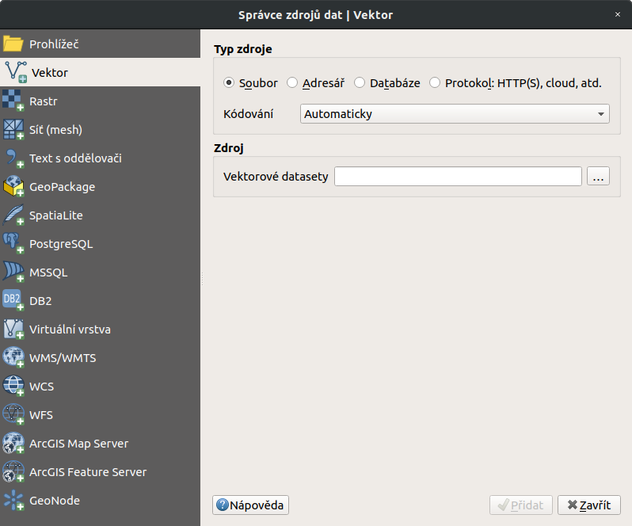
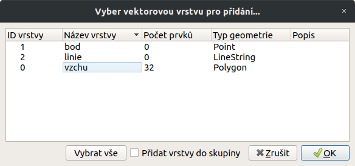
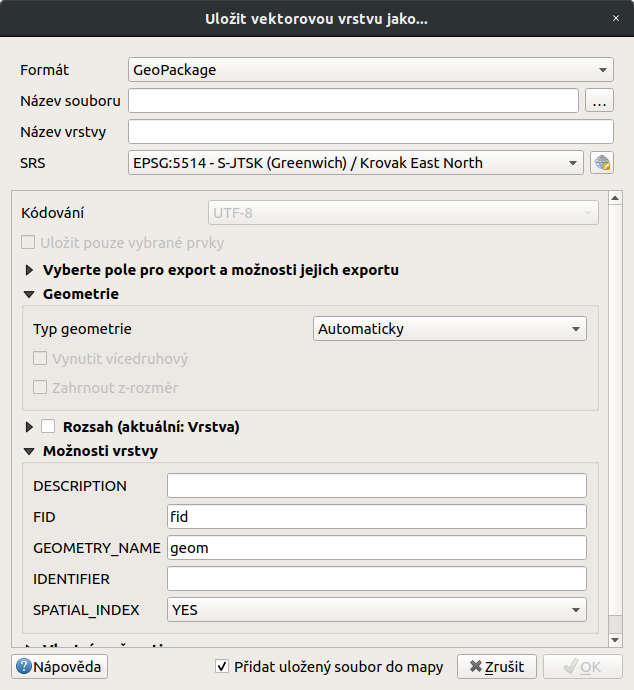

# Přidání a export dat

V této kapitole je popsán postup přidání a exportu vektorových dat.
Obecný princip přidávání a exportu dat v QGIS najdeme v kapitole
`importexport`. Pro čtení a zápis vektorových formátů používá QGIS
knihovnu GDAL.

> [!TIP]
> V režimu čtení lze vektorová data také načíst přímo z archivu *zip* a
> *gzip*.

## Přidávání vektorových dat

Nabídka pro načtení vektorové vrstvy se aktivuje v záložce
`Vrstva --> Přidat vrstvu --> Přidat vektorovou vrstvu`, ikonou
přidání vektorové vrstvy nebo pomocí klávesové zkratky
`Ctrl+Shift+V`.

<figure>

<figcaption>Dialogové okno přidání vektorové vrstvy.</figcaption>
</figure>

Nejčastější volbou vkládání dat je soubor nebo adresář. Vložení jedné
vrstvy je možné označením `Typ zdroje` - `Soubor`. Kliknutím na tlačítko
`Procházet` se otevře navigační okno s možností vybrat soubor s
vektorovými daty. Po potvrzení se označená vrstva načte do mapového
okna.

Volba `Adresář` umožňuje označit složku, ve které se nachází vektorová
data. Potvrzením tlačítkem `Otevřít` QGIS připraví všechna dostupná data
uložená ve složce k načtení. Objeví se potvrzující okno se všemi
dostupnými vrstvami. Vrstvy lze buď označit všechny, nebo podržením
klávesy `Ctrl` vybrat jen požadované vrstvy (`vecfolder`). Další
možností je přidat data pomocí vestavěného datového katalogu (prohlížeče
souborů) viz kapitola `vectorimport`.

<figure>

<figcaption>Výběr jednotlivých vrstev při přidávání vektorových vrstev
ze složky.</figcaption>
</figure>

## Export vektorových dat

Pravým kliknutím na vrstvu vyvoláme kontextové menu, vybereme možnost
`Export -> Save Features As...` a zadáme parametry exportu. Můžeme zde
zvolit výstupní formát (např. `*.kml`, `*.shp`, `*.gpx`), souřadnicový
systém vrstvy a další volitelné parametry.

<figure>

<figcaption>Okno exportu vektorové vrstvy.</figcaption>
</figure>

Pokud potřebujeme exportovat pouze část prvků vrstvy nebo konkrétní
zájmové prvky, musíme tyto prvky nejprve označit výběrem (např.
Vybrat prvky oblastí nebo jednoklikem nebo Vabrat prvky
pomocí vzorce). Potom se nám v okně exportu aktivuje možnost
Uložit pouze vybrané prvky, nebo pro export použijeme druhou
volbu z kontextového menu `Export --> Save Features As...`

> [!TIP]
> Pro uložení pouze atributové tabulky vrstvy lze zvolit výstupní formát
> `*.csv`.
