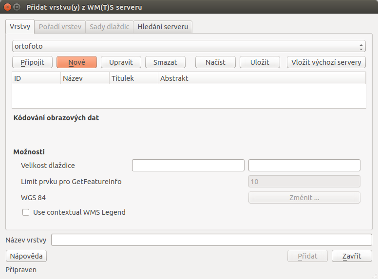
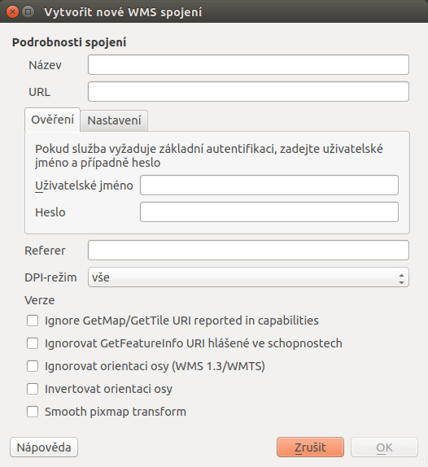
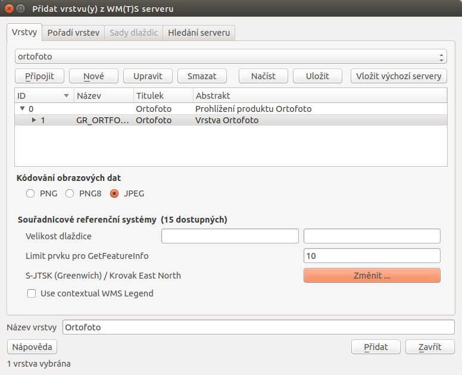
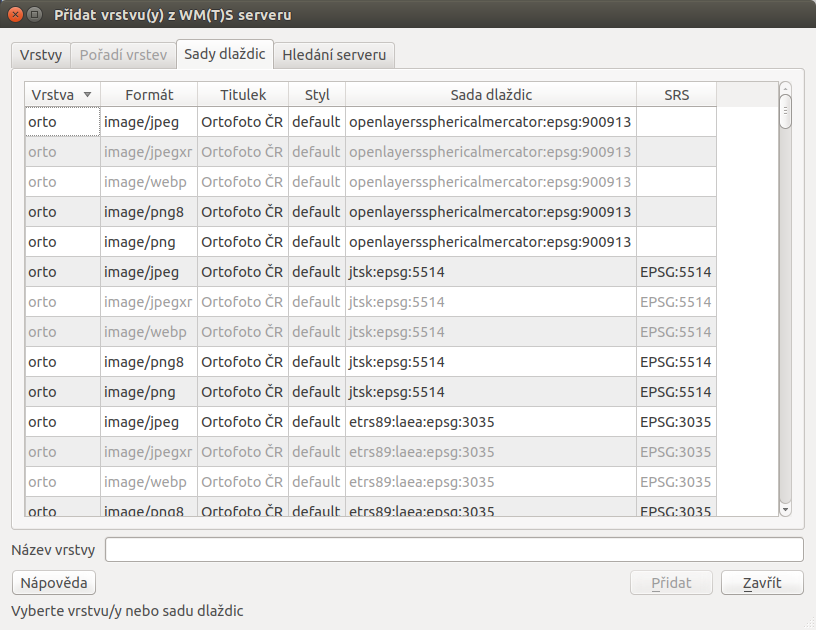
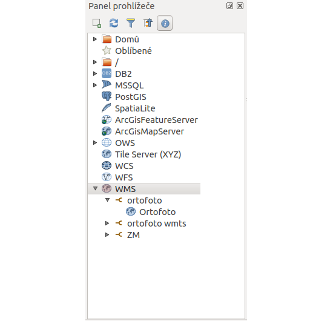

# Připojení WMS/WMTS služby

Existuje více variant webových služeb poskytujících rastrová data.
Nejrozšířenější službou je `WMS
<open-source-gis/standardy/ogc/wms.html>`. Rychlejší, ale méně
používanou alternativou k WMS je `WMTS
<open-source-gis/standardy/ogc/wmts.html>`, kde "T" v názvu znamená
"Tile", tedy dlaždice. WMTS přistupuje k již předgenerovaným dlaždicím,
tudíž tolik nezatěžuje server a data se ke klientovi dostanou rychleji.
Rastrová data je možné ukládat a následně je zobrazovat přímo v
databázích. QGIS poskytuje možnosti jak pracovat s daty v databázích
PostGIS nebo Oracle.

## Připojení WMS služby

Bezesporu nejpoužívanější webovou službou je `WMS
<open-source-gis/standardy/ogc/wms.html>` (Web Map Service). Služba WMS
se postupem času vyvíjela a dnes můžeme narazit na různé verze 1.0.0,
1.1.1 nebo 1.3.0. QGIS podporuje všechny verze WMS, a tak lze bez obav
přistupovat k jakékoliv publikované službě. V QGISu je správa WMS a WMTS
vrstev umístěna do stejného okna.

Správce WMS a WMTS spustíme v záložce `Vrstva --> Přidat vrstvu 
--> Přidat vrstvu WMS`, ikonou <sup>Přidat vrstvu WMS/WMTS</sup> nebo
pomocí klávesové zkratky `Ctrl+Shift+W`.

<figure>

<figcaption>Okno správce WM(T)S služeb.</figcaption>
</figure>

Pokud nejsou ve správci vložená žádná připojení, dá se tak udělat přes
tlačítko `Nové`.

Přidání a editace připojení služby WMS nebo WMTS probíhá ve formuláři
(`wmsedit`). Pro úspěšné vložení (pokud není služba zaheslovaná anebo
není potřeba klást na službu speciální požadavky) stačí zadat název
služby, připojovací URL a potvrdíme tlačítkem `Ok`.

<div id="wmsedit">

<figure>

<figcaption>Okno přidání/editace WMS vrstvy.</figcaption>
</figure>

</div>

Pokud je nastaveno připojení ke službě správně, vybráním požadované
služby z menu a potvrzením tlačítkem `Připojit` proběhne komunikace se
serverem. Po úspěšném navázání spojení, v závislosti na nastavení
serveru, se zobrazí nabídka dostupných vrstev.

<div id="wmsedit2">

<figure>

<figcaption>Nabídka dostupných vrstev a možnosti jejich
nahrání.</figcaption>
</figure>

</div>

Tak jako tomu bylo u lokálních vektorových a rastrových dat, k označení
více vrstev je možné použít klávesu `CTRL`. Přidání vrstvy může
proběhnout jak na nejnižší úrovni stromu, kde se zpravidla jedná o
licenční logo služby, tak je možné označit nejvyšší úroveň, čímž budou
přidány všechny dostupné vrstvy. Některé servery mohou poskytovat data
ve více formátech a souřadnicových systémech. Výběr formátu kódování
obrazových dat můžeme specifikovat pod seznamem dostupných vrstev. V
levé spodní části okna máme vypsaný použitý souřadnicový systém, na
stejné úrovni se nachází tlačítko `Změnit ...`. Okno pro změnu
souřadnicového systému (SRS) je shodné s oknem definování SRS vkládaných
lokálních rastrových a vektorových dat. QGIS v okně zobrazí pouze
podporované souřadnicové systémy ze strany serveru. Po nastavení všech
parametrů služby a výběru vrstev proběhne přidání vrstvy do mapového
pole tlačítkem `Přidat`. Pokud bylo vybráno více vrstev, jeví se v
seznamu vrstev jako jedna.

## Připojení WMTS služby

Jak bylo zmíněno, správa WMS a `WMTS
<open-source-gis/standardy/ogc/wmts.html>` probíhá ve stejném dialogovém
okně. V předchozím kroku bylo ukázáno jak vkládat WMS služby. Pro
připojení WMTS služby je potřeba v nabídce přidání nového spojení zadat
URL na platný WMTS server. Po vybrání služby a připojení přes tlačítko
`Připojit` proběhne komunikace s WMTS serverem. Po navázání spojení se
ve správci vrstev aktivuje záložka `Sady dlaždic` (`wmts`). Tabulka
zobrazuje dostupné vrstvy ze serveru. V jednotlivých sloupcích je možné
číst informace o názvu vrstvy, poskytovaném formátu i souřadnicovém
systému. V tabulce není možné vybrat více vrstev najednou, stačí vybrat
jednu vrstvu a potvrdit tlačítkem `Ok`.

<div id="wmts">

<figure>

<figcaption>Záložka <code class="interpreted-text"
role="item">Sady dlaždic</code> při připojení na WMTS
server.</figcaption>
</figure>

</div>

> [!WARNING]
> V současných verzích QGIS musíme při zadání URL WMTS serveru přesně
> specifikovat, že se jedná o WMTS. Za URL tedy přidáme:
>
> ``` none
> ?SERVICE=WMTS&REQUEST=GetCapabilities
> ```

### Práce s WMS/WMTS službami v okně prohlížeče

Procházet, editovat a přidávat WMS/WMTS připojení lze také v panelu
prohlížeče (`wmsbrowser`). Vyvoláním kontextového menu pravým kliknutím
na položku můžeme provádět vybrané akce.

- WMS - vytvoření připojení
- konkrétní připojení - editace, odstranění
- konkrétní vrstva - přidání do projektu, vlastnosti

Přidat požadovanou vrstvu do projektu jde obdobně jako u lokálních dat,
dvojitým kliknutím nebo přetažením z datového katalogu (prohlížeče).

<div id="wmsbrowser">

<figure>

<figcaption>Práce s WMS/WMTS službami v okně prohlížeče.</figcaption>
</figure>

</div>
