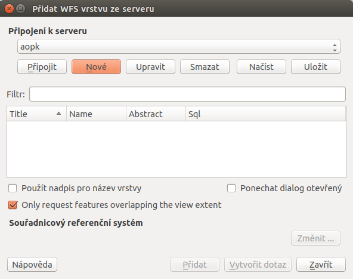
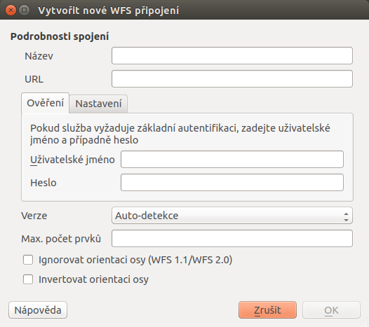
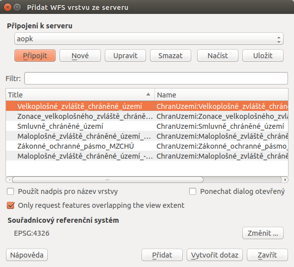
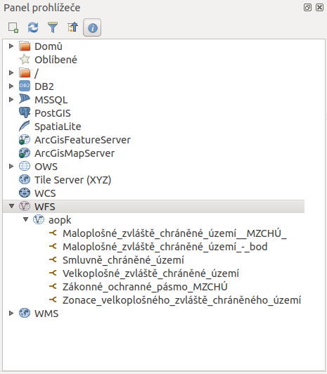

# Připojení WFS služby

Správce `WFS <open-source-gis/standardy/ogc/wfs.html>` spustíme v
záložce `Vrstva --> Přidat vrstvu --> Přidat
vrstvu WFS` nebo pomocí ikony Přidání vrstvu WFS.

<figure>

<figcaption>Okno správce WFS služeb.</figcaption>
</figure>

Okno správce umožňuje přidání, odebrání služby a nahrání vrstev do
projektu. Formulář přidání nové služby se aktivuje tlačítkem `Nové`. Ve
formuláři (`wfsform`) stačí v případě nezaheslované služby vyplnit pouze
URL a pojmenování služby. V případě zaheslované služby jsou vyžadovány
přihlašovací údaje.

<figure>

<figcaption>Formulář přidání WFS služby.</figcaption>
</figure>

Po potvrzení a připojení ke službě se tlačítkem `Připojit` zobrazí
seznam vrstev poskytovaných WFS serverem (`wfslayers`).

<figure>

<figcaption>Seznam dostupných vrstev na připojeném WFS
serveru.</figcaption>
</figure>

Výběr více vrstev pro přidání lze opět uskutečnit pomocí klávesy `CTRL`,
vrstvy se v takovém případě nahrají do seznamu vrstev samostatně (jako
při přidávání lokálních dat). Tak jako v případě WMS lze změnit
souřadnicový systém sloužící ke stahování dat. Změna se provádí pod
tlačítkem `Změnit ...` ve spodní pravé části okna. Potvrzením `Přidat`
proběhne přidání vrstev do mapy.

## Práce s WFS službami v okně prohlížeče

Procházet, editovat a přidávat WFS připojení lze také z panelu
prohlížeče (`wfsbrowser`). Vyvoláním kontextového menu pravým kliknutím
na položku můžeme provádět vybrané akce.

- WFS - vytvoření připojení
- konkrétní připojení - editace, odstranění
- konkrétní vrstva - přidání do projektu, vlastnosti

Přidat požadovanou vrstvu do projektu jde obdobně jako u lokálních dat,
dvojitým kliknutím nebo přetažením z datového katalogu (prohlížeče).

<figure>

<figcaption>Práce s WFS službami v okně prohlížeče.</figcaption>
</figure>

