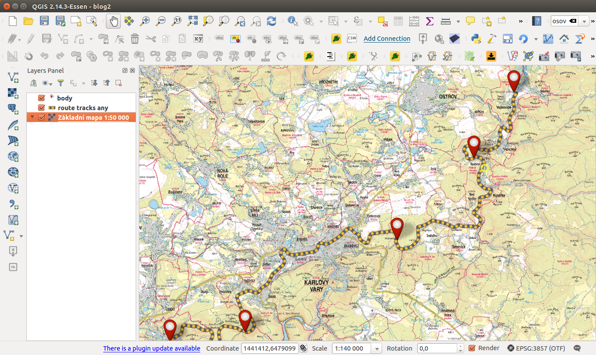

.. only:: latex

   #####
   Obsah
   #####

.. only:: html

   `GISMentors <http://gismentors.cz>`_ | Školení `GRASS GIS
   <http://gismentors.cz/skoleni/grass-gis>`_ | `QGIS
   <http://gismentors.cz/skoleni/qgis>`_ | `PostGIS
   <http://gismentors.cz/skoleni/postgis>`_ | `GeoPython
   <http://gismentors.cz/skoleni/geopython>`_
   
   ****
   Úvod
   ****

.. only:: html

   .. image:: images/intro_logo.png
      :width: 140px
      :align: left

.. index::
   single: GIS
   single: geografický informační systém

`QGIS <http://qgis.org/en/site/>`_  je Open Source *geografický informační systém*
(:wikipedia:`GIS`) publikovaný pod všeobecnou licencí GNU GPL.
Projekt QGIS vznikl v roce 2002, verze s označením 1.0 vyšla později v roce 2009.
Mezi hlavní výhody patří zejména rychlost vývoje a rozšiřování jeho funkcionality.
Licence GNU GPL umožňuje používání software i pro komerční účely. Podstatné je, že
umožňuje i modifikaci zdrojového kódu a jeho následné šíření.

.. only:: latex

   .. figure:: images/intro_logo.png
      :scale-latex: 150

      Logo projektu QGIS.

Současným konceptem ve vývoji je pravidelné a intenzivní publikování nových verzí.
Dlouhodobá stabilní verze (LTR) je doplněna dvěma krátkodobými verzemi.

.. only:: html

.. tip::
   Text školení je dostupný i v tisknutelné formě `PDF
   <./skoleni-qgis-zacatecnik.pdf>`_.
   
.. important:: Školení je zaměřeno na aktuální LTR verzi `QGIS 2.14 Essen
               <https://www.qgis.org/en/site/forusers/download.html>`_. V
               jiných verzích není zaručena funkčnost uvedených příkladů. Dále
               předpokládáme zapnutou *českou lokalizaci*.

.. index::
   pair: datové sady; ke stažení

.. notedata::

   *Data ke školení* jsou stažitelná jako `zip archiv
   <http://training.gismentors.eu/geodata/qgis/data.zip>`_ (436
   MB), rastrová data `DMT
   <http://training.gismentors.eu/geodata/qgis/dmt.zip>`_
   (97 MB).

.. warning:: :red:`Toto je pracovní verze školení, která je aktuálně ve vývoji!`

.. raw:: latex

   \newpage

QGIS je psán v programovacím jazyce C++ a uživatelské prostředí je
naprogramováno pomocí knihovny Qt. Díky použití těchto rozšířených
programovacích prostředků je QGIS multiplatformní, tudíž jej lze
využívat na většině používaných operačních systémech jako je MS
Windows, GNU/Linux nebo OS X. QGIS využívá pro práci s geografickými
daty v rastrové anebo vektorové reprezentaci knihovnu `GDAL
<http://gdal.org>`_, díky tomu je možné v QGISu pracovat se širokým
spektrem formátů a webových služeb OGC, ale i jiných formátů.

        
   Ukázka uživatelského rozhraní QGIS.

Program nabízí přehledné uživatelské prostředí. Uživatel má k dispozici širokou
škálu nástrojů pro prohlížení, modifikaci a export dat.
Od verze 2.0 QGIS obsahuje \"Print Composer\", tedy nástroj pro vytváření map.
V tiskovém modulu lze vytvářet z nahraných dat výstupy se všemy kartografickými
náležitostmi. Výsledky je možné exportovat do formátu PDF nebo obrázku.

.. figure:: images/intro_map.png
   :scale-latex: 65
   :class: middle
        
   Ukázka mapového výstupu vytvořeného v QGIS.

QGIS je populární i pro svou rozšiřitelnost pomocí takzvaných
zásuvných modulů (tzv. "pluginů").  Pluginy jsou dílčí nástroje, které
jsou vyvíjeny komunitou kolem QGIS.  Pomocí pluginů je možné dopnit do
QGIS novou funkcionalitu či podporu pro další formáty či služby jako
je např. Google Maps, Bing nebo OpenStreetMap. Pro připojení k WFS
poskytovaným ČÚZK je možné použít plugin \"WFS 2.0\" a pro prohlížení
souborů ve formátu Výměnného formátu katastru slouží plugin `VFK
<http://freegis.fsv.cvut.cz/gwiki/VFK_/_QGIS_plugin>`_.

.. figure:: images/intro_vfk.png
   :scale-latex: 75
   :class: middle
        
   Ukázka práce s katastrálními daty v QGIS pomocí VFK pluginu.

.. only:: html
             
   #####   
   Obsah
   #####

.. toctree::
   :maxdepth: 2

   intro/index
   vektorova_data/index
   rastrova_data/index
   webove_sluzby/index
   mapovy_vystup/index
   ruzne/index

*******
Dodatky
*******

O dokumentu
===========

Text dokumentu je licencován pod `Creative Commons
Attribution-ShareAlike 4.0 International License
<http://creativecommons.org/licenses/by-sa/4.0/>`_.

.. figure:: images/cc-by-sa.png 
   :width: 130px
   :scale-latex: 120
              
*Verze textu dokumentu:* |release| (sestaveno |today|)

Autoři
------

Za `GISMentors <http://www.gismentors.cz/>`_:

* `Alžbeta Gardoňová <http://www.gismentors.cz/mentors/gardonova/>`_
* `Ľudmila Furtkevičová <http://www.gismentors.cz/mentors/furtkevicova/>`_
* `Oto Kaláb <http://www.gismentors.cz/mentors/kalab/>`_ 
* `Vojtěch Dubrovský <http://www.gismentors.cz/mentors/dubrovsky/>`_

Text dokumentu
--------------

.. only:: latex

   Online HTML verze textu školení je dostupná na adrese:

   * http://training.gismentors.eu/qgis-zacatecnik/

Zdrojové texty školení jsou dostupné na adrese:

* https://github.com/GISMentors/qgis-zacatecnik

