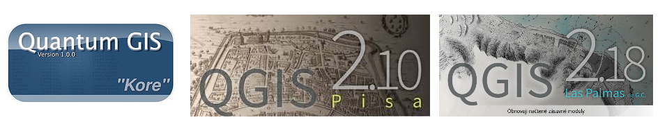

Instalace
=========

.. index::
   single: Unix
   single: Instalace

Vývoj projektu QGIS začal v roce 2002 pod názvem *Quantum GIS*. Verze
1.0.0 vyšla v lednu 2009. Později projekt změnil jméno na QGIS.

   
   Úvodní obrazovka verze 1.0, 2.18 a 3.4.

Program QGIS je multiplatformní, lze jej tedy nainstalovat na různé
operační systémy. V současnosti jsou oficiálně podporovány MS Windows,
Mac OSX, GNU/Linux a Android (experimentální). V tomto části školení
je detailně popsán postup instalace pro dvě nejrozšířenější
platformy - *MS Windows* a *Ubuntu Linux*. Kompletní návody pro
instalaci na všech dostupních platformách jsou dostupné `zde
<https://www.qgis.org/en/site/forusers/alldownloads.html>`__.

.. only:: html
          
   .. rubric:: Návod
      :class: secnotoc

.. toctree::
   :maxdepth: 1

   linux.rst
   windows.rst

