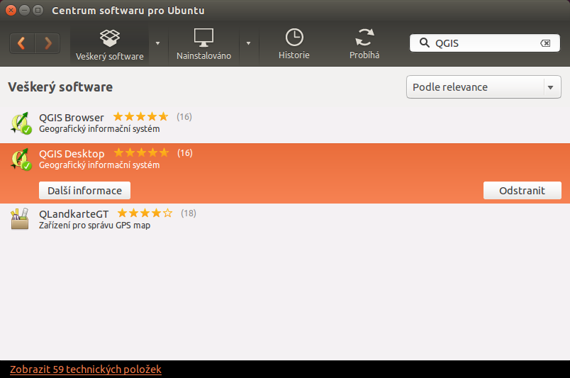

.. |aplikace_ikona| image:: images/aplikace_ikona.png
   :width: 1.5em

.. _label: instalace-linux

.. index::
   single: Linux
   see: Linux; Instalace

Ubuntu Linux
============

Instalace programů v operačním systému Ubuntu je založená na
tzv. balíčcích, které jsou k dispozici v repozitářích.  Některé
repozitáře mohou obsahovat starší verze systému QGIS, proto je nutné
dbát na způsob instalace. Instalace v Ubuntu je popsána ve dvou
základních způsobech - instalace přes *Terminál* a pomocí *Centra
softweru pro Ubuntu*.

Terminál
--------

Podrobný postup jak nainstalovat požadovanou verzi (Latest/Long Term) lze 
nálezt v instalační příručce v 
`QGIS dokumentaci <https://www.qgis.org/en/site/forusers/alldownloads.html#linux>`_. 
Zde také naleznete odkazy na repozitáře těchto verzí.

Instalaci můžeme provézt dvěma základními způsoby, a to buď se závislostmi na 
repozitáři UbuntuGIS či nikoliv.

V případě `UbuntuGIS <https://launchpad.net/~ubuntugis>`__ máte dvě
možnosti, zvolit repositář *Stable* či *Unstable*. Oba repositáře obsahují
pouze QGIS LTR verzi. Pokud máte zájem o skutečně aktuální verzi QGIS
LTR zvolte repositář Unstable. Příklad instalace níže.

.. code-block:: bash

   sudo add-apt-repository ppa:ubuntugis/ubuntugis-unstable
   sudo apt update
   sudo apt install qgis

Další možností je použit oficiální baličky QGIS. V tomto případě
musíte přidat repositář do zdrojů softwaru systému, a to přes aplikaci
:item:`software-sources` nebo editací souboru
:file:`/etc/apt/sources.list`. Zdroje přidáme v následujícím tvaru:

.. code-block:: bash
		
   deb     *repository* *codename* main
   deb-src *repository* *codename* main

Příklad pro případnou instalaci LTR verze na Ubuntu 16.04 (LTS)
Xenial:

.. code-block:: bash
		
   deb     http://qgis.org/debian-ltr xenial main
   deb-src http://qgis.org/debian-ltr xenial main

Poté již můžete QGIS nainstalovat podobným způsobem jako z UbuntuGIS
(zde uvedeno s dalšími užitečnými balíčky).

.. code-block:: bash

   sudo apt update
   sudo apt install qgis python-qgis qgis-plugin-grass

Centrum softwaru pro Ubuntu
---------------------------

Jedná se o jednoduchého grafického správce balíčků umožňující jejich
instalaci. Je dostupný z menu přes ikonu |aplikace_ikona|. Ve
vyhledávacím okně lze zadat "QGIS" a následně se vypíšou všechny
dostupné aplikace. Pomocí tlačítka :item:`Další informace` lze otevřít
detailní popis nabízeného systému. Hlavní informací je zejména verze
systému QGIS, kterou instalací získáme. Samotnou instalaci lze provést
tlačítkem :item:`Nainstalovat`.

        
   Výběr QGISu přes Centrum softwaru pro Ubuntu.
