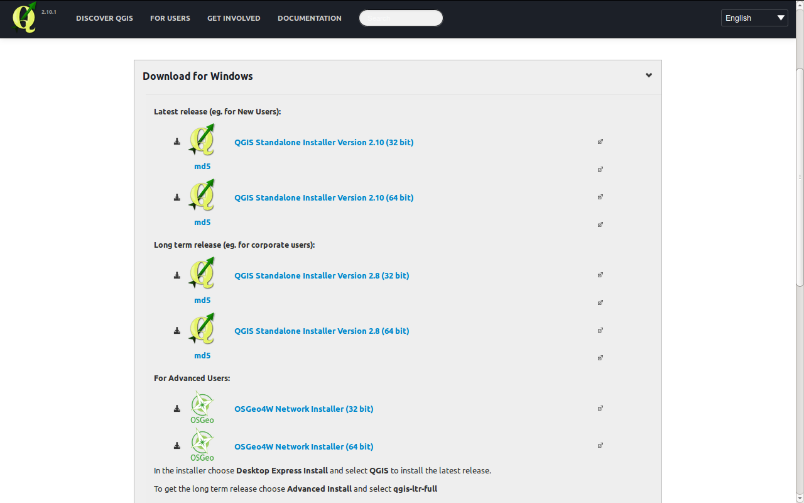
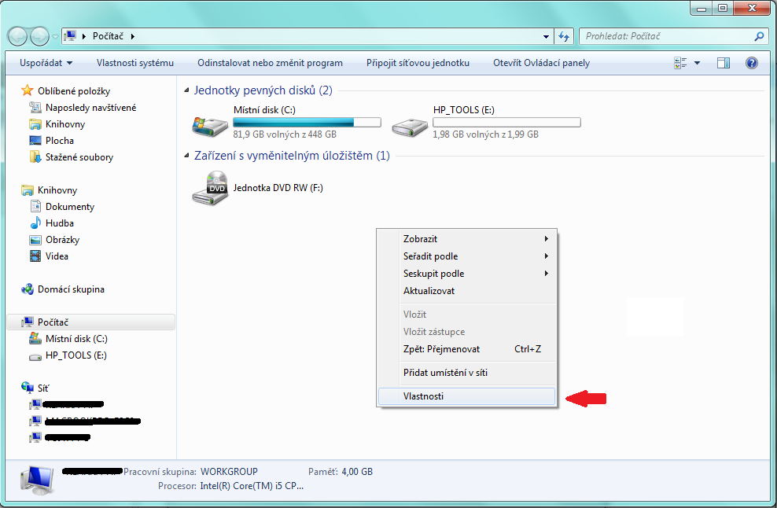
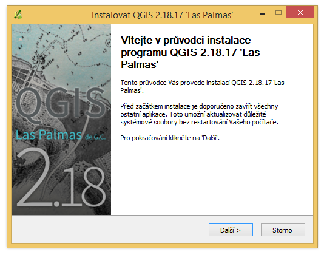
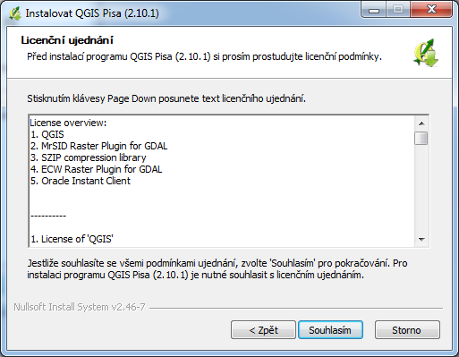
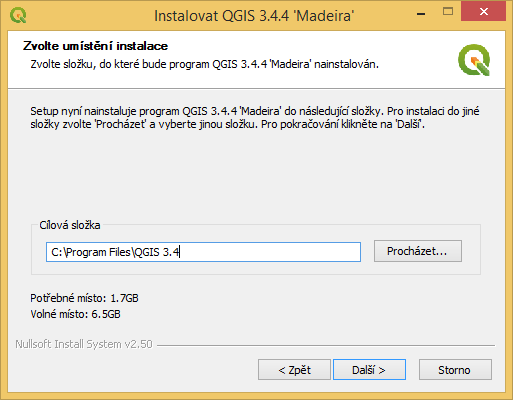
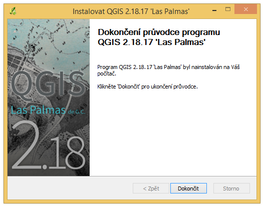

.. _label: instalace-windows

.. index::
   single: MS Windows
   see: MS Windows; Instalace

MS Windows
----------

Systém QGIS je možné pod MS Windows nainstalovat *dvěma způsoby*:

#. pomocí :ref:`samostaného instalátoru<samostatny-instalator>`

   * *pro začátečníky*
   * dostupná dlouhodobá stabilní verze, ale i nejnovější (krátkodobá) 

#. v rámci :ref:`OSGeo4W instalátoru <osgeo4w-instalator>`

   * *pro pokročilejší uživatele*
   * komplexnější řešení umožňující instalaci dalšího softwaru
     distribuovaného pod hlavičkou `OSGeo <http://www.osgeo.org/>`_

Oba uvedené způsoby jsou dostupné přímo ze stránek `QGIS
<https://www.qgis.org/en/site/forusers/download.html>`_.

   Nabídka instalací pro MS Windows.

.. _samostatny-instalator:

Samostatný instalátor
=====================

Pokud si uživatel zvolí samostatnou instalaci, tak je nutné, aby si
vybral již danou verzi. K dispozici je *dlouhodobá stabilní verze* (LTS),
nebo *krátkodobá verze*.  Krátkodobé verze mají sloužit pro
zveřejňování nových funkcionalit v kratších intervalech.

.. tip::
	Pro začínající uživatele je dobré začít nejnovější verzí -
	není potřeba instalovat dlouhodobou stabilní verzi.

Pak je nutné zvolit instalaci kompatibilní s vaším operačním systémem.
Zda je váš systém 32 bitový nebo 64 bitový zjistíte otevřením složky
\"Počítač\", klik pravým tlačítkem do složky, z nabídky vybrat
vlastnosti. V novém okně lze zjistit typ systému.

   Složka \"Počítač\".

.. figure:: images/install_pc_type.png
   :scale-latex: 75

   Typ operačního systému.

.. raw:: latex

   \clearpage

Proces instalace
^^^^^^^^^^^^^^^^

Po výběru verze k instalaci se tento stáhne a spustí (jako správce).
Samotná instalace má 5 kroků, které jsou zobrazeny a popsány níže.

   Spuštění instalátoru.

   Licenční podmínky.

   Adresář, kde se QGIS nainstaluje.

.. _nativni-instalator-data:

.. figure:: images/install_4.png

   Volba rozsahu instalace (je možné zvolit i ukázkovou datovou sadu z nabídky).

.. raw:: latex

	 \clearpage

   Dokončení instalace.

Pok úspěšné instalaci se na pracovní ploše i v nabídce Start objeví
položka QGIS 2.10.1, kterou je možné jednoduše spustit.

.. index::
   single: OSGeo4W
   see: OSGeo4W; Instalace

.. _osgeo4w-instalator:

OSGeo4W instalátor
==================

Instalátor OSGeo4W je dostupný na adrese:
https://trac.osgeo.org/osgeo4w/.

Pokud si uživatel zvolí tento instalátor, tak se nejedná jenom o
instalaci QGISu, ale i dalších součástí jako např. GRASS GIS, SAGA GIS
a další.  I zde si můžete vybrat mezi dlouhodobou stabilní nebo
krátkodobou verzi QGISu.  Instalátor funguje podobně jako ten pro
samostatnou instalaci QGISu a není potřebné ho popisovat samostatně.

.. note:: Tento způsob instalace QGISu není pro začátečníky vhodný.
