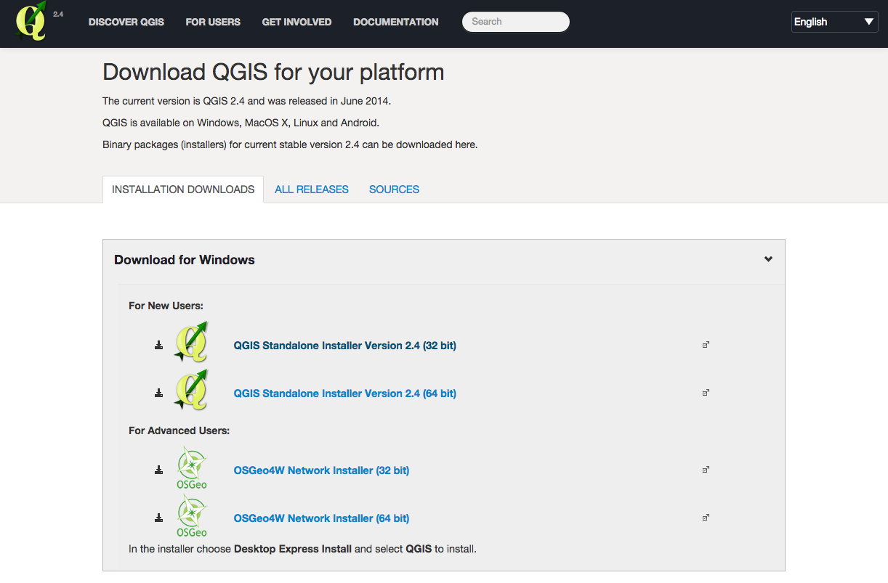
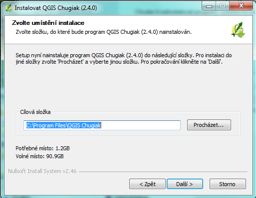
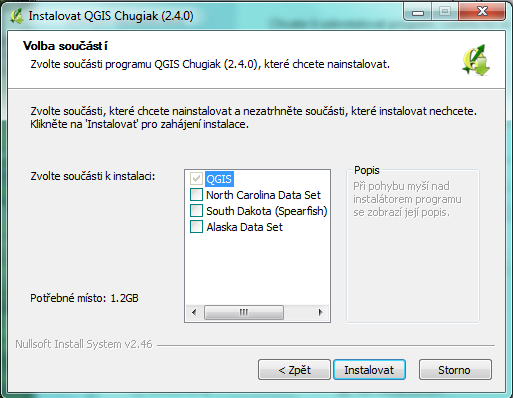

INSTALACE
=========

Program QGIS je multiplatformní, lze jej tedy nainstalovat na různé operační
systémy. Následující kapitola popíše kroky pro úspěšné nainstalování QGISu na
operační systém Windows 7. Postup instalace na operačních systémech Windows
je vesměs totožné, a tak lze uvedený postup  aplykovat i na jiné verze systém.

Stažení instalačního souboru
^^^^^^^^^^^^^^^^^^^^^^^^^^^^
K výběru instalačního souboru se lze dostat proklikem přes hlavní stránku projektu
`http://qgis.org/ <http://qgis.org/>`_ nebo z
`této <http://qgis.org/en/site/forusers/download.html#>`_ stránky.

	    
   Obr 1 Stránka stažení instalátoru

Z webové stránky vyberte verzi kompatibilní s vaším operačním systémem.
Zda je váš systém 32 bit nebo 64 bit zjistíte otevřením složky \"Počítač\",
klik pravým tlačítkem do složky, z nabídky vybrat vlastnosti. V novém okvě lze
přečíst typ systému.

.. figure:: images/install_pc.png

   Obr 2 Složka \"Počítač\"

.. figure:: images/install_pc_type.png
	    
   Obr 3 Typ operačního systému

Instalační soubor volíme ze skupiny pro nové uživatele (For New Users).
Instalační soubor je veliký zhruba 300 MB, stažení může trvat dlouho.

instalace
^^^^^^^^^

Otevřením instalačního souboru začna samotný proces instalace. Instalace QGIS
nevyžaduje žádné speciální zásahy, a tak je možné jednotlivé kroky po
nakonfigurování proklikat. Během instalace je vhodné věnovat se dvěma krokům.
První obrazovkou, keré je potřeba věnovat pozornost, je ta kde se volí cesta
uložení programu (Obr 4). Druhá obrazovka kde je možno zakročit je volba
doinstalování testovacích datasetů. Instalace testovacích dat je volitelná.
Data je možné využít především pro výuku a testování, pokud neplánujete takovéto
využití, nezaškrtávejte během instalace (Obr 5).

   Obr 4 Volba cesty instalace

   Obr 5 Datasety k instalaci

Pokud proběhla instalace úspěšně, na ploše přibyly dvě ikony.
\"QGIS Browser\" je program instalovaný v rámci QGIS, jedná se o souborový
prohlížeč se zaměžením na GIS formáty. V QGIS Browser je možné rychle vytvářet
nebo manipulovat s různými GIS formáty.

\"QGIS Desktop\" bude popsán v další kapitole. Nyní je možné jej zapnout.
