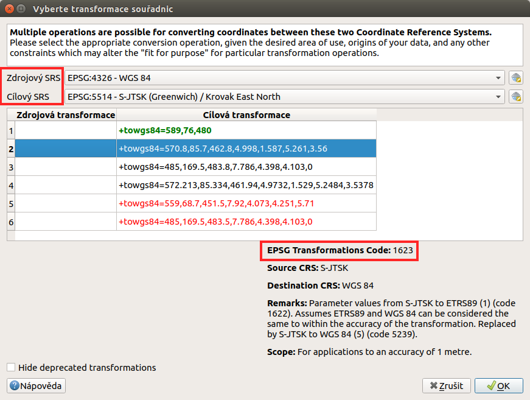

.. _importexport:

Přidávání a export geodat
=========================

QGIS podporuje široké spektrum geodat. Geografická data můžeme rozdělit
podle způsobu uložení na lokální a distribuovaná (síťová).  V obou
kategoriích se následně vyskytují data rastrová a vektorová.  V této
kapitole jsou popsány základní principy připojení a exportu geodat v
programu QGIS. Práce s konkrétními formáty budou potom uvedeny v
samostatných kapitolách.

.. index::
   pair: import dat; rozhraní - popis

.. _vectorimport:

Přidávání dat
-------------

Data lze přidat z hlavního menu :menuselection:`Vrstva --> Přidat
vrstvu-->...`. Na základě vybraného typu dat se nám zobrazí konkrétní
dialogové okno s nastavením pro nahrání dat.

.. _addlayer:

.. figure:: images/addlayer_menu.png

    Menu přidávání vrstev.

.. noteadvanced:: Jak jde vidět na :numref:`addlayer`, u většiny 
   typů dat lze pro přidání využít klávesové zkratky.

Stejného výsledku lze dosáhnout i pomocí ikon v nástrojovém panelu
:item:`Spravovat vrstvy`.

.. figure:: images/addlayer.png
   :scale-latex: 40

   Nástrojový panel pro přidávání vrstev Spravovat vrstvy

Další možností je přidat data pomocí vestavěného datového katalogu
(prohlížeče souborů), a to buď dvojitým kliknutím, jednoduchým
přetažením souboru do mapového okna nebo okna vrstev
(:numref:`browser`) anebo přes kontextové memu dané vrstvy.
Pomocí kláves :kbd:`CTRL` nebo :kbd:`SHIFT` můžeme vybrat a přidat
přetažením více souborů najednou. Pomocí datového
katalogu lze také procházet a přidávat soubory přímo z archivu zip.

.. tip:: Pomocí přetažení lze přidat data také přímo ze správce
         souborů v operačním systému.

.. _browser:

.. figure:: images/qgis_ogc_addbrowser.png
   :class: large
   :scale-latex: 65

   Přidání vrstvy přetažením souboru do mapového okna nebo seznamu
   vrstev.

.. index::
   pair: export dat; rozhraní - popis
   
.. tip:: Přes panel nástrojů je možné dosáhnout i další funkčnost.
         Jednou z nich je nově **mazání** dat, nejenom jejich
         odstranění z projektu. Další fukncionalita je závislá od typu
         dat (souborová databáze - přidávání dat tažením).

Export dat
----------
Pro export vrstvy nebo její částí se používá funkce
:menuselection:`Uložit jako...`. Funkci můžeme spustit dvěma způsoby:

V seznamu vrstev označíme vrstvu, kterou chceme exportovat, a vybereme
z hlavního menu :menuselection:`Vrstva --> Uložit jako...`

.. figure:: images/saveas.png
   :class: small
   :scale-latex: 40

   Spuštění exportu z hlavního menu.

Elegantnější a rychlejší způsob je spuštění exportu ze seznamu
vrstev. Pravým kliknutím na vrstvu vyvoláme kontextové menu a vybereme
:menuselection:`Export --> Save Features As`.

.. figure:: images/layer_saveas.png
   :class: small
   :scale-latex: 30

   Spuštění exportu z kontextového menu v seznamu vrstev.

.. tip:: Exportování dat umožňuje i změnu kódování textu, změnu souřadnicového
         systému (transformaci) a další funkce, které jsou základními
         operacemi pro každodenní praxi.

Jak exportovat konkrétní data se dozvíme v jednotlivých kapitolách.

.. _sour-system:

Výběr souřadnicového systému
----------------------------

Při vkládání rastrových nebo vektorových dat se může stát, že po
potvrzení výběru je vyžadována specifikace souřadnicového systému
vkládaných dat (:numref:`srs`). Okno se zobrazí v případě, pokud
vkládaný soubor neobsahuje vlastní specifikaci souřadnicového systému,
jako například ESRI Shapefile bez souboru končícího příponou
:file:`\*.prj`, s uvedeným EPSG kódem, který by odpovídal kódu které
používá QGIS (z knihovny proj4).

.. note:: Soubory typu ESRI Shapefile QGIS opatří dalším souborem
          :file:`.qpj`, který vytváří sám pro jasné přiřazení
          souřadnicového systému vrstvě.

V okně výběru je možné vyhledat souřadnicové systémy pomocí
filtru. Zvolení správného souřadnicového systému je velice důležité,
pokud máte v mapovém okně načtena data v různých souřadnicových
systémech, a dochází tak k transformaci, při měření nebo připojování k
webovým službám.

.. _srs:

.. figure:: images/qgis_ogc_set_proj.png
   :scale-latex: 47

   Volba souřadnicového systému při vkládání dat.
   
Mezi souřadnicovými systémy je možné filtrovat pomocí jejich názvů. Na obrázku
:numref:`srs` je vidět filtr pomocí textu \"jtsk\". Pokud v poli s vybranými
systémy označíme jeden, tak se níže vypíše jeho definice (zapsání
matematických koeficientů) a vykreslí rozsah území, pro který se používá.

Naposledy použité souřadnicové systémy se pak budou objevovat v horní části pro
rychlý výběr a budou i v rychlých nabídkách jiných nástrojů, které umožňují
výběr souřadnicového systému.

.. tip:: Po přidání dat můžeme zkontrolovat jejich pozici v prostoru
   pomocí funkce |mActionZoomToLayer| :sup:`Přiblížení na vrstvu`, nebo
   pomocí funkce |mActionZoomFullExtent| :sup:`Přiblížit na rozměry okna`
   pozici vůči ostatním vrstvám projektu. Změnu špatně zvoleného systému
   lze provést ve vlastnostech dané vrstvy v záložce :item:`Zdroj`.

.. warning :: Pokud má vrstva přiřazený špatný sořadnicový systém, tak
              není vhodné pracovat s takovouto vrstvou. Vrstva může působit,
              že funguje korektně, ale některé nástroje mohou fungovat
              jinak než  uživatel očekává. Některé nástroje při interakci
              vrstev mohou vyžadovat, aby vstupní vrstvy byly ve stejném
              souřadnicovém systému.
              
              
Transformace
------------

Výchozí nastavení QGIS-u používá tzv. \"on-the-fly\" transformaci, což
umožňuje pracovat v projektu s daty v jiných souřadnicových systémech, než
jaký má projekt. Prakticky to znamená, že při každém překreslení mapového
okna se všechny vrstvy v jiném souřadnicovém systému, než jaký má projekt,
přepočítávají.
Některé souř. systémy můžou mít víc než jednu možnost tansformace.
Chování lze nastavit dle potřeb v :menuselection:`Nastavení --> Možnosti`,
záložka :item:`SRS` sekce :item:`Výchozí transformace souřadnic`.

.. figure:: images/transformation_params_menu.png
   :class: medium

   Nastavení požadovaných transformačních klíčů v menu.
   
V případě souřadnicového systému S-JTSK je vohdné tuto transformaci nastavit.
Pomocí tlačítka |mActionSignPlus| zvolíme možnost přidání nové zvolené
transformace.
Jako první je nutné zvolit dvojici :item:`zdojový` a :item:`cílový` souř. 
systém, který chceme přesně nadefinovat. V tomto případě se jedná o dvojici 
EPSG 4326 a 5514.
Po zadání této dvojice se vypíšou všechny dostupné transformace.
Pro detailní popis je potřeba na zvolenou transformaci kliknout a ve spodní
části se náseldně vypíše detailní popis. 
Zde je možné zjistit přesné číselné parametry, textový popis, ale zejména
číselnou identifikaci konkrétní transformace.

   Výběr transformace pro konkrétní dvojici EPSG kódů.
   
Jeden zápis definuje jeden konkrétní převod. Pro opačnou transformaci je nutné
udělat nový zápis se správným pořadím zdrojového a cílového souř. systému.

V případě, že existuje víc možností transformace a žádná není nastavená jako
preferovaná, tak bude uživatel opakovaně vyzýván při každé přidávané vrstvě zvlášť.
              

