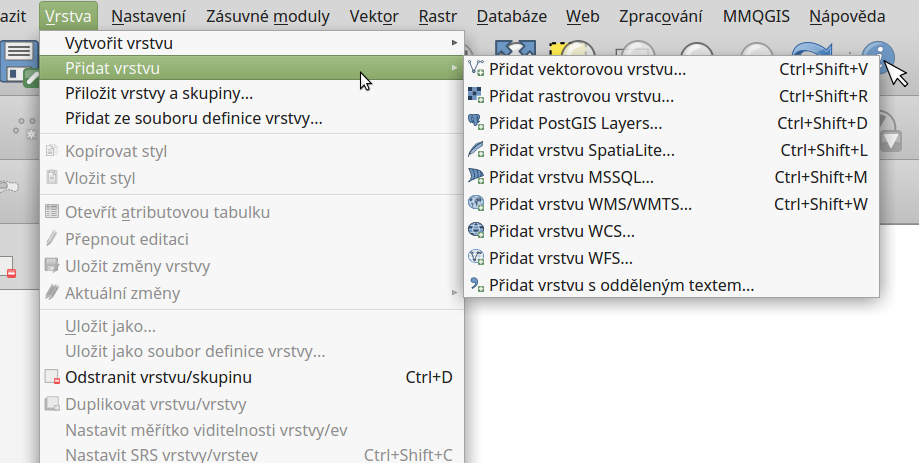
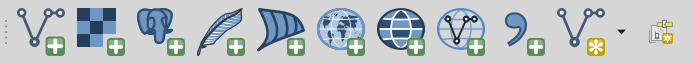
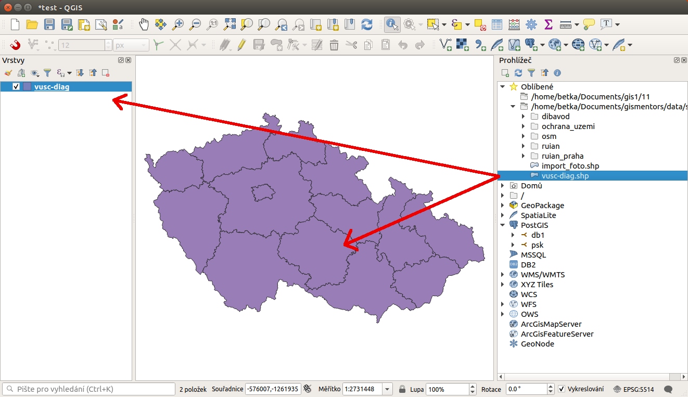
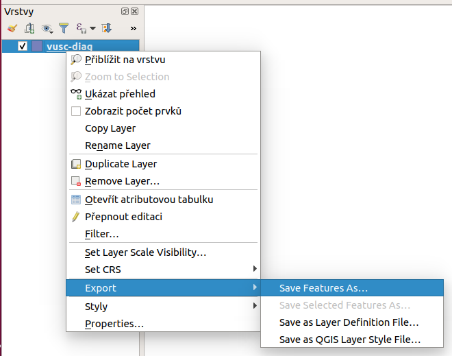

.. |mActionZoomToLayer| image:: ../images/icon/mActionZoomToLayer.png
   :width: 1.5em
.. |mActionZoomFullExtent| image:: ../images/icon/mActionZoomFullExtent.png
   :width: 1.5em

.. _importexport:

Přidávání a export geodat
=========================

QGIS podporuje široké spektrum geodat. Prostorová data můžeme rozdělit
podle způsobu uložení na lokální a distribuovaná (síťová).  V obou
kategoriích se následně vyskytují data rastrová a vektorová.  V této
kapitole jsou popsány základní principy připojení a exportu geodat v
programu QGIS. Práce s konkrétními formáty budou potom uvedeny v
samostatných kapitolách.

.. index::
   pair: import dat; rozhraní - popis

.. _vectorimport:

Přidávání dat
-------------

Data lze přidat z hlavního menu :menuselection:`Vrstva --> Přidat
vrstvu-->...`. Na základě vybraného typu dat se nám zobrazí konkrétní
dialogové okno s nastavením importu dat.

.. _addlayer:

    Menu přidávání vrstev.

.. noteadvanced:: Jak jde vidět na obrázku :num:`addlayer`, u většiny 
   typů dat lze pro přidání využít klávesové zkratky.

Stejného výsledku lze dosáhnout i pomocí ikon v nástrojovém panelu
:item:`Spravovat vrstvy`.

   Nástrojový panel pro přidávání vrstev Spravovat vrstvy

Další možností je přidat data pomocí vestavěného datového katalogu
(prohlížeče souborů), a to buď dvojitým kliknutím, nebo jednoduchým
přetažením souboru do mapového okna nebo okna vrstev
(:num:`#browser`). Pomocí kláves :kbd:`CTRL` nebo :kbd:`SHIFT` můžeme
vybrat a přidat přetažením více souborů najednou. Pomocí datového
katalogu lze také procházet a přidávat soubory přímo z archivu zip.

.. tip:: Pomocí přetažení lze přidat data také přímo ze správce
         souborů v operačním systému.

.. _browser:

   Přidání vrstvy přetažením souboru do mapového okna nebo seznamu
   vrstev.

.. index::
   pair: export dat; rozhraní - popis

Export dat
----------
Pro export vrstvy nebo její částí se používá funkce
:menuselection:`Uložit jako...`. Funkci můžeme spustit dvěma způsoby:

V seznamu vrstev označíme vrstvu, kterou chceme exportovat, a vybereme
z hlavního menu :menuselection:`Vrstva --> Uložit jako...`

.. figure:: images/saveas.png
   :scale-latex: 40

   Spuštění exportu z hlavního menu.

Elegantnější a rychlejší způsob je spuštění exportu ze seznamu
vrstev. Pravým kliknutím na vrstvu vyvoláme kontextové menu a vybereme
:menuselection:`Uložit jako...`

   Spuštění exportu z kontextového menu v seznamu vrstev.

Jak exportovat konkrétní data se dozvíme v jednotlivých kapitolách.

Výběr souřadnicového systému
----------------------------

Při vkládání rastrových nebo vektorových dat se může stát, že po
potvrzení výběru je vyžadována specifikace souřadnicového systému
vkládaných dat (:num:`#srs`). Okno se zobrazí v případě, pokud
vkládaný soubor neobsahuje vlastní specifikaci souřadnicového systému,
jako například ESRI Shapefile bez souboru končícího příponou \*.prj. V
okně výběru je možné vyhledat souřadnicové systémy pomocí
filtru. Zvolení správného souřadnicového systému je velice důležité,
pokud máte v mapovém okně načtena data v různých souřadnicových
systémech, a dochází tak k transformaci, při měření nebo připojování k
webovým službám.

.. raw:: latex

   \clearpage

.. _srs:

.. figure:: images/qgis_ogc_set_proj.png
   :scale-latex: 47

   Volba souřadnicového systému při vkládání dat.

.. tip:: Po přidání dat můžeme zkontrolovat jejich pozici v prostoru
   pomocí funkce |mActionZoomToLayer| :sup:`Přiblížení na vrstvu`, nebo
   pomocí funkce |mActionZoomFullExtent| :sup:`Přiblížit na rozměry okna`
   pozici vůči ostatním vrstvám projektu. Změnu špatně zvoleného systému
   lze provést ve vlastnostech dané vrstvy v záložce :item:`Obecné`.

