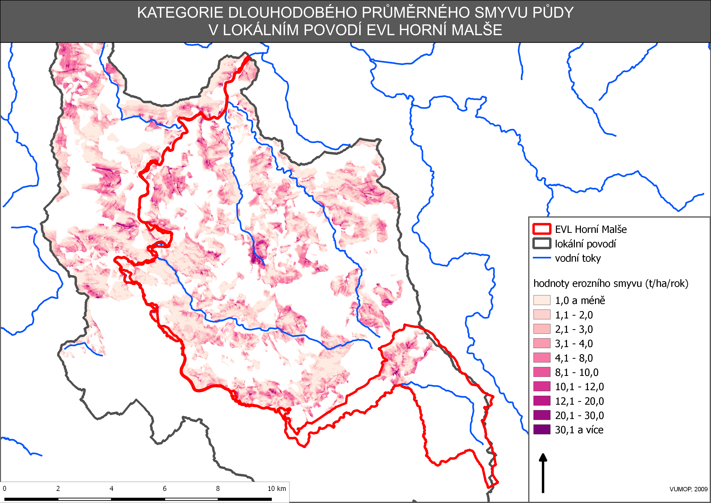
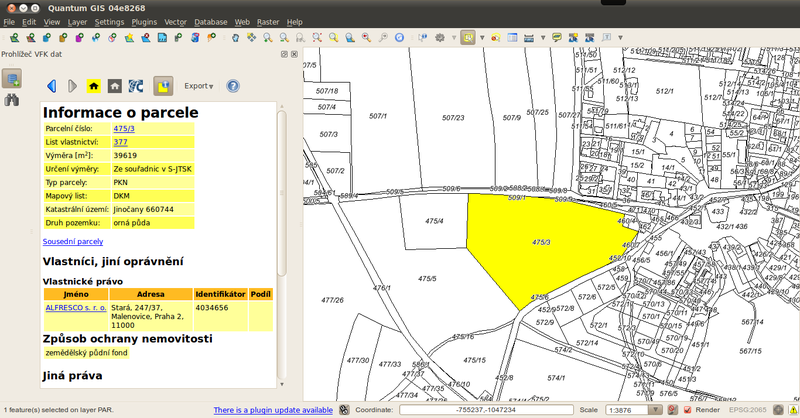

QGIS
====

`Quantum GIS <http://qgis.org/en/site/>`_ (zkráceně `QGIS <http://qgis.org/en/site/>`_) je Open Source Geografický Informační Systém.
Projekt QGIS vznikl v roce 2002, verze s označením 1.0 vyšla však v roce 2009.
Projekt QGIS je nejrychleji rostoucím Open Source projektem mezi GIS.
Ke konci roku 2014 výjde verze 2.5, která rozšíří program o další funkcionalitu
a vyšší stabilitu.

   
   Obr 1

QGIS je psán v programovacím jazyce C++ a uživatelské prostředí je naprogramováno
pomocí knihovny Qt. Díky použití těchto rozšířených programovacích prostředků je
QGIS multiplatformní, tudíž jej lze využívat na většině používaných operačních
systémech jako je Windows, Linux nebo OS X. QGIS využívá pro práci s prostorovýmy
daty knihovnu GDAL pro rastrová data a OGR pro vektorová data, díky tomu je možné
v QGISu otevřít široké spektrum OGC formátů.

.. figure:: images/intro_qgis.png

   Obr 2

Program nabízí přehledné uživatelské prostředí. Uživatel má k dispozici širokou
škálu nástrojů pro prohlížení, modifikaci a export dat.
Od verze 2.0 QGIS obsahuje \"Print Composer\", tedy nástroj pro vytváření map.
V tiskovém modulu lze vytvářet z nahraných dat výstupy se všemy kartografickými
náležitostmi. Výsledky je možné exportovat do pdf, nebo obrázku.

   Obr 3

QGIS je populární i pro svou rozšiřitelnost pomocí takzvaných \"pluginů\".
Pluginy jsou dílčí nástroje, které jsou vyvíjeny komunitou kolem QGIS.
Pomocí pluginů je možné vložit pod data v mapovém okně mapové podklady Google,
Bing nebo Open Street Map. Pro připojení k WFS poskytovaným ČÚZK je možné použít
plugin \"WFS 2.0\" a pro prohlížení souborů vfk slouží plugin
`VFK <http://freegis.fsv.cvut.cz/gwiki/VFK_/_QGIS_plugin>`_.

   Obr 4
