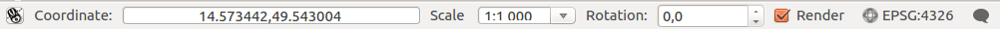
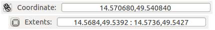
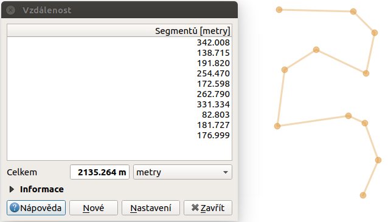
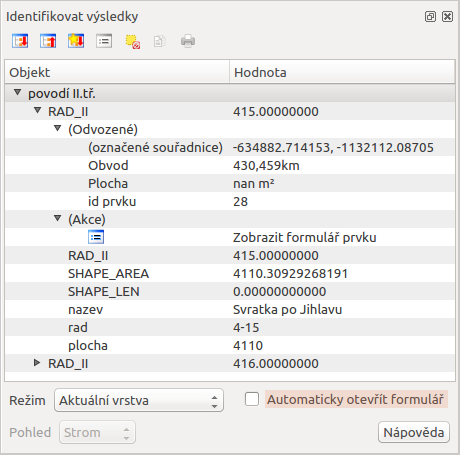

.. |extents| image:: ../images/icon/extents.png
   :width: 1.5em
.. |tracking| image:: ../images/icon/tracking.png
   :width: 1.5em
.. |addscale| image:: ../images/icon/symbologyAdd.png
   :width: 1.5em
.. |removescale| image:: ../images/icon/symbologyRemove.png
   :width: 1.5em
.. |geographic| image:: ../images/icon/geographic.png
   :width: 1.5em
.. |log| image:: ../images/icon/mIconInfo.png
   :width: 1.5em
.. |mActionZoomOut| image:: ../images/icon/mActionZoomOut.png
   :width: 1.5em
.. |mActionZoomIn| image:: ../images/icon/mActionZoomIn.png
   :width: 1.5em
.. |mActionZoomLast| image:: ../images/icon/mActionZoomLast.png
   :width: 1.5em
.. |mActionZoomNext| image:: ../images/icon/mActionZoomNext.png
   :width: 1.5em
.. |mActionZoomToLayer| image:: ../images/icon/mActionZoomToLayer.png
   :width: 1.5em
.. |mActionZoomFullExtent| image:: ../images/icon/mActionZoomFullExtent.png
   :width: 1.5em
.. |mActionPan| image:: ../images/icon/mActionPan.png
   :width: 1.5em
.. |mActionRefresh| image:: ../images/icon/mActionRefresh.png
    :width: 1.5em
.. |mActionSelectRectangle| image:: ../images/icon/mActionSelectRectangle.png
    :width: 1.5em
.. |mActionSelectPolygon| image:: ../images/icon/mActionSelectPolygon.png
    :width: 1.5em
.. |mActionSelectFreehand| image:: ../images/icon/mActionSelectFreehand.png
    :width: 1.5em
.. |mActionSelectRadius| image:: ../images/icon/mActionSelectRadius.png
    :width: 1.5em
.. |mIconExpressionSelect| image:: ../images/icon/mIconExpressionSelect.png
    :width: 1.5em
.. |mActionUnselectAttributes| image:: ../images/icon/mActionUnselectAttributes.png
    :width: 1.5em
.. |mActionZoomToSelected| image:: ../images/icon/mActionZoomToSelected.png
    :width: 1.5em
.. |mActionPanToSelected| image:: ../images/icon/mActionPanToSelected.png
    :width: 1.5em
.. |mActionMeasureArea| image:: ../images/icon/mActionMeasureArea.png
    :width: 1.5em
.. |mActionMeasure| image:: ../images/icon/mActionMeasure.png
    :width: 1.5em
.. |mActionMeasureAngle| image:: ../images/icon/mActionMeasureAngle.png
    :width: 1.5em
.. |mActionIdentify| image:: ../images/icon/mActionIdentify.png
    :width: 1.5em

.. index::
   single: rozhraní - popis

.. _popisrozhrani:

Popis rozhraní
--------------

Po spuštění systému QGIS se zobrazí standardní rozhraní. 
Na obrázku níže jsou označeny základní části systému.

.. tip:: Vzhled systému QGIS je možné jednoduše měnit dle
   potřeb. Zobrazování jednotlivých nástrojů je možné upravit a
   přizpůsobit si tak pracovní prostředí. Pokud budete rozšiřovat
   funkčnost systému, tak je dobré si vhodně umístit nové nástroje.

.. figure:: images/menu_description.png
   :class: large
   :scale-latex: 80

   Základní části systému QGIS (detailní popis částí je níže).

.. index::
   pair: mapové okno; rozhraní - popis
   
Mapové okno (1)
===============

V tomto okně se vykreslují všechny mapové vrstvy.

.. index::  
   pair: přepínač vrstev; rozhraní - popis

Přepínač vrstev / Panel prohlížeče (2)
======================================

Přepínač vrstev zobrazuje všechny přidané vrstvy. Jejich zobrazení
poskytuje rychlou informaci o jejich pozici a grafickém zobrazení v
mapovém okně.  Kliknutím pravého tlačítka na vybranou vrstvu se vyvolá
kontextové menu k dané vrstvě. V tomto menu je možné najít vše od
stylování vrstvy až po export dat.

Panel prohlížeče slouží k zjednodušení přístupu ke geodatům. Umožňuje
přistupovat k různým typům dat, např. vektorovým, rastrovým, databázím,
službám.

.. index::  
   pair: postranní menu; rozhraní - popis

Postranní menu (3)
==================

Menu s nástroji pro přidávání vrstev, nebo vytváření nových.  

.. index::
   single: stavový řádek
   pair: stavový řádek; rozhraní - popis

Stavový řádek (4)
=================

Obsahuje základní informace o nastavení mapového okna. 
Jednotlivé části jsou posány níže.

   
   Stavový řádek systému QGIS.

.. index::
   pair: souřadnice mapového okna; stavový řádek

Souřadnice
^^^^^^^^^^ 

První část stavového řádku slouží pro orientaci v mapovém okně. Zde se
zobrazuje buď aktuální souřadnice ukazatele myši v mapovém okně, nebo tzv.
extent (rozsah území aktuálně zobrazeného v mapovém okně). Ukázka obou možností
je zobrazena na následujícím obrázku. Jako přepínač mezi uvedenými fukcemi
slouží ikona |extents| :sup:`Přepnout rozšíření a zobrazení pozice myši`, resp. 
|tracking| :sup:`Přepnout rozšíření a zobrazení pozice myši`.
   

    
   Možnosti zobrazení souřadnic ukazatele myši nebo rozsahu mapového okna.

.. index::
   pair: měřítko; stavový řádek

Měřítko
^^^^^^^   

Další funkcí je měřítko. Tato funkce zobrazuje aktuální měřítko mapového okna.
Umožňuje také překreslení mapového okna do jiného měřítka pomocí výběru z
předdefinovaného seznamu měřítek.

.. figure:: images/choose_scale.png
   :class: small
   :scale-latex: 50
    
   Výběr měřítka z předdefinovaného seznamu.

.. tip:: Seznam předdefinovaných měřítek je možné upravit. V menu 
   :menuselection:`Nastavení --> Možnosti...` záložka :item:`Nástroje mapy` je
   část :item:`Předdefinovaná měřítka`. Nové měřítko je možné přidat pomocí ikonky 
   |addscale| :sup:`Přidat předdefinované měřítko` a nebo odstranit pomocí
   |removescale| :sup:`Odstranit vybrané`. 

         .. figure:: images/predefined_scales.png
            :class: middle
            
            Menu pro upravení předdefinovaných měřítek.

.. index::
   pair: překreslování mapového okna; stavový řádek

Překreslování mapového okna
^^^^^^^^^^^^^^^^^^^^^^^^^^^           

Vykreslování v mapovém okně je možné nastavit různým způsobem. Standardně se
kresba v mapovém okně překresluje při následujících akcích:
    * přidání nové vrstvy
    * posun nebo zoomování mapového okna
    * změna velikosti QGIS okna
    * změna viditelnosti vrstvy
    
V některých případech může překreslování mapového okna trvat déle, než je
vhodné. V takovýchto případech je možné upravit nastavení vykreslování a
:ref:`stylování <styl-vrstvy>` jednotlivých vrstev.  V případě, že
překreslování není potřebné, tak je možné jej potlačit - mapové okno se nebude
překreslovat. Pro takovéto nastavení je ve stavovém řádku položka s checkboxem
:item:`Vykreslování`.

.. tip:: Pokud potřebujete přerušit vykreslování jednorázově, tak je to možné 
   provést stisknutím klávesy :item:`Esc`.

.. index::
   pair: souřadnicový systém mapového okna; stavový řádek

Souřadnicový systém
^^^^^^^^^^^^^^^^^^^        

Mezi nejdůležitější nastavení patří nastavení souřadnicového systému mapového
okna. Aktuální EPSG kód souřadnicového systému je vidět přímo ve stavovém řádku
vedle ikony |geographic|.

.. note:: Podrobnější informace k problematice souřadnicových systémů
          ve školení :skoleni:`Open Source GIS
	  <open-source-gis/soursystemy/index.html>`.

.. tip:: Souřadnicové systémy je možné vybírat podle EPSG kódu. Po
   instalaci je defaultně nastaven souřadnicový systém WGS 84
   (:epsg:`4326`). Pro potřeby zpracování geodat na území ČR se však
   většinou používá souřadnicový systém :epsg:`5514`
   (S-JTSK). Nastavení přes stavový řádek je však platné jenom pro
   aktuální projekt. Po opětovném spuštění se systém spustí v
   defaultním souřadnicovém systému. Jak nastavit defaultní
   souřadnicový systém je popsáno v kapitole :ref:`sour-system`.

.. noteadvanced:: Pokud potřebujete zjistit detaily o jakékoli aktivitě
   systému, tak si nechte vypisovat tzv. logovací zprávy. Záložku s
   jednotlivými logovacími zprávami je možné otevřít pomocí ikonky
   |log| :sup:`Zprávy`. Tyto zprávy jsou podstatné zejména v případě
   neočekávaného chování systému.

.. index::
   single: hlavní menu   
   see: hlavní menu; rozhraní - popis

Hlavní menu (5)
===============

Hlavní menu se skládá ze dvou základních částí. První je standardní menu v liště
a druhou je nástrojová lišta.

V menu se nachází zejména nástroje pro správu systému a jeho nastavení.

.. tip:: Nastavení systému je možné změnit přes :menuselection:`Nastavení -->
   Možnosti...`. Prvním důležitým nastavením je volba souřadnicového systému -
   záložka :item:`SRS`. Zde se nastaví souřadnicový systém  pro nový projekt a
   zvlášť pro novou vrstvu.
    
Nástrojová lišta obsahuje základní nástroje pro práci s projektem a vrstvami.
Vypínání a zapínání jednotlivých nástrojových lišt a oken lze provádět pravým
kliknutím na panel a výběrem z nabídky.

.. index::
   single: pohyb v okně   
   see: pohyb v okně; rozhraní - popis

Základní nástroje pro pohyb v okně 
^^^^^^^^^^^^^^^^^^^^^^^^^^^^^^^^^^

- |mActionZoomIn| :sup:`Přiblížit`, |mActionZoomOut| :sup:`Oddálit` -
  přiblíží/oddálí vybranou oblast, pro přibližování bez vybrání
  oblasti lze použít i kolečko myši
- |mActionZoomLast| :sup:`Zvětšit podle posledního výřezu`,
  |mActionZoomNext| :sup:`Přiblížit na další` - lze vrátit na předchozí
  stav přiblížení a zpět
- |mActionZoomToLayer| :sup:`Přiblížení na vrstvu` - přiblíží na
  rozsah vybrané vrstvy
- |mActionZoomFullExtent| :sup:`Přiblížení na všechny vrstvy` -
  přiblíží na všechny vrstvy v projektu
- |mActionPan| :sup:`Posun mapy` - umožní posun v mapovém okně tažením,
  tuto funkci lze nahradit stisknutím kolečka myši a následným tažením
        .. tip:: Při posunu pomocí stisknutí kolečka myši můžeme mít
           aktivní jinou funkci, např. výběr, vytváření nových prvků atd.
- |mActionRefresh| :sup:`Obnovit` - obnoví zobrazení všech nahraných dat

.. index::
   single: výběr v mapě  
   see: výběr v mapě; rozhraní - popis

Základní nástroje výběru
^^^^^^^^^^^^^^^^^^^^^^^^

Pomocí těchto nástrojů lze ve vektorových datech označit konkrétní
prvky, se kterými hodláme dále pracovat. Tato označení se nazývá
:option:`Výběr`.

- |mActionSelectRectangle| :sup:`Vybrat prvky oblastí nebo jednoklikem` -
  nejjednodušší tvorba výběru
- |mActionSelectPolygon| :sup:`Vybrat prvky polygonem` - vytvořit výběr
  naklikáním polygonu
- |mActionSelectFreehand| :sup:`Vybrat prvky kreslením od ruky`
- |mActionSelectRadius| :sup:`Vybrat prvky poloměrem`

- |mIconExpressionSelect| :sup:`Vybrat prvky pomocí vzorce` - viz kapitola
  :ref:`atrdotaz`

- |mActionUnselectAttributes|:sup:`Zrušit výběr ve všech vrstvách` -
  zruší veškerý výběr

.. tip:: Nástroje pro pohyb v okně na základě výběru

    - |mActionZoomToSelected| :sup:`Přiblížit na výběr`
    - |mActionPanToSelected| :sup:`Posunout mapu na výběr`

.. index::
   single: měření   
   see: měření; rozhraní - popis

Měření v mapovém okně
^^^^^^^^^^^^^^^^^^^^^

.. warning:: Nástroje pro měření jsou závislé na souřadnicovém
   systému. V případě nastavení zeměpisného souřadnicového systému
   bude výsledek měření (délky a plochy) uveden ve stupních. Pro tento
   účel je nutné mít správně nastavený mapový souřadnicový
   systém. Měření v mapovém okně také respektuje nastavení
   přichytávání (tzv. snapping).

V mapovém okně lze použít pro měření následující nástroje z hlavního menu.

- |mActionMeasure| :sup:`Měřit linii` :kbd:`Ctrl+Shift+M`
- |mActionMeasureArea| :sup:`Měřit plochu` :kbd:`Ctrl+Shift+J`
- |mActionMeasureAngle| :sup:`Měřit úhel` 

Pro měření se kliknutím vybere požadovaný nástroj. Zobrazí se dialogové okno k
danému typu měření, kde lze vybrat jednotky měření. Kliknutím do mapy se začne
kreslit požadovaný útvar pro měření. Během kreslení se určovaná hodnota 
upravuje dle polohy kurzoru.  Definování prkvu kresbou lze ukončit pravým 
kliknutím. Nové měření lze začít pomocí tlačítka :item:`Nové`.

.. figure:: images/measure_area.png
   :scale-latex: 50
    
   Měření plochy - ukázka volby jednotek.

U měření délek se určuje délka jednotlivých segmentů mezi vrcholy, ale i součet
všech délek.

    
   Měření délky - délky segmentů a celková délka.

.. tip:: Nastavení měření se nachází v menu :menuselection:`Nastavení -->
         Možnosti...` záložka :item:`Nástroje mapy` část :item:`Nástroj pro
         měření`.
         
         .. figure:: images/measure_units.png
            :class: middle
            :scale-latex: 65

            Nastavení měření - jednotky, symbologie, hodnoty.

.. index::
   single: identifikace prvku   
   see: identifikace prvku; rozhraní - popis

Identifikace prvku
^^^^^^^^^^^^^^^^^^

Nástroj pro identifikaci prvku slouží pro získání informací o interaktivně
vybraném prvku v mapovém okně. Pro identifikaci je možné použít menu
:menuselection:`Zobrazit --> Identifikovat prvky`, použít klávesovou zkratku 
:kbd:`Ctrl+Shift+I` nebo ikonu |mActionIdentify| :sup:`Identifikovat prvky`. 

Po vyvolání nástroje pro identifikaci se kliknutím v mapě vyberou prvky, které
chceme identifikovat.

    
   Výsledek identifikace prvku.

Výsledky identifikace se zobrazují v pop-up okně ve formě stromové
struktury.  Pokud vybíráme prvky ve vícero vrstvách, tak první úrovní
rozdělení je jméno vrstvy. Na další úrovni je atribut nastavený v menu
vrstvy :menuselection:`Vlastnosti --> Zobrazení`. Na další úrovni se
zobrazují 3 skupiny informací:

- Odvozené - informace, které nejsou mezi atributy, ale jsou určené při
  identifikaci (plocha, obvod, délka, poloha - dle typu prvku),
- Akce - interaktivní položky, které vyvolají akci  (menu vrstvy 
  :menuselection:`Vlastnosti --> Akce`),
- Vlastnosti - seznam atributů daného objektu (z atributové tabulky).

Při vícero vrstvách lze v mapovém okně nastavit režim výběru (v spodní
části okna) a formu zobrazování.

Při pravém kliku na detail v tabulce se vyvolá kontextové menu, které
umožňuje různé možnosti od zoomování na vybraný prvek, kopírování
hodnot, práci s výběrem až po nastavení dané vrstvy.
