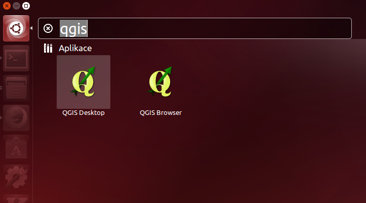
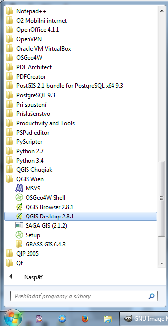

Úvod do systému QGIS
---------------------

Po úspěšné instalaci systému QGIS (dle návodu pro :doc:`GNU/Linux
<../instalace/linux>` nebo :doc:`MS Windows <../instalace/windows>`)
je možné jej spustit a začít okamžitě pracovat.

.. tip:: Pro potřeby testování je možné použít připravená geodata. Při
      instalaci na MS Windows je možné stáhnout dataset již během
      instalace samotného programu, pomocí volby :ref:`v průběhu
      instalace <nativni-instalator-data>`. Testovací data je možné
      `stáhnout <http://qgis.org/downloads/data/>`_ i samostatně.

.. index::
   single: spuštění QGIS

Spuštění systému QGIS
=====================

Úspěšně nainstalovaný systém by měl být dostupný z hlavní nabídky operačního systému.

.. raw:: latex

	 \newpage

   Spuštění systému QGIS v Ubuntu 14.04 (položka QGIS Desktop).
   

   Spuštění systému QGIS z nabídky Start v MS Windows.

.. notecmd:: Spuštění QGIS

   V systému GNU/Linux je možné spustit QGIS z příkazové řádky
   jednoduchým zadáním názvu programu.
             
   .. code-block:: bash
		
      qgis

Po spuštění programu se objeví standardní pracovní rozhraní systému
QGIS. V tomto rozhraní je možné okamžitě začít importovat data,
provádět analýzy nebo tvořit výstupy. Vzhled samotné aplikace se
přizpůsobuje dle aktuálního nastavení funkčnosti. Popis jednotlivých
částí bude vysvětlen postupně dle potřeby.
 
 .. figure:: images/run_qgis.png
    :class: large
    :scale-latex: 85

    Vzhled QGIS po spuštění.

.. noteadvanced::

                Pokud máte rozpracované projekty v konkrétní verzi a
                chcete vyskoušet novou verzi, tak není nutné stávajíci
                verzi odinstalovat.
                
                Jednotlivé verze jsou schopné pracovat vedle sebe.
                Navíc jsou schopné přebírat nastavení. To například
                znamená, že pokud používáte určité pluginy, tak budou
                okamžitě dostupné i v nové verzi. Platí to i zpětně,
                když přidáte funkcionalitu v nové verzi, tak je možné
                ji použít i ve starší verzi (platí pro nástroje
                kompatibilní pro nainstalované verze).
                
                .. figure:: images/qgis_more_versions.png
                   :class: small
                   :scale-latex: 40
                            
                   Výběr z vícero verzí QGIS v MS Windows.

.. index::
   single: QGIS projekt

QGIS projekt
============

Aktuální nastavení systému QGIS při práci je možné uložit. Takovéto
nastavení se ukládá do tzv. projektu. Projekt systému QGIS je
standardní soubor s příponou ``.qgs``. Uložení do projektu umožňuje
opětovné načtení všech dat i s kompletním nastavením systému.

.. noteadvanced:: QGIS projekt je ukládán jako ``.xml``
   soubor. Vzhledem k tomu, že se jedná o textový formát, lze jej
   editovat i mimo samotný QGIS. Je však nutné znát strukturu formátu, a
   proto tento postup lze doporučit pro opravdu pokročilé uživatele a
   spíše v extrémních případech.

.. todo:: pridat ikonky ?
