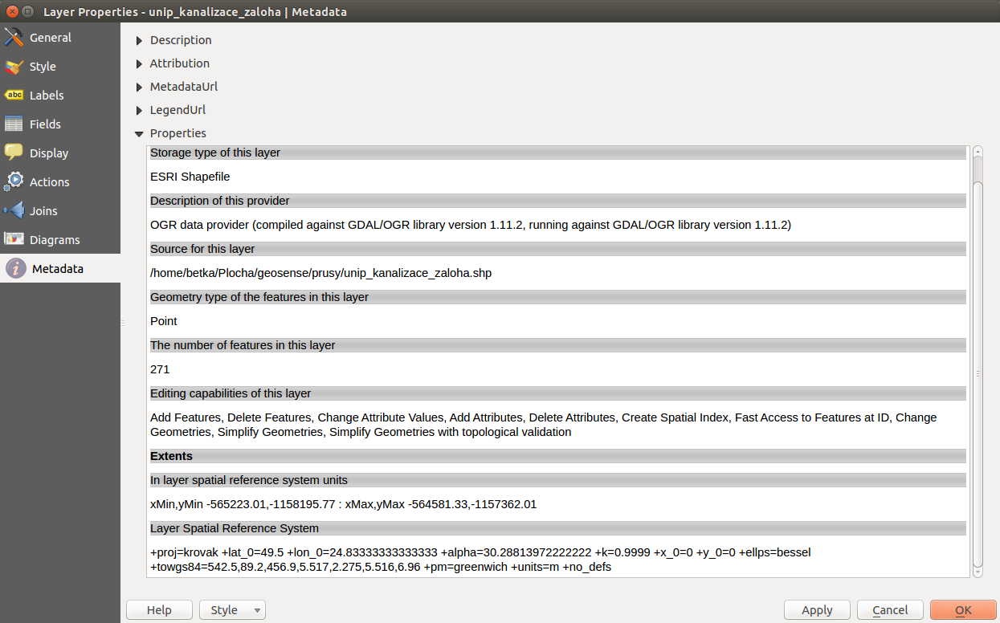

Vektorová data 
--------------
V systému QGIS lze pracovat s různými formáty vektorových dat. 
Vektorová data se standardně dělí dle typu geometrie na bodové, liniové a plošné.
To jakým způsobem se data ukládají a co daný způsob přináší za možnosti se může velice lišit.

QGIS s daty pracuje v jejich původním formátu a nepřevádí je. Převod do jiných formátů je možný pomocí knihovny nástrojů.

Pro převod mezi formáty se používá knihovna `GDAL <http://gdal.org/>`_.  
`Zde <http://gdal.org/ogr_formats.html>`_ je dostupný seznam podporovaných vektorových formátů i s doplňujícími informacemi.

Podrobné informace jsou v kapitole :ref:`Práce s vektorovými daty <vektorova-data-detaily>`.

Metadata
^^^^^^^^
Základní metadata vektorové vrstvy jemžné získat pravým kliknutím na vrstu. V kontextovém menu se nachází položka :item:`Properties`. V záložce :item:`Metadata` jsou v různých záložkách uložené informace o dané vrstvě.

   Příklad výpisu metadat vrstvy typu ESRI shapefile.

.. figure:: images/postgis_metadata.png
   :class: large
   :scale-latex: 80

   Příklad výpisu metadat vrstvy typu Postgis.
