.. |add_map| image:: ../images/icon/mActionAddMap.png
   :width: 1.5em
.. |add_label| image:: ../images/icon/mActionLabel.png
   :width: 1.5em
.. |add_legend| image:: ../images/icon/mActionAddLegend.png
   :width: 1.5em
.. |add_scale| image:: ../images/icon/mActionScaleBar.png
   :width: 1.5em
.. |add_image| image:: ../images/icon/mActionAddImage.png
   :width: 1.5em 
.. |add_arrow| image:: ../images/icon/mActionAddArrow.png
   :width: 1.5em
.. |add_attributes| image:: ../images/icon/grass_edit_attributes.png
   :width: 1.5em
.. |up| image:: ../images/icon/symbologyUp.png
   :width: 1.5em
.. |down| image:: ../images/icon/symbologyDown.png
   :width: 1.5em
.. |add| image:: ../images/icon/symbologyAdd.png
   :width: 1.5em  
.. |remove| image:: ../images/icon/symbologyRemove.png
   :width: 1.5em 

Prvky mapového výstupu
----------------------

Mapový výstup může obsahovat různé součásti (mapové pole, legenda,
titulek, měřítko a jiné). Nastavení celého výstupu je popsáno krok po
kroku až po export výstupu.

Zobrazení pracovních panelů
^^^^^^^^^^^^^^^^^^^^^^^^^^^
Pro příjemnou práci při tvorbě výsledků je vhodné mít nastavené 
zobrazování jednotlivých panelů. *Vypnout/zapnout* panel je možné v menu
:menuselection:`Zobrazení --> Panels`, kde se nastaví viditelnost 
jednotlivým panelům. Na obrázku :num:`#panels` je zobrazeno doporučené 
nastavení zobrazených panelů.

.. raw:: latex

   \newpage

.. _panels:
   
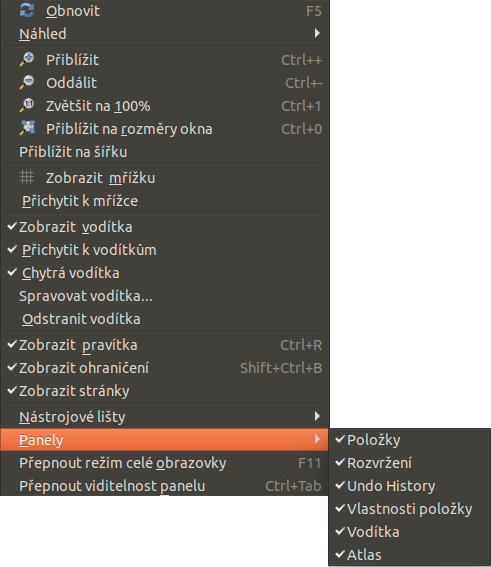
   
   Nastavení zobrazení a skrytí jednotlivých panelů.
 
Obsah mapového okna
^^^^^^^^^^^^^^^^^^^

Pomocí ikony |add_map| :sup:`Přidat novou mapu` se aktivuje funkce pro 
přidání výřezu s mapovým oknem. Dalším krokem je umístění výřezu pro 
mapové okno do pracovní plochy pomocí tažení myši.  Po umístění se do 
výřezu načte obsah mapového okna.

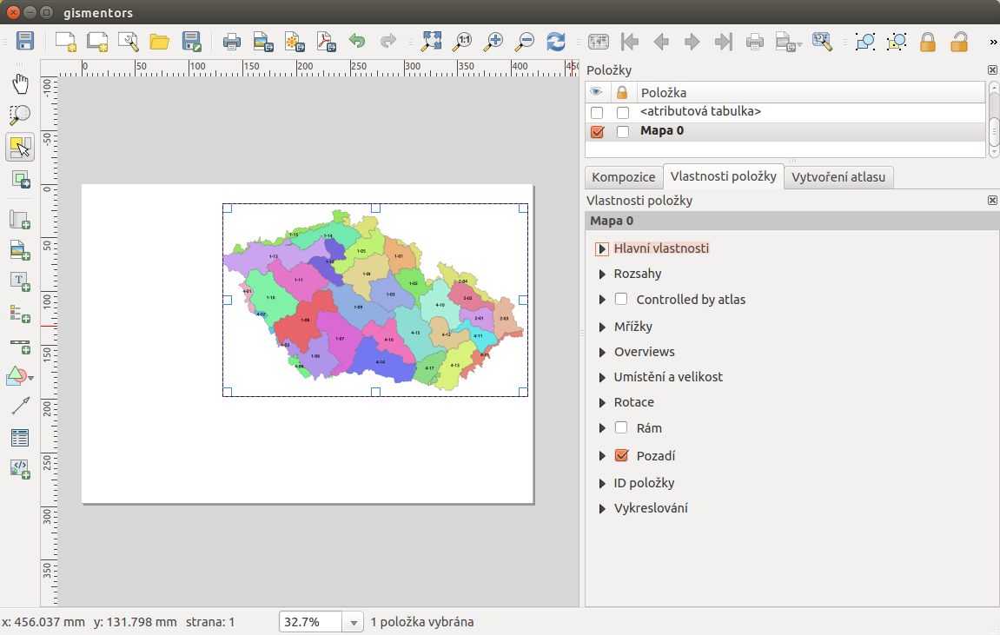
 
   Výřez s obsahem mapového okna a jeho detailní nastavení.
       
Velikost výřezu a jeho polohu lze měnit pomocí tahání za jeho hrany
nebo uchopení za jeho obsah a posun.

.. raw:: latex

   \newpage

.. tip:: Výřez s mapovým oknem má vícero dalších nastavení. Rozšířené
   nastavení je dostupné pro každý prvek přidaný do mapového
   výstupu. V části :item:`Položky` se nachází přehled všech
   prvků přidaných v mapovém výstupu. Označením vybraného prvku
   se v části :item:`Vlastnosti položky` otevře detailní
   nastavení konkrétního mapového prvku.
        
        .. figure:: images/map_items.png
           :class: small
           :scale-latex: 38
 
           Výřez s obsahem mapového okna a jeho detailní nastavení.
           
Obsah výřezu byl při jeho umístění vygenerován dle aktuálního rozsahu
mapového okna. Překreslení dle pozměněného mapového okna je možné v
detailu prvku :item:`Vlatnosti položky` v části :item:`Hlavní vlastnosti`
pomocí tlačítka :item:`Aktualizovat náhled`. V této části též lze nastavit
přesné měřítko mapového okna.

V části :item:`Rozsahy` lze přesně nadefinovat rozsah mapového okna v
souřadnicovém systému mapového projektu. Pomocí tlačítek lze také
nastavit rozsah (extent) z mapového okna :item:`Nastavit na rozsah
mapového okna` nebo naopak, zobrazit nadefinovaný extent v mapovém
okně :item:`Zobrazit rozsah v mapovém okně`.

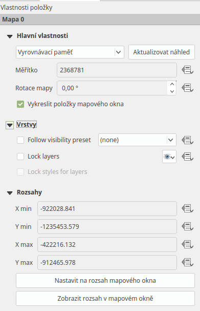
 
   Nastavení měřítka a extentu pro mapové okno.
       
Častou součástí mapového výřezu je i souřadnicová mřížka - grid s
popisem souřadnic. Grid lze přidat a nastavit v položce
:item:`Mřížky`. Lze nastavit styl gridu (linie, křížky, jiné symboly,
jenom rám se souřadnicemi) a dále nastavit interval a styl
vykreslování.

.. tip:: Pro grid lze definovat souřadnicový systém odlišný od
             projektu.

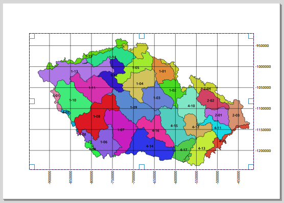
   
   Mapové okno s gridem a souřadnicemi.
       
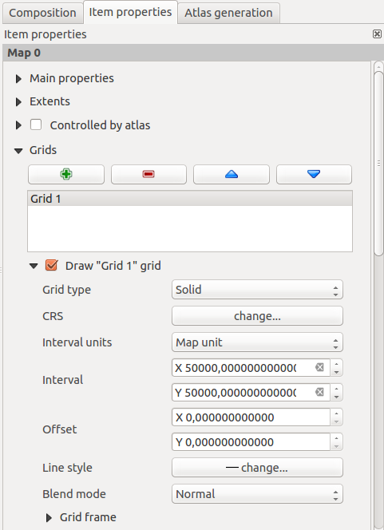
        
   Nastavení gridu pro mapové okno.
 
Nastavení popisků gridu je umístěno v části :item:`Vykreslit
souřadnice`. Lze nastavit formát vystupu, počet desetinných míst font
i barvu.  Popisky jsou rozděleny do jednotlivých částí mapového okna
(levá, pravá, horní, dolní). Každou stranu lze nastavit samostatně -
zda se zobrazuje, pozici vůči rámu, orientaci a řazení.

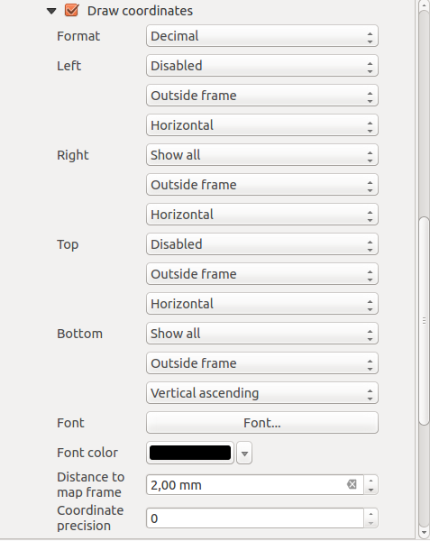
		 
   Nastavení zobrazování popisových souřadnic gridu.

Titulek
^^^^^^^

Obvyklým požadavkem pro mapový výstup je textové pole s titulkem.
Textové pole se přidá pomocí ikonky |add_label| :sup:`Přidat nový 
popísek`. Umístění textového pole probíhá stejně jako je popsané 
u mapového výřezu.

Jednotlivá nastavení pro obsah tohoto pole jsou opět dostupná přes
záložku :item:`Vlastnosti položky`. Lze zde nastavit samotný text, jeho
font, zarovnání, orámování, pozadí a další různé.

Legenda
^^^^^^^
Další obvyklou součástí mapového výstupu je legenda. Ta má popisovat
jednotlivé prvky, které jsou zobrazovány.  Přidání legendy do mapového
výstupu je možné pomocí ikonky |add_legend| :sup:`Přidat novou legendu`.
Umístění položky legendy do mapového okna je proveden stejně jako u 
předchozích položek.

Obsah legendy je vygenerován v momentě jejího umístění a na základě
nastavení stylů jednotlivých vrstev zobrazovaných v mapovém okně.

Obsah legendy je možné upravovat podobným způsobem jako ostatní prvky
(:item:`Vlastnosti položky`). Lze upravit název, zarovnání, odsazování
a další vizuální nastavení pro zobrazování legendy. 

Dále lze upravit i jednotlivé položky legendy, ubrat, přidat novou,
změnit text i zařazení jednotlivých položek v rámci legendy samotné.

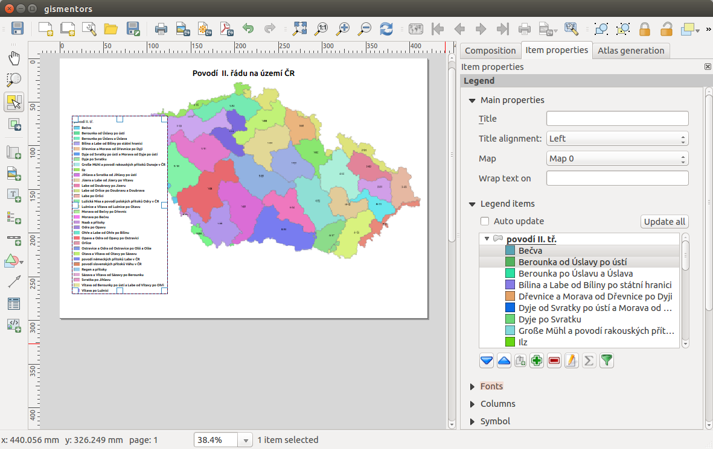
 
   Přidaná legenda a úprava jejich položek.

.. tip:: Pokud upravujete legendu, tak se může stát, že se změnami nebudete 
   spokojeni. V případě, že nechcete změny v nastavení provést ručně, můžete 
   legendu vygenerovat z dat znova pomocí tlačítka :item:`Aktualizovat vše`.

Atributová tabulka
^^^^^^^^^^^^^^^^^^

V některých případech je vhodné umístit do mapového výstupu i část
atributové tabulky. Tuto lze přidat pomocí tlačítka |add_attributes| 
:sup:`Přidat atributovou tabulku`.

Všeobecná nastavení tabulky a jejího vzhledu se nachází v části
:item:`Vlastnosti položky`. Pokud je v projektu přidáno vícero vrstev,
které mají atributovou tabulku, tak se nastaví zdrojová vrstva pro
atributovou tabulku do mapového výstupu.

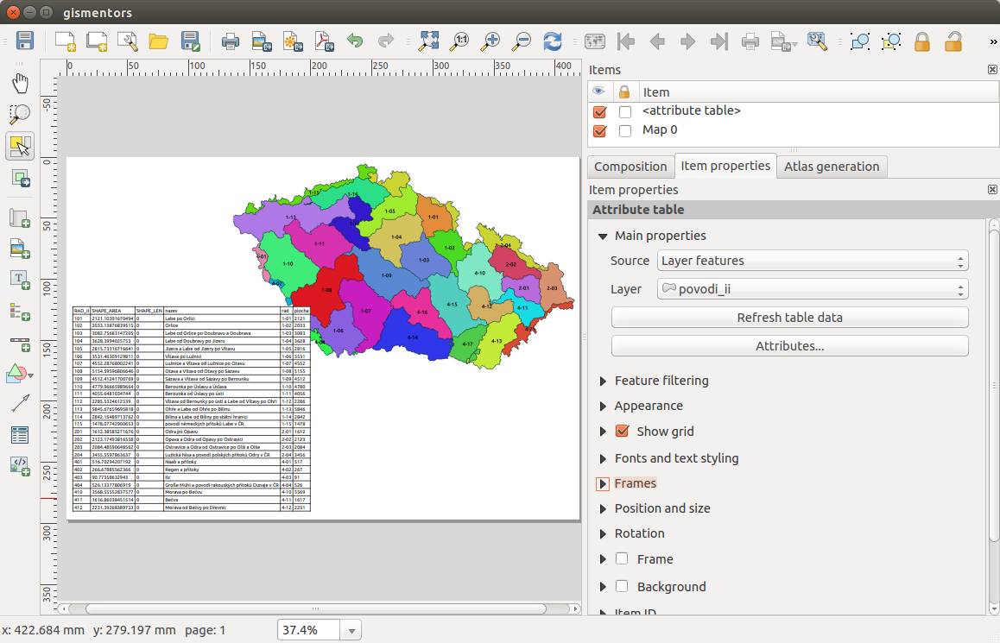
 
   Atributová tabulka vybrané vrstvy přidaná v mapovém výstupu.
       
Úprava samotné tabulky se nachází pod tlačítkem
:item:`Atributy...`. V tomto menu jsou 2 základní části. V první
části se manipuluje s atributy. Zde se vyberou všechny atributy, které
se v tabulce mají zobrazit |add| |remove|, jejich pořadí |up| |down|,
může se zde nastavit titulek pro atribut, ale i zarovnávání hodnot.

V druhé části se nastavuje řazení dat v tabulce. Řazení se řídí
definovanými pravidly. Každé pravidlo musí obsahovat atribut podle
kterého se tabulka bude řadit a typ řazení (sestupně nebo
vzestupně). Takto nadefinované pravidlo se pak tlačítkem |add| přidá
do seznamu pravidel. Jednotlivá pravidla se vypisují do pole pod
sebe. Jejich pořadí je možné měnit a ovlivnit tak přesné vypsání
tabulky do mapového výstupu.
       
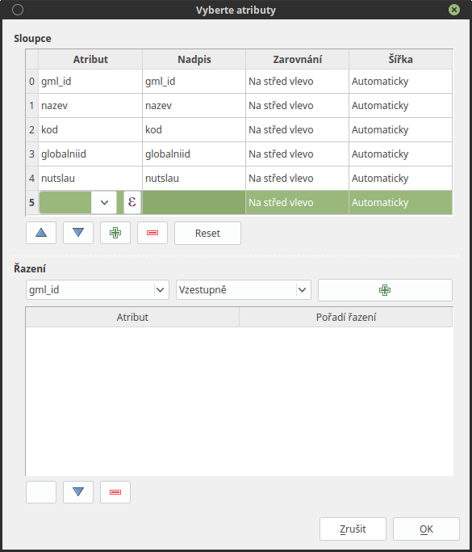

   Nastavení zobrazení atributové tabulky v mapovém výstupu.
 
Směrová šipka (růžice)
^^^^^^^^^^^^^^^^^^^^^^

Do mapového výstupu lze přidat také směrovou růžici - pomocí ikony |add_arrow| 
:sup:`Přidat šipku`. Směrová růžice může být vykreslena různou symbologii. 
Výběr symbologie a další nastavení jsou dostupné v záložce :item:`Vlastnosti 
položky`. Lze zde ponechat defaultní styl prvku, kdy se vykresluje jednoduchá 
šipka. Je možné použít i složitější nastavení - například použít vlastní svg 
symboly pro začátek a konec šipky.

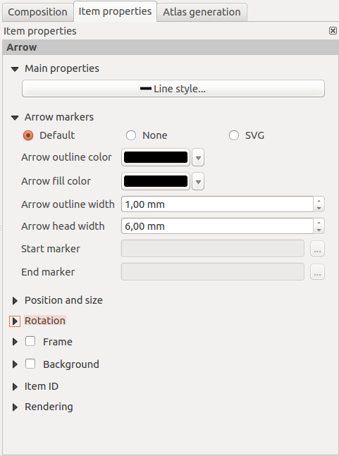
 
   Detailní nastavení směrové šipky.

Měřítko
^^^^^^^

Běžnou součástí výstupu je také měřítko. To lze přidat pomocí ikony |add_scale|
:sup:`Přidat nové grafické měřítko` a vložením prvku do výstupu. Výběr stylu a
další nastavení je dostupné v záložce :item:`Vlastnosti položky` viz
:num:`#legenda-nastaveni`. Nejdůležitější je výběr stylu legendy v položce :item:`Styl`. 
Lze vybrat z grafických měřítek nebo zvolit číselné měřítko. Dále lze nastavit
jednotky a jejich popisek. Dále jsou pak ostatní nastavení pro vzhled měřítka.

.. _legenda-nastaveni:

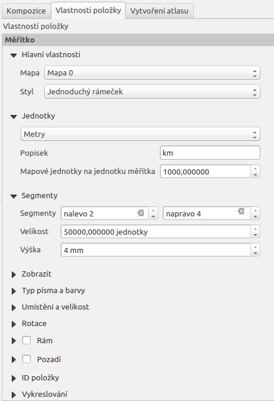
 
   Detailní nastavení měřítka.

Další prvky
^^^^^^^^^^^

Jako součást mapového výstupu se dá použít i například obrázek. Lze jej přidat 
pomocí ikony  |add_image| :sup:`Přidat obrázek`.
