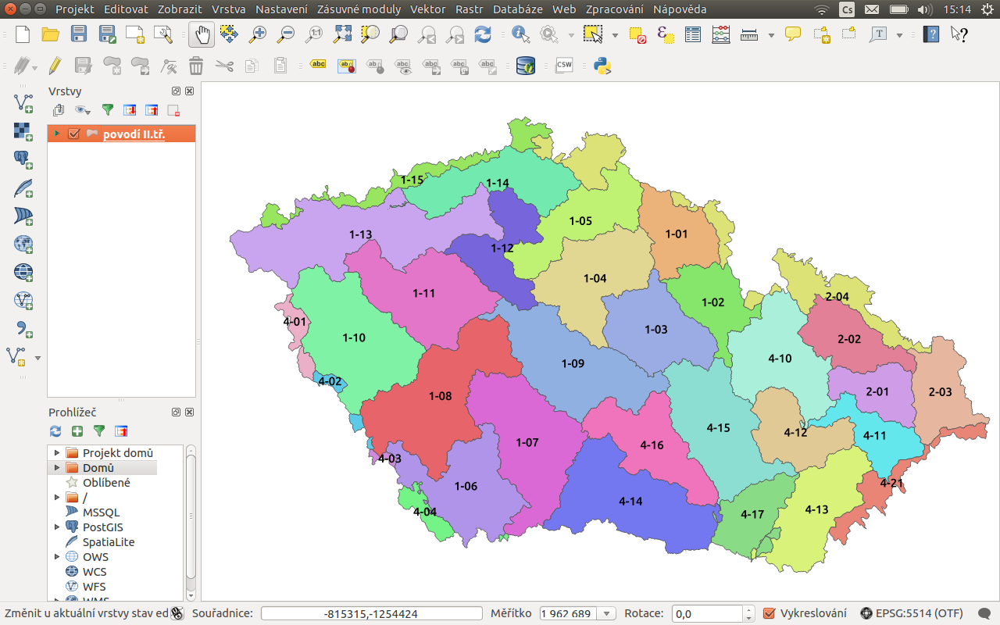
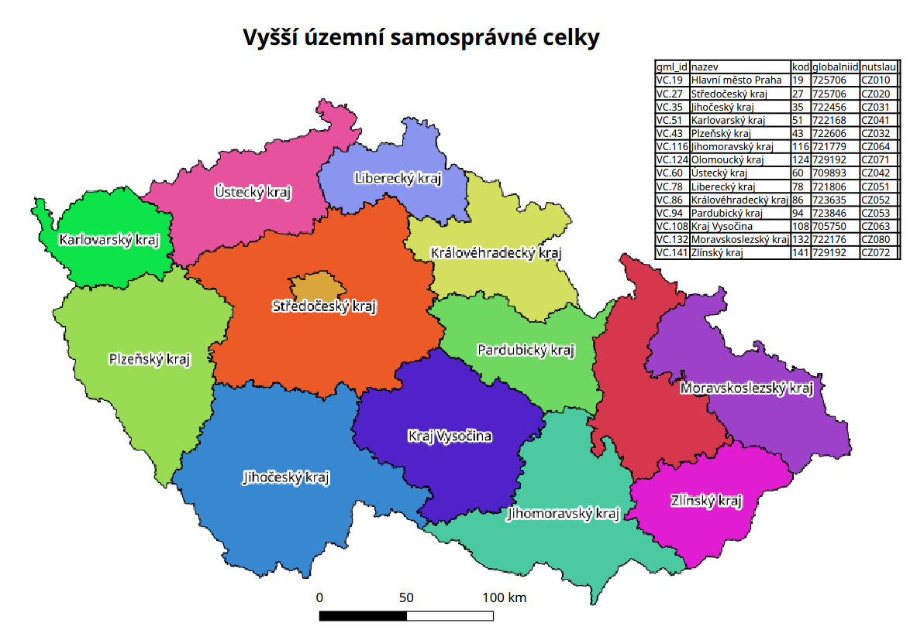
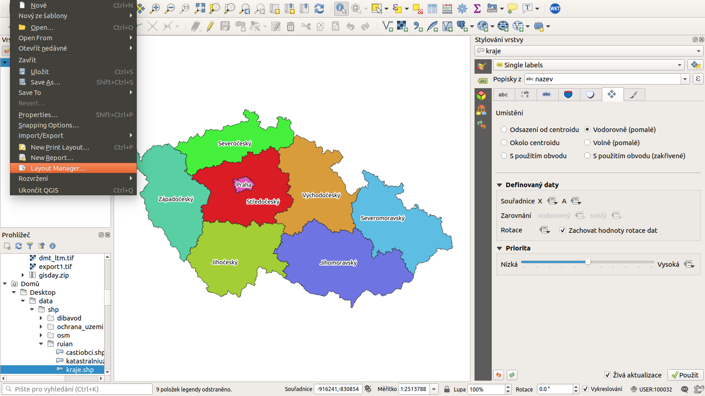
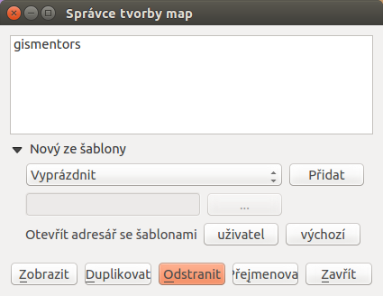
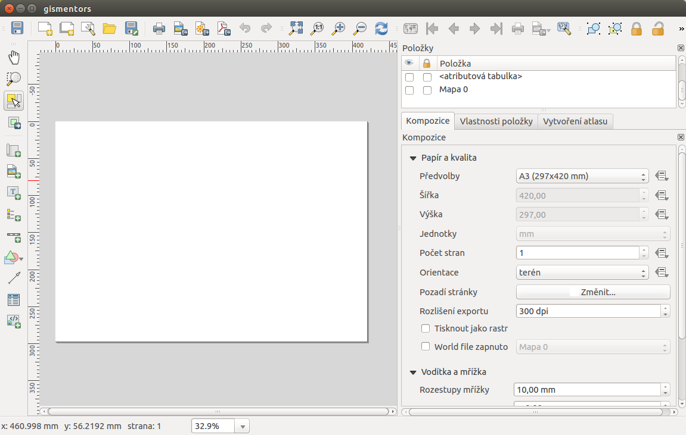

.. index::
   see: tvůrce map

Tvůrce mapy (Map Composer)
==========================

Systém QGIS dokáže pracovat s různými formáty a zobrazovat je v
mapovém okně (viz :numref:`map-window`). Obsah mapového okna lze
jednoduše vyexportovat jako obrázku (:menuselection:`Projekt -->
Uložit jako obrázek`). To však v řadě případů nemusí stačit, hlavně
když vyžadujeme mapový výstup určený pro tisk.

Pro vytvoření mapového výstupu určeného pro tisk, který si zachová
nastavení vrstev (stylování, popisky a další) z projektu, slouží
samostatný nástroj *Tvůrce mapy (Map Composer)*. Tento nástroj je
dostupný z menu :menuselection:`Projekt --> Tvůrce mapy`.

.. _map-window:
          

 
   Mapové okno zobrazující vrstvy dle jejich stylování.
       

 
   Ukázka mapového výstupu vytvořeného v Map Composeru.

Map Composer umožňuje vytvořit na základě dat mapový výstup v běžně
používaných formátech, jakými jsou např. PDF, PNG, JPEG a
další. Takovýmto způsobem je možné prezentovat jednotlivá data, jejich
kombinaci nebo výsledky různých analýz i bez potřeby speciálních
kartografických systémů.

.. index::
   pair: tvůrce map; správce tvorby mapy

Správce tvorby mapy
-------------------

Systém QGIS umožňuje vytvářet víc než jeden mapový výstup na daný
projekt. Zpravování jednotlivých mapových výstupů umožňuje *Správce 
tvorby mapy* dostupný z menu :menuselection:`Projekt --> Správce 
tvůrců mapy`.

 
   Otevření Správce tvorby mapy z menu.

Zde se nachází okno, kde jsou uvedeny všechny vytvořené mapové
výstupy. Pokud není doposud žádný vytvořený, tak je seznam prázdný a
pomocí tlačítka :item:`Přidat` se dá vytvořit nový.

 
   Zakládání nového mapového výstupu.

Vyskočí okno pro zadání názvu nově vytvářeného mapového výstupu. Po
zadání názvu a potvrzení tlačítkem :item:`OK` se tento vytvoří a
následně se otevře okno pro editaci a úpravu samotného mapového
výstupu.
        
        
.. tip:: Existující mapový výstup lze zkopírovat pomocí tlačítka
         :item:`Duplikovat`. Mapový výstup ke zkopírování se označí
         a pak se stiskne zmíněné tlačítko. V otevřeném okně se
         pak nastaví nový název mapového výstupu.

Pokud chcete otevřít existující mapový výstup, tak jej v seznamu
*Správce tvorby mapy* vyberte a tlačítkem :item:`Zobrazit` otevřete.
Všechny existující mapové výstupy jsou přístupné také z menu
:menuselection:`Projekt --> Tvorba map`.

.. index::
   pair: tvůrce map; nastavení pracovní plochy

Nastavení pracovní plochy
-------------------------

Jako první je nutné nastavit vlastnosti pracovní plochy. Toto
nastavení najdeme v pravé části v záložce :item:`Kompozice` část
:item:`Papír a kvalita`.

 
   Okno nového mapového výstupu.

.. figure:: images/paper_settings.png
   :class: small
   :scale-latex: 40
   
   Zakládání nového mapového výstupu - vlastnosti podkladu.

Zde se nastaví velikost "papíru", jeho orientace, barva pozadí a
rozlišení v DPI při exportu. Tyto hodnoty lze přenastavit i v průběhu
práce. Do takto nastavené pracovní plochy lze začít přidávat
jednotlivé prvky.

.. tip:: Při tvorbě profesionálních mapových výstupů se doporučuje
         používat 400 DPI. Pro běžné použití je vhodné ponechat
         původní nastavení 300 DPI.
    
         V některých případech je nutné najít vhodnou kombinaci měřítka
         zobrazovaného mapového výřezu, velikosti podkladového papíru a
         příslušného DPI.

         DPI je zkratka pro *Dots per inch*, více informací na
         :wikipedia:`Wikipedii <DPI>`.
    

