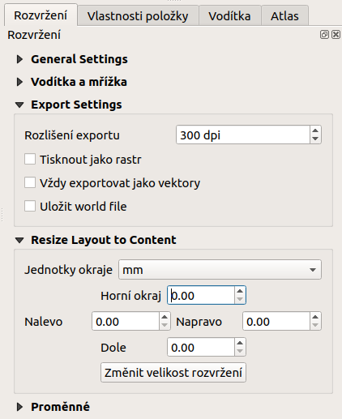

.. index::
   see: tvůrce map

Tiskové rozvržení (Print Layout)
================================

Systém QGIS dokáže pracovat s různými formáty a zobrazovat je v
mapovém okně (viz :numref:`map-window`). Obsah mapového okna lze
jednoduše vyexportovat jako obrázku (:menuselection:`Projekt -->
Import/Export --> Eport Map to image.../pdf`). 
To však v řadě případů nemusí stačit, hlavně když vyžadujeme mapový
výstup určený pro tisk.

Pro vytvoření mapového výstupu určeného pro tisk, který si zachová
nastavení vrstev (stylování, popisky a další) z projektu, slouží
samostatný nástroj *Rozvržení (Print Layout)*. Tento nástroj je
dostupný z menu :menuselection:`Projekt --> Layout manager...`.

.. _map-window:
          
.. figure:: images/map_window.png
   :class: large
   :scale-latex: 70
 
   Mapové okno zobrazující vrstvy dle jejich stylování.
       
.. figure:: images/composer_output.png
   :class: large
   :scale-latex: 70
 
   Ukázka možného výstupu z nástroje Rozvržení.

Nástroj Rozvržení umožňuje vytvořit na základě dat mapový výstup v běžně
používaných formátech, jakými jsou např. :file:`PDF, PNG, JPEG` a
další. Takovýmto způsobem je možné prezentovat jednotlivá data, jejich
kombinaci nebo výsledky různých analýz i bez potřeby speciálních
kartografických systémů.

.. index::
   pair: tvůrce map; správce tvorby mapy

Správce vytváření map
---------------------

Systém QGIS umožňuje vytvářet víc než jeden mapový výstup na daný
projekt. Zpravování jednotlivých mapových výstupů umožňuje *Layout manager* dostupný z menu :menuselection:`Projekt --> Layout manager...`.

.. figure:: images/composer_manager.png
   :class: large
   :scale-latex: 70
 
   Otevření Správce pro vytváření mapových výstupů.

Zde se nachází okno, kde jsou uvedeny všechny vytvořené mapové
výstupy. Pokud není doposud žádný vytvořený, tak je seznam prázdný a
pomocí tlačítka :item:`Create...` se dá vytvořit nový.

.. figure:: images/add_new_composer.png
   :class: small
   :scale-latex: 35
 
   Zakládání nového mapového výstupu.

Vyskočí okno pro zadání názvu nově vytvářeného mapového výstupu. Po
zadání názvu a potvrzení tlačítkem :item:`OK` se tento vytvoří a
následně se otevře okno pro editaci a úpravu samotného mapového
výstupu.
        
        
.. tip:: Existující mapový výstup lze zkopírovat pomocí tlačítka
         :item:`Duplicate...`. Mapový výstup ke zkopírování se označí
         a pak se stiskne zmíněné tlačítko. V otevřeném okně se
         pak nastaví nový název mapového výstupu.

Pokud chcete otevřít existující mapový výstup, tak jej v seznamu
*Layout manager* vyberte a tlačítkem :item:`Zobrazit` otevřete.
Všechny existující mapové výstupy jsou přístupné také z menu
:menuselection:`Projekt --> Rozvržení`.

.. index::
   pair: tvůrce map; nastavení pracovní plochy

Nastavení pracovní plochy
-------------------------

Jako první je nutné nastavit základní vlastnosti pro pracovní plochu a pro
export. 

První část je nastavení stránky. Toto je dostupné po kliknutí pravým tlačítkem
na plochu stránky pod položkou :item:`Vlastnosti stránky...`. V pravé části se
otevře nastavení stránky v záložce :item:`Vlastnosti položky`. 

.. figure:: images/composer_plain.png
   :class: large
   :scale-latex: 60
 
   Okno nového rozvržení výstupu.

.. figure:: images/paper_settings.png
   :class: small
   :scale-latex: 40
   
   Zakládání nového rozvržení- vlastnosti stránky.

Zde se nastaví velikost "papíru", jeho orientace a barva pozadí. Tyto hodnoty
lze přenastavit i v průběhu práce. 

Další část nastavení je v záložce :item:`Rozvržení`. Zde je možné nastavit
další části výstupu jako je nastavení výstupu při exportu.

   
   Zakládání nového rozvržení - export.

Do takto nastavené pracovní plochy lze začít přidávat
jednotlivé prvky.

.. tip:: Při tvorbě profesionálních mapových výstupů se doporučuje
         používat 400 DPI. Pro běžné použití je vhodné ponechat
         původní nastavení 300 DPI.
    
         V některých případech je nutné najít vhodnou kombinaci měřítka
         zobrazovaného mapového výřezu, velikosti podkladového papíru a
         příslušného DPI.

         DPI je zkratka pro *Dots per inch*, více informací na
         :wikipedia:`Wikipedii <DPI>`.
    

