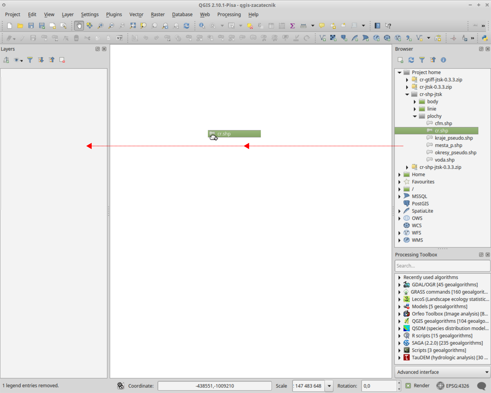
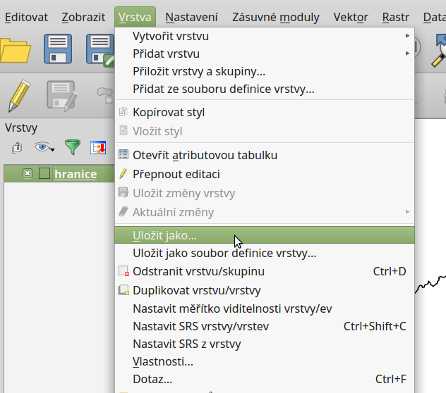
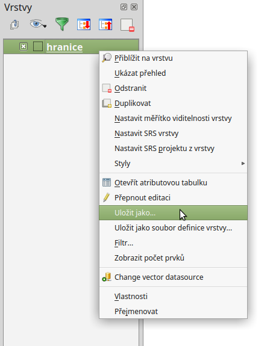

Přidávání a export prostorových dat
===================================

QGIS podporuje široké spektrum prostorových dat. Prostorová data můžeme
rozdělit podle způsobu uložení na lokální a distribuovaná (síťová).
V obouch kategoriích se následně vyskytují data rastrová a vektorová.
V této kapitole jsou popsány základní principy připojení a exportu prostorových dat v prgramu QGIS.
Práce s konkrétními formáty budou potom uvedeny v samostatných kapitolách.

Přidávání dat
-------------

Data lze přidat pomocí hlavního menu :menuselection:`Vrstva --> Přidat vrstvu-->...`. Na základě vybraného typu dat se nám zobrazí konkrétní dialogové okno s nastavením importu dat.

.. _addlayer:

.. figure:: images/addlayer_menu.png

    Menu přidávání vrstev

.. noteadvanced:: Jak jde vidět na obrázku :num:`addlayer`, u většiny typů dat ůze pro přdiání využít klávesové zkratky

Stejného výsledku lze dosáhnout i pomocí ikon v nástrojovém panelu :option:`Spravovat vrstvy`

.. figure:: images/addlayer.png

    nástrojový panel pro přidávání vrstev :option:`Spravovat vrstvy`
    
Další možností je přidat data pomocí vestavěného datového katalogu (prohlížeče souborů) a to buď dvojitým kliknutím nebo jednoduchým přetažením souboru do mapového okna nebo okna vrstev (:num:`obr. #browser`). Stisknutím kláves :kbd:`CTRL` a :kbd:`SHIFT` můžeme vybrat a přidat přetažíním více souborů najednou. Pomocí datového katalogu lze také procházet a přidávat soubory přímo z archivu zip.

    .. tip:: pomocí přetažení lze přidat data také přímo ze správce souborů v operačním systému

.. _browser:

    
    Přidání vrstvy přetažením souboru do mapového okna nebo seznamu vrstev

Export dat
----------
Pro export vrstvy nebo její částí se používá funkce :menuselection:`Uložit jako...`. Funkci můžeme spustit dvěma způsobi:

V seznamu vrstev označíme vrstvu, kterou chceme exportovat. Spustíme funkci z hlavního menu :menuselection:`Vrstva --> Uložit jako...`

    Spuštění exportu z hlavního menu

Elegantnější a rychlejší způsob je spuštění exportu ze seznamu vrstev. Pravým kliknutím na vrstvu vyvoláme kontextové menu a vybereme :menuselection:`Uložit jako...`

    
    Spuštění exportu z kontextového menu v seznamu vrstev

Jak exportovat konkrétní data se dovzíme v jednotlivých kapitolách

.. todo:: následující podkapitoly upravit a rozdělit do konkrétních kapitol, pro síťová data vytvořit novou kapitolu

Lokální data
------------

Lokální data jsou uložena na na vašem PC nebo na síťovém disku.

Vektorová data
^^^^^^^^^^^^^^

Nabídka pro načtení vektorové vrstvy se aktivuje v záložce
:menuselection:`Vrstva --> Přidat vrstvu --> Přidat vektorovou vrstvu`, nebo ikonou viz [obr 1]

.. figure:: images/qgis_ogc_addvector_icons.png

   Obr 1

Nejčastější volbou vkládání dat je soubor nebo adresář.
Volba adresář umožňuje označit složku ve které se nachází vektorová data.
Potvrzením tlačítkem otevřít QGIS připraví všechna dostupná data uložená
ve složce k načtení. Objeví se potvrzující okno se všemi dostupnými vrstvami.
Vrstvy lze buď označit všechny nebo podržením klávesy :kbd:`CTRL` vybrat jen
požadované vrstvy [obr 2].

.. figure:: images/qgis_ogc_addvector_selectfromfolder.png
	    
   Obr 2

Vložení jen jedné vrstvy je možné označením soubor na [obr 1].
Kliknutím na tlačítko procházet se otevře navigační okno s možností vybrat
formát vektorových dat [obr 3]. Po potvrzení se označená vrstva načte do
mapového pole.

.. figure:: images/qgis_ogc_addvector_choose.png

   Obr 3

Rastrová data
^^^^^^^^^^^^^

Nabídka pro načtení rastrové vrstvy se aktivuje v záložce
:menuselection:`Vrstva --> Přidat vrstvu --> Přidat rastrovou vrstvu`, nebo ikonou viz [obr 4]

.. figure:: images/qgis_ogc_addraster_icons.png

   Obr 4

Nástroj zobrazí okno, kde lze výběrem označit rastrové soubory pro přidání
do mapy [obr 5]. Podržením klávesy :kbd:`CTRL` je možné vybrat více souborů.
V pravém spodním rohu se nachází stejně jako u výběru vektorových vrstev
roletka s podporovanými formáty, pomocí níž lze filtrovat obsah okna.

.. figure:: images/qgis_ogc_addraster_choose.png
	    
   Obr 5

Výběr souřadnicového systému
^^^^^^^^^^^^^^^^^^^^^^^^^^^^

Při vkládání rastrových nebo vektorových dat se může stát, že po potvrzení
výběru je vyžedována specifikace souřadnicového systému vkládaných dat
[obr 6]. Okno se zobrazí v případě, pokud vkládaný soubor neobsahuje vlastní
specifikaci souřadnicového systému, jako například ESRI Shapefile bez souboru
končícího příponou prj \*.prj. V okně výběru je možné vyhledat pomocí filtru
požadovanou projekci.
Zvolení správné projekce je velice důležité pro překrývání více vrstev s
jinou projekcí, měření nebo pro připojování k webovým službám.

.. figure:: images/qgis_ogc_set_proj.png

   Obr 6

Vkládání lokálních dat pomocí panele prohlížeče
^^^^^^^^^^^^^^^^^^^^^^^^^^^^^^^^^^^^^^^^^^^^^^^
Rastrová a vektorová data lze do projektu přidávat také pomocí vestavěného datového katalogu (prohlížeče souborů) a to buď dvojitým kliknutím nebo jednoduchým přetažením souboru do mapového okna nebo okna vrstev [obr 7]. Stisknutím kláves :kbd:`CTRL` a :kbd:`SHIFT` můžeme vybrat a přidat přetažíním více souborů najednou. Pomocí datového katalogu lze také procházet a přidávat soubory přímo z archivu zip.

   
   Obr 7

Síťová data
------------
Pod pojmem síťová data jsou reprezentovány především data přístupná
z internetu jako WMS a WFS. Mnohé společnosti používají k ukládání dat
serverové řešení, které není přístupné z internetu, a tak připojení k
databázi PostGIS můžeme provést i z lokální sítě.

Rastrová data
^^^^^^^^^^^^^

Existuje více variant síťových rastrových služeb. Nejrozšířenější službou
je WMS.
Rychlejší, ale méně používanou alternativou k WMS je WMTS, kde \"T\" v názvu
znamená \"Tile\", tedy dlaždice. WMTS přistupuje k již předgenerovaným dlaždicím,
tudíž tolik nezatěžuje server a data se ke klientovi dostanou rychleji.
Rastrová data je možné ukládat a následně je zobrazovat přímo v databázích.
QGIS poskytuje možnosti jak pracovat s daty z databází PostGIS nebo Oracle.

WMS/WMTS
^^^^^^^^

Bezesporu nejpoužívanější webovou službou je WMS (Web Map Service). Služba WMS
se postupem času vyvíjela a dnes můžeme narazit na různé verze
1.0.0, 1.1.1 nebo 1.3.0. . QGIS podporuje všechny werze WMS, a tak lze bez
obav přistupovat k jakékoliv publikované službě.
V QGISu je správa WMS a WMTS vrstev umístěna do stejného okna. Do správce se
vstupuje buď ikonkou vlevo, nebo v záložce :menuselection:`Vrstva --> Přidat vrstvu --> Přidat vrstvu WMS`[obr 8].

.. figure:: images/qgis_ogc_addwms_icons.png

   Obr 8

Pokud nejsou ve správci vložené žádné připojení, dá se tak udělat přes
tlačítko přidat [obr 9].

.. figure:: images/qgis_ogc_addwms_manager.png

   Obr 9

Přidání a editace připojení služby WMS nebo WMTS probíhá ve formuláři [obr 10].
Pokud není služba zaheslovaná a nebo není potřeba klást na službu speciální
požadavky (ve většině případů), pro úspěšné vložení stačí zadat název služby,
jak jej chceme pro vlastní potřebu, a připojovací URL.

.. figure:: images/qgis_ogc_addwms_add_edit.png
	    
   Obr 10

Pokud je nastaveno připojení ke službě správně, vyberáním požadované služby z
menu a potvrzením tlačítkem :item:`Připojit` proběhne komunikace se serverem.

Pokud bylo v předchozím formuláři [obr 10] zadáno spojení k WMS serveru,
po úspěšném navázání spojení se serverem se zobrazí v závislosti na dostupných
vrstvách a nastavení serveru nabídka bodobná [obr 11]. Nabídka pouze rozšířila
stávající zobrazení okna. V závislosti na dostupných vrstvách serveru se
zobrazí strom, ze kterého je možné vybírat vrstvy pro následné přidání do mapy.
Tak jako tomu bylo u lokálních vektorových a rastrových dat, je možné použít
klávesu :kbd:`CTRL` k označení více vrstev. Přidání vrstvy může proběhnout jak na
nejnižší úrovni stromu, kde se zpravidla jedná o licenční logo služby, tak je
možné označit nejsyšší úroveň, čímž budou přidány všechny dostupné vrstvy.
Pokud server umožňuje poskytování dat ve více formátech, volba formátu se
prování ve spodní části okna. Na obrázku 10 je v levé spodní části vypsáno
\"WGS 84\" a na stejné úrovni se nachází tlačítko :item:`změnit`. Již bylo zmíněno,
že služby WMS lze konzumovat ve více formátech (PNG,JPEG,GIF...), taktéž lze
specifikovat souřadnicový systém, v jakém bude služba vyžadována. Změna
souřadnicového systému se provádí pod vyvoláním nabídky tlačítkem :item:`změnit`.
Okno pro změnu projekce je shodné s oknem definování projekce vkládaných
lokálních rastrových a vektorových dat [obr 7]. QGIS v okně zobrazí poze
podporované souřadnicové systémy ze strany serveru. Po nastavení všech
parametrů služby a výběru vrstev proběhne přidání vrstvy do mapového pole
tlačítkem přidat. Pokud bylo vybráno více vrstev, jeví se v layer manageru
jako jedna.

.. figure:: images/qgis_ogc_addwms_choose.png

   Obr 11

Jak bylo zmíňeno, správa WMS a WMTS probíhá ve stejném okně. V předchozím
kroku bylo ukázáno jak vkládat WMS služby. Pro připojení WMTS služby je
potřeba v nabídce přidání nového spojení zadat URL na platný WMTS server.
Po vybrání služby a připojení přes tlačítko :item:`připojit` proběhne komunikace s
WMTS serverem. Po navázání spojení se ve správci vrstev aktivuje záložka
:item:`sady dlaždic` [obr 12]. Tabulka zobrazuje dostupné vrstvy ze serveru.
V jednotlivých sloupcích je možné číst informace oo názvu vrstvy, poskytovaném
formátu i projekci. V tabulce není možné vybrat více vrstev najednou, stačí
vybrat jednu vrstvu a potvrdit ok.

.. figure:: images/qgis_ogc_addwmts_choose.png

   Obr 12

Vektorová data
^^^^^^^^^^^^^^
Pro připojení síťových prostorových dat je připraven formát WFS. Správce WFS
vrstev se aktivuje buď ikonkou vlevo, nebo v záložce
:menuselection:`Vrstva --> Přidat vrstvu --> Přidat vrstvu WFS` [obr 13].

.. figure:: images/qgis_ogc_addwfs_icons.png
	    
   Obr 13

Okno správce [obr 14] umožňuje přidání, odebrání služby nebo slouží k výběru
vrstev.

.. figure:: images/qgis_ogc_addwfs_manager.png

   Obr 14

Formulář přidání nové služby se aktivuje tlačítkem :item:`Nové`. Ve formuláři [obr 15]
stačí v případě nezaheslované služby vyplnit pouze URL a pojmenování služby.
V případě zaheslované služby jsou vyžadovány přihlašovací údaje.

.. figure:: images/qgis_ogc_addwfs_add.png

   Obr 15

Po potvrzení a připojení ke službě ze správce tlačítkem :item:`Připojit` se zobrazí
poskytované vrstvy WFS serverem [obr 16]. Tak jako v případě WMS lze změnit
souřadnicový systém sloužící ke stahování dat. Změna se provádí pod tlačítkem
:item:`změnit` ve spodní pravé části. Výběr více vrstev pro přidání lze uskutečnit
pomocí klávesy :kbd:`CTRL`. Potvrzením :item:`ok` proběhne přidání vrstev do mapy.

.. figure:: images/qgis_ogc_addwfs_choose.png

   Obr 16
   
Vkládání síťových dat pomocí panele prohlížeče
^^^^^^^^^^^^^^^^^^^^^^^^^^^^^^^^^^^^^^^^^^^^^^
Obdobně jako u lokálních dat lze dvojitým kliknutím nebo přetažením z datového katalogu (prohlížeče) přidat do projektu také síťové služby. Pomocí datového katalogu můžeme pomocí kontextového menu také editovat stávající připojení nebo vytvářet nová [obr 17].

.. figure:: images/qgis_ogc_addwms_browser.png

    Obr 17
