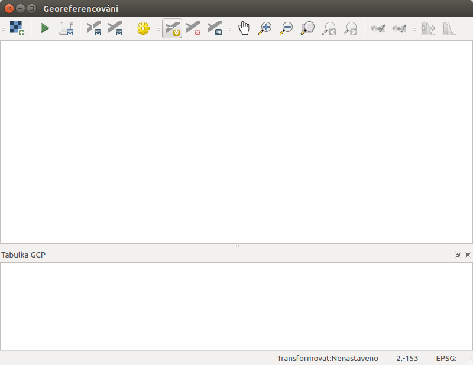

.. |mActionAddRasterLayer| image:: ../images/icon/mActionAddRasterLayer.png
   :width: 1.5em
.. |mActionTransformSettings| image:: ../images/icon/mActionTransformSettings.png
   :width: 1.5em

Georeferencování obrazových dat 
^^^^^^^^^^^^^^^^^^^^^^^^^^^^^^^
V prostředí QGIS je možné pracovat s obrazovými daty - rastry. Jedná se o 
obrazová data s informací o jejich umístění v prostoru. 
Existuje však obrovské množství obrazových dat, které nejsou prostorově
umístěné a jsou to tedy jenom obrázky.
Existuje však možnost jak takovýmto datům určit jejich umístění v prostoru.
Tento proces se nazývá georeferencování.

Využití
=======
V současnosti je k dispozici velké množství obrazových dat, které nemají
protorovou informaci. Často je však žádané zobrazit si takováto data jako
podkladová, nebo je dále využívat pro tvorbu vektorových dat.
Typickým příkladem může být územní plán. Ten je často vypracován jako
přerozdělení prostoru do různých kategorií. Výsledný produkt je často ve 
formátu `pdf` - bez prostorových informací.
Abychom měli možnost pracovat s takovýmito daty jako s prostorovými, 
musíme využít nástroj pro georeferencování. 

1. instalace pluginu
====================
Nástroj pro georeferencování je možné nainstalovat přes Správce zásuvných
modulů menu :menuselection:`Zásuvné moduly --> Spravovat a instalovat
zásuvné moduly`. Plugin se jmenuje :item:`Georeferencovač GDAL` a je možné
jej najít v :menuselection:`Rastr --> Georeferencování --> Georeferencér`.
V pluginu se nachází 2 oddělená okna. V prvním se zobrazí zpracovávaný
rastr a v druhém tabulka tzv. `GCP bodů - identických bodů`.

        
   Nástroj pro georeferencování.   

2. přidání zvoleného obrázku   
============================
Prvním krokem po zpuštění pluginu je přidání zvoleného rastru do nástroje.
Pomocí tlačítka |mActionAddRasterLayer| :sup:`Otevřít rastr`, se otevře
dialogové okno, pomocí kterého lze zvolit požadovaný vstupní rastr.

.. note::
   Díky knihovně GDAL jemožné georeferencovat velké množství formátů.
   Seznam všech formátů je vypsán v nástroji  pro přidání rastru. Mezi 
   podporované formáty patří také `pdf, jpeg, png` a mnoho dalších.

Výběrem a potvrzením se zvolený rastr načte do první části okna pluginu, 
kde je připraven na další kroky.

3. zadávání GCP - identických bodů
==================================
Dalším krokem je zadání tzv. identických bodů (z ang. `ground control 
points`). Jde o identifikaci polohy na zpracovávaném obrázku a následnou
identifikaci té samé polohy přímo v mapovém okně QGISu. Tímto získáme polohu
bodu v relativních souřadnicích obrázku, ale i v souřadnicovém systému
mapového okna.

Obrázek plugin, okno, souřadnice

.. note::
   Pro dosažení požadovaného výseldku je nutné použít vícero bodů (
   minimální počet bodů se liší dle dalšího voleného nastavení typu
   transformace).Podstatné je také jejich rozmístění, které by mělo 
   být takové, aby body pokryly ideálně celou plochu rastru rovnoměrně.

4. nastavení transformace
=========================
Po zadání dostatečného množství identických bodů je možné pokračovat 
dalším krokem. Buňky vstupního rastru musí být přepočítány pomocí klíče,
který je definován identickými body a typem transformace.
Tlačítko |mActionTransformSettings| :sup:`Nastavení transformace` otevře
dialogové okno, kde se nastavují následující parametry:
    * typ transformace
    * metoda převzorkování
    * komprese
    * výstupní rastr
    * souřadnicový systém výstupního rastru
    * vytvoření `pdf` mapy
    * vytvoření `pdf` zprávy
    * cílové rozlišení
    * použít průhlednost  

