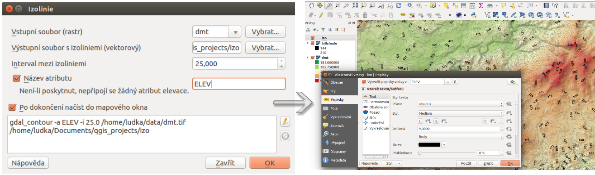

Generovanie vrstevníc
---------------------

Z digitálneho modelu terénu sa dá pomocou voľby :menuselection:`Rastr
--> Extrakce --> Izolinie` vygenerovať vektorová vrstva izolínií. V
dialógovom menu je potrebné nastaviť vstupný a výstupný súbor, hodnotu
intervalu medzi vrstevnicami a prípadne názov atribútu vo výslednej
vektorovej vrstve. Po spustení výpočtu sa vektorová vrstva automaticky
objaví v mapovom okne. Je potrebné nastaviť jej štýl, popis a ďalšie
vlastnosti. Ako môže výsledok vyzerať je na :num:`#izo`.

.. _izo:

   Tvorba vektorovej mapy vrstevníc z rastra digitálneho modelu terénu

