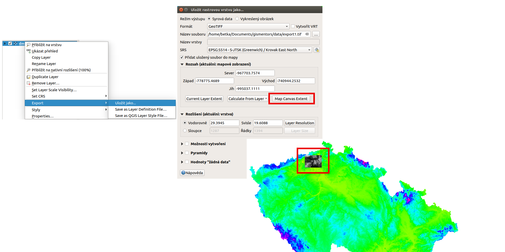
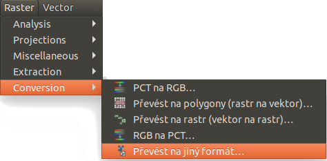
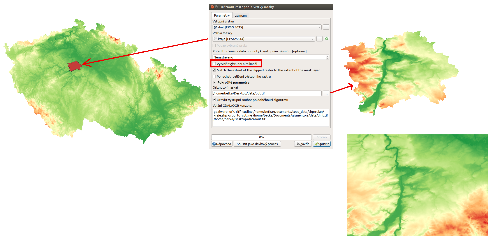

.. |gdal| image:: ../images/icon/gdal.png
   :width: 1.5em

.. index::
   pair: rastrová data; export dat

Export rastrových údajů
^^^^^^^^^^^^^^^^^^^^^^^

.. Díky knihovně |gdal| :sup:`GDAL` (Geospatial Data Abstraction Library) je možné
   čtení a zápis rastrových GIS formátů v prostředí QGIS. Pro všechny podporované
   datové formáty využívá knihovna jednoduchý datový model.

Existuje množství rastrových formátů, které jsou obvykle odlišené dle
přípony souborů. Díky knihovně GDAL umožňuje QGIS export do velkého
množství různých běžně používaných formátů.

Data je možné exportovat dvěma způsoby. Pokud potřebujeme vrstvu
uložit (exportovat) v tom samém formátu, protože pracujeme například
jenom s částí zájmového území, použijeme volbu :menuselection:`Export -->
Uložit jako...`. Tato volba je dostupná z kontextového menu na vybranou
vrstvou. Objeví se dialogové okno, kde se dá nastavit režim výstupu
(surová data nebo vykreslený obrázek), název, souřadnicový systém,
rozsah, rozlišení, možnosti vytvoření a další parametry nově
exportované vrstvy. Po spuštění se nová vrstva přidá do mapového okna
(:numref:`saveas`).
Pomocí volby rozsahu lze vybrat rozsah aktuálního mapového okna, nebo odvodit
od rozsahu jiné vrstvy (i vektorové). Takto může export sloužit na výběr území,
transformaci do jiného souřadnicového systému, změnu velikosti buňky rastru, 
použití komprese, nebo i vytvoření pyramid.

.. _saveas:

   
   Export rastrové vrstvy pomocí :item:`Uložit rastrovou vrstvu jako...`.

Pokud potřebujeme rastrovou vrstvu uložit v jiném formátu, použijeme
:menuselection:`Rastr --> Převod --> Převést na jiný formát` 
(:numref:`menu-prevod`). V dialogovém okně nastavíme vstupní vrstvu, cílový
souřadnicový systém a ostatní dle potřeby.

.. _menu-prevod:

   
   Export rastrové vrstvy do jiného formátu.
   

Ořezání rastru
^^^^^^^^^^^^^^

Výše popsaný nástroj pro export je poměrně komplexním nástrojem na vytvoření
odvozeného rastru. V podstatě se jedná o nástroj pro ořezávání rastru rozsahem.
Ať už zadáním přes mapové okno, nebo pomocí rozsahu jiné vrstvy. Nástroj se 
stejnou funkcionalitou je k dispozici v horním menu :menuselection:`Rastr -->
Extrakce --> Oříznout rastr podle rozsahu...`.

Dalším nástrojem na ořezání rastru je varianta pro ořez podle polygonové vrstvy.
Tento je umístěn ve stejném menu :menuselection:`Rastr -->
Extrakce --> Oříznout rastr podle masky...`. 

Na obrázku :numref:`raster-extract` je vidět příklad ořezání rastrové vrstvy
celé ČR pomocí hranic hlavního města Prahy (polygonová vrstva krajů s
aplikovaným filtrem). Výslední vrstva má tvar pravoúhelné mřížky, za použití
tzv. "no data" hodnoty.
Níže je výsledek ořezání pomocí rozsahu - celý rastr obshauje hodnoty z
původního rastru.

.. _raster-extract:

   
   Ořez rastru pomocí polygonové vrstvy, porovnání s výsledkem ořezu rozsahem.

