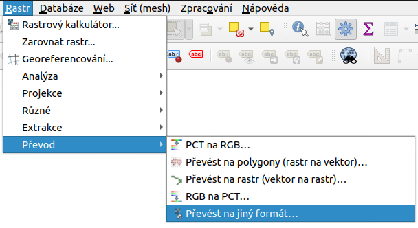

.. |gdal| image:: ../images/icon/gdal.png
   :width: 1.5em

Export rastrových údajů
^^^^^^^^^^^^^^^^^^^^^^^

Díky knihovně |gdal| :sup:`GDAL` (Geospatial Data Abstraction Library) je možné
čtení a zápis rastrových GIS formátů v prostředí QGIS. Pro všechny podporované
datové formáty využívá knihovna jednoduchý datový model.

Existuje množství rastrových formátů, které jsou obvykle odlišené dle přípony
souborů. QGIS umožňuje export do velkého množství různých běžně používaných
formátů. `Zde <http://gdal.org/formats_list.html>`_ je dostupný seznam rastrových
formátů i s doplňujícími informacemi.

Data je možné exportovat dvěma způsoby. Pokud potřebujeme vrstvu uložit
(exportovat) v tom samém formátu, protože pracujeme například jenom s částí
zájmového území, použijeme volbu :item:`Uložit jako`. Najdeme ji pravým
kliknutím myši na mapu v panelu vrstev. Objeví se dialogové okno, kde se dá
nastavit režim výstupu (surová data nebo vykreslený obrázek), název,
souřadnicvý systém, rozsah, rozlišení, možnosti vytvoření a další parametry nově
exportované vrstvy. Po spuštění se nová vrstva přidá do mapového okna
(:num:`#saveas`).  

.. _saveas:

.. figure:: images/saveas.png
   :class: middle
   
   Export rastrové vrstvy pomocí :item:`Uložit rastrovou vrstvu jako ...`

Pokud potřebujeme rastrovou vrstvu uložit v jiném formátu, použijeme
:menuselection:`Raster --> Převod --> Převíst na jiný formát` 
(:num:`#menu-prevod`). V dialogovém okně nastavíme vstupní vrstvu, cílový
souřadnicový systém a ostatní dle potřeby.

.. _menu-prevod:

   
   Export rastrové vrstvy do jiného formátu

