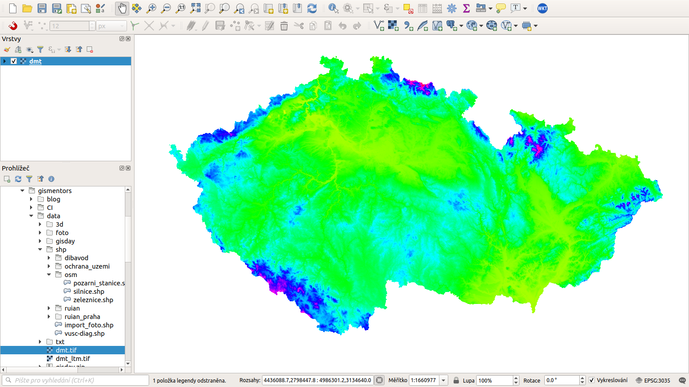

Nahratie rastrových údajov
^^^^^^^^^^^^^^^^^^^^^^^^^^

Rastrové dáta možno do prostredia QGIS pridať kliknutím na tlačítko
|mActionAddRasterLayer| :sup:`Pridať rastrovú vrstvu`, výberom z lišty menu
pomocou :menuselection:`Vrstva --> Pridať vrstvu --> Pridať rastrovú vrstvu`
alebo súčasným stlačením kláves :kbd:`Ctrl+Shift+R`. Na :num:`#addraster`
je znázornenie rastrovej vrstvy :map:`dmt.tiff` z datasetu :data:`EU-DEM
(GeoTIFF)`.

.. _addraster:

   Nahratie rastrovej vrstvy do QGIS

.. note:: Ak by sa vrstva nezobrazila v mapovom okne ako je to na
:num:`#addraster`, je potrebné kliknúť pravým tlačítkom na meno vrstvy
a zvoliť |mIconZoom| :sup:`Priblížiť na vrstvu`.

.. tip:: V prípade potreby pridržaním klávesy :kbd:`Ctrl` v dialógu
vyberania súborov možno súčasne nahrať viacero vrstiev naraz.

